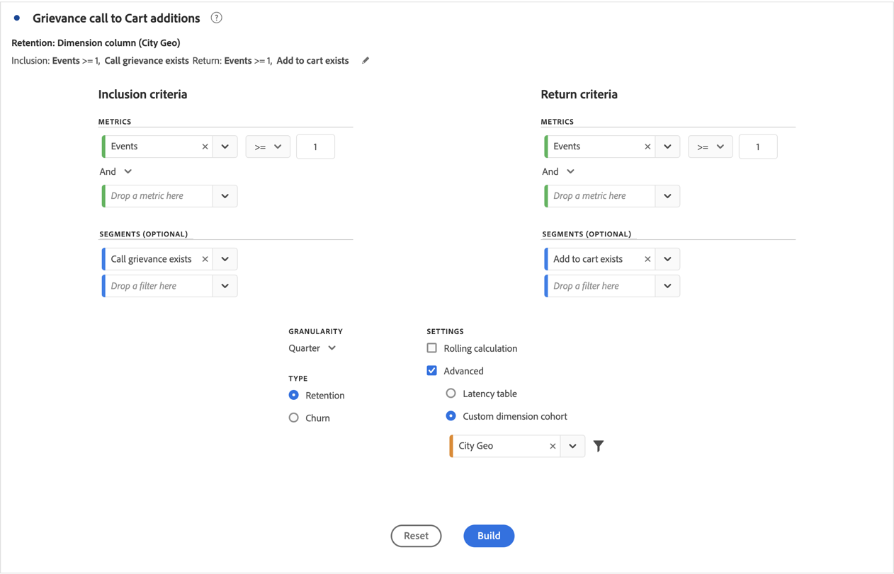
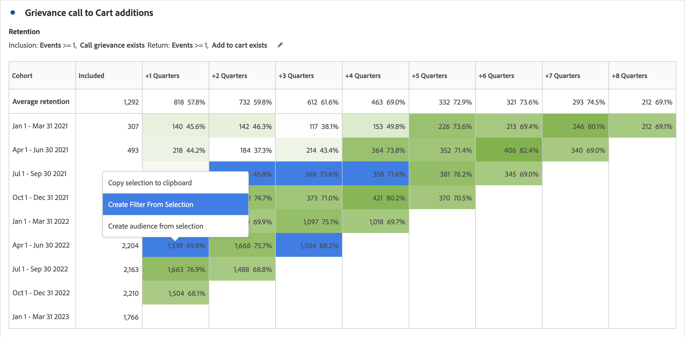

# Configurare una tabella coorte

Per creare e configurare una [!UICONTROL tabella coorte]:

1. Aggiungi una visualizzazione  **[!UICONTROL Cohort Table]**. Consulta [Aggiungere una visualizzazione a un pannello](../freeform-analysis-visualizations.md#add-visualizations-to-a-panel).

1. Definisci i **[!UICONTROL criteri di inclusione]**, **[!UICONTROL criteri di ritorno]**, **[!UICONTROL tipo coorte]** e **[!UICONTROL impostazioni]** come definito nella tabella seguente.

   

   | Elemento | Descrizione |
   |--- |--- |
   | **[!UICONTROL Criteri di inclusione]** | Puoi applicare fino a 10 segmenti di inclusione e fino a 3 metriche di inclusione. La metrica specifica a quale coorte appartiene un utente. Ad esempio, se la metrica di inclusione è Ordini, nella coorte iniziale vengono inclusi solo gli utenti che hanno effettuato un ordine durante l’intervallo di tempo dell’analisi della coorte. L’operatore predefinito tra più metriche è AND, ma è possibile cambiarlo in OR. Inoltre, puoi aggiungere la segmentazione numerica a queste metriche. Esempio: `Sessions >= 1`.  |
   | **[!UICONTROL Criteri restituiti]** | Puoi applicare fino a 10 segmenti di ritorno e fino a 3 metriche di ritorno. La metrica indica se l’utente è stato mantenuto (mantenimento) o meno (abbandono). Ad esempio, se la metrica di ritorno è Visualizzazioni video, vengono considerati fidelizzati solo gli utenti che hanno visualizzato un video durante i periodi successivi (dopo il periodo in cui sono stati aggiunti a una coorte). Un’altra metrica che quantifica la conservazione è Sessioni. |
   | [!BADGE B2B edition]{type=Informative url="https://experienceleague.adobe.com/it/docs/analytics-platform/using/cja-overview/cja-b2b/cja-b2b-edition" newtab=true tooltip="Customer Journey Analytics B2B Edition"} **[!UICONTROL Contenitore ]** | Per impostazione predefinita, l’analisi per coorte è associata al contenitore Persona. Se dalla connessione basata sull&#39;account che supporta il progetto Workspace sono disponibili altri contenitori oltre a Persona, è possibile selezionare un altro contenitore per l&#39;analisi per coorte dal menu a discesa **[!UICONTROL Contenitore]**. |
   | **[!UICONTROL Granularity (Granularità)]** | Granularità temporale per Day, Week, Month, Quarter, o Year (Giorno, Settimana, Mese, Trimestre, Anno). |
   | **[!UICONTROL Tipo]** | **[!UICONTROL Mantenimento]** (impostazione predefinita): una coorte di tipo **[!UICONTROL Mantenimento]** misura se le coorti delle persone ritornano a visitare la proprietà digitale nel tempo. Una coorte di fidelizzazione è la coorte standard e indica il comportamento degli utenti in merito a ritorno e ripetizione. Un colore verde indica una coorte di [!UICONTROL Mantenimento] nella tabella. **[!UICONTROL Abbandono ]**: una coorte di**[!UICONTROL  Abbandono ]**(nota anche come perdita o attrito) misura il modo in cui le coorti di persone abbandonano la proprietà digitale nel tempo. Churn è l&#39;opposto di Retention: `Churn = 1 - Retention`. [!UICONTROL Abbandono] è utile per misurare la fedeltà e le opportunità, in quanto mostra con quale frequenza i clienti non ritornano. Con churn è possibile analizzare e individuare specifiche aree su cui concentrarsi, ovvero i segmenti di coorte che richiedono maggiore attenzione. Un colore rosso indica una coorte [!UICONTROL Churn] nella tabella (simile all&#39;abbandono nella visualizzazione**[!UICONTROL  Flow ]**).  |
   | **[!UICONTROL Impostazioni]** | **[!UICONTROL Calcolo continuo]**: consente di calcolare il livello di fidelizzazione o abbandono in base alla colonna precedente, non alla colonna Included (impostazione predefinita). [!UICONTROL Il calcolo continuo] modifica il metodo di calcolo per i periodi di &quot;ritorno&quot;. Con il calcolo normale vengono trovati gli utenti che rispondono ai criteri di ritorno e che rientravano nel periodo di inclusione. Indipendentemente dal fatto che rientrassero o meno nella coorte del periodo precedente. Il [!UICONTROL calcolo continuo] trova invece gli utenti che soddisfano i criteri di &quot;ritorno&quot; e che facevano parte del periodo precedente. Pertanto, [!UICONTROL Il calcolo continuo] segmenta e incanala gli utenti che continuano a soddisfare i criteri di &quot;ritorno&quot; per più periodi di tempo. I criteri [!UICONTROL Restituisci] vengono applicati a ogni periodo precedente al periodo selezionato.   **[!UICONTROL Tabella di latenza ]**: una [!UICONTROL Tabella di latenza] misura il tempo trascorso prima e dopo il verificarsi dell&#39;evento di inclusione. [!UICONTROL La tabella di latenza] è molto utile per l&#39;analisi pre/post. Ad esempio, in previsione del lancio di un prodotto o di una campagna, desideri tenere traccia del comportamento prima e dopo il lancio. Nella [!UICONTROL Tabella di latenza] vengono visualizzati affiancati i comportamenti prima e dopo per vedere l&#39;impatto diretto. Le celle di pre-inclusione nella [!UICONTROL Tabella di latenza] calcolano gli utenti che soddisfano i criteri di [!UICONTROL Inclusione] nel periodo di inclusione e quindi soddisfano i criteri di [!UICONTROL Ritorno] nei periodi precedenti al periodo di inclusione. La [!UICONTROL tabella di latenza] e la [!UICONTROL coorte di dimensioni personalizzate] non possono essere utilizzate insieme.  **[!UICONTROL Coorte con dimensione personalizzata]**: consente di creare coorti in base alla dimensione selezionata, anziché in base al tempo (impostazione predefinita). Molti clienti vogliono poter analizzare le coorti in base a fattori diversi dal tempo. Con la nuova funzione per coorti con dimensione personalizzata hai la flessibilità di creare le coorti in base alle dimensioni che rispondono alle tue esigenze. Puoi usare dimensioni quali canale di marketing, campagna, prodotto, pagina, regione, o qualsiasi altra dimensione per mostrare in che modo la fidelizzazione cambia in base a valori diversi di tali dimensioni. La definizione del segmento di coorte [!UICONTROL Custom Dimension] applica l&#39;elemento dimensione solo come parte del periodo di inclusione e non come parte della definizione di ritorno.  Dopo aver scelto l&#39;opzione [!UICONTROL Custom Dimension cohort] (Coorte con dimensione personalizzata), puoi trascinare nella zona di rilascio la dimensione che ti interessa. L’aggiunta di dimensioni consente di confrontare elementi dimensionali simili nello stesso periodo di tempo. Ad esempio, puoi confrontare le prestazioni di città una accanto all’altra, prodotti, campagne, ecc. La tabella coorte restituisce i primi 14 elementi dimensionali. È tuttavia possibile utilizzare un segmento  per visualizzare solo gli elementi dimensionali desiderati. Impossibile utilizzare una [!UICONTROL coorte di dimensioni personalizzate] con la funzionalità [!UICONTROL Tabella di latenza].  |

1. Fare clic su **[!UICONTROL Build]**.
1. Per riconfigurare la [!UICONTROL tabella coorte], selezionare .

1. (Facoltativo) Crea un segmento o un pubblico da una selezione.

   Seleziona le celle (contigue o non contigue), quindi fai clic con il pulsante destro del mouse e scegli > **[!UICONTROL Crea segmento da selezione]**.

   

1. Nel [Generatore di segmenti](/help/components/segments/seg-builder.md), modifica ulteriormente il segmento, quindi fai clic su **[!UICONTROL Salva]**.

   Il segmento salvato è disponibile per l&#39;utilizzo nel pannello [!UICONTROL Segment] in [!UICONTROL Analysis Workspace].

## Impostazioni

È possibile definire impostazioni specifiche per una [!UICONTROL tabella coorte].

1. Selezionare  per regolare le impostazioni della [!UICONTROL tabella coorte].

   | Impostazione | Descrizione |
   |---|---|
   | **Mostra solo percentuale** | Rimuove il valore numerico e visualizza solo la percentuale. |
   | **Arrotondare la percentuale al numero intero più vicino** | Arrotonda il valore percentuale al numero intero più vicino invece di mostrare il valore decimale. |
   | **Mostra riga percentuale media** | Inserisce una nuova riga nella parte superiore della tabella, quindi aggiunge la media dei valori all’interno di ogni colonna. |

>[!MORELIKETHIS]
>
>[Aggiungi una visualizzazione a un pannello](/help/analysis-workspace/visualizations/freeform-analysis-visualizations.md#add-visualizations-to-a-panel)
>[Impostazioni di visualizzazione](/help/analysis-workspace/visualizations/freeform-analysis-visualizations.md#settings)
>[Menu di scelta rapida della visualizzazione](/help/analysis-workspace/visualizations/freeform-analysis-visualizations.md#context-menu)
>

