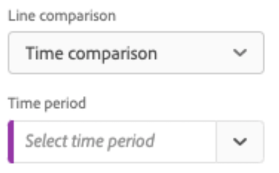
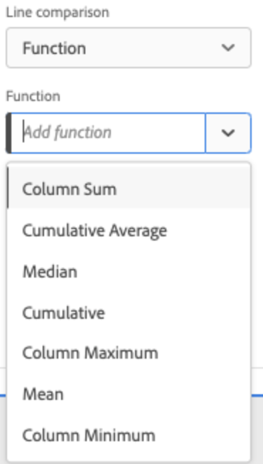
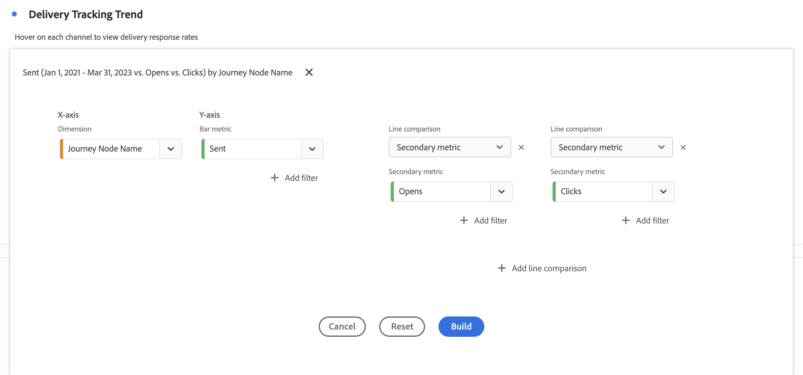
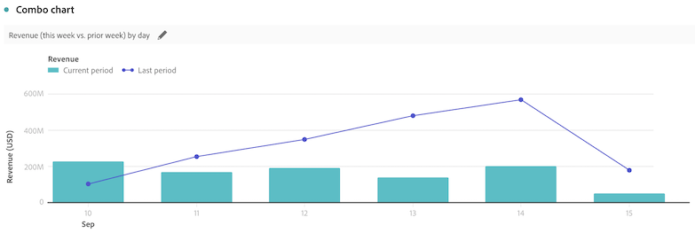
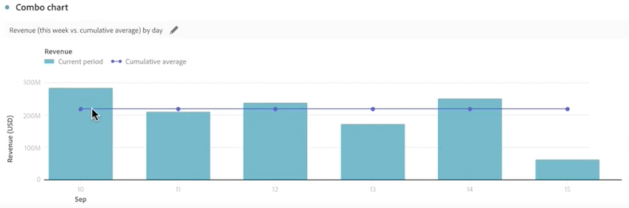
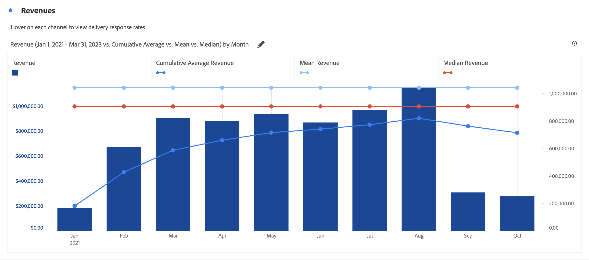

# Combinato {#combo}

<!-- markdownlint-disable MD034 -->

>[!CONTEXTUALHELP]
>id="workspace_combo_button"
>title="Combinato"
>abstract="Crea rapidamente una visualizzazione con grafico combinato senza dover prima creare una tabella a forma libera."

<!-- markdownlint-enable MD034 -->

>[!BEGINSHADEBOX]

_Questo articolo descrive la visualizzazione combinata in_  _&#x200B;**Customer Journey Analytics**._

_Consulta [Combinato](https://experienceleague.adobe.com/it/docs/analytics/analyze/analysis-workspace/visualizations/combo-charts) per la versione_  _&#x200B;**Adobe Analytics** di questo articolo._

>[!ENDSHADEBOX]

La visualizzazione  **[!UICONTROL Combo]** consente di creare rapidamente una visualizzazione di confronto senza dover prima creare una tabella. Puoi visualizzare chiaramente le tendenze nei dati con una combinazione di linee e barre.

Utilizza un [!UICONTROL Combo] per:

* Confrontare gli ordini di questa settimana con quelli nello stesso periodo dello scorso mese (e dello scorso anno).
* Analizza e confronta rapidamente più metriche (come [!UICONTROL Persone] e [!UICONTROL Ricavi]) tra di loro sullo stesso grafico.
* Analizzare una metrica rispetto a una funzione (ad esempio [!UICONTROL Media cumulativa]) su un orizzonte temporale.

Tieni presente che:

* È possibile aggiungere più confronti in un singolo [!UICONTROL grafico combinato].
* Se aggiungi uno o più confronti, questi devono essere dello stesso tipo, ad esempio [!UICONTROL Confronto temporale].
* Puoi aggiungere fino a 5 confronti.
* Puoi applicare fino a 3 segmenti a una metrica.
* Le metriche calcolate non sono supportate nei grafici combinati.

## Utilizzo

1. Aggiungi una visualizzazione  [!UICONTROL Combo]. Consulta [Aggiungere una visualizzazione a un pannello](freeform-analysis-visualizations.md#add-visualizations-to-a-panel)

1. Dai menu a discesa, seleziona una dimensione per l’asse X e una metrica per l’asse Y.

1. Selezionare il tipo di [!UICONTROL Confronto righe] che si desidera utilizzare.

   | Tipo di confronto a linee | Definizione |
   | --- | --- |
   | **[!UICONTROL Confronto delle ore]** | Il tipo di confronto più comune; ad esempio, è utile per paragonare i dati attuali a qualli di 4 settimane fa. Se hai selezionato [!UICONTROL Confronto ore], effettua una selezione secondaria per definire il periodo di tempo che desideri confrontare.
 |
   | **[!UICONTROL Funzione]** | È possibile introdurre nel confronto una funzione come [!UICONTROL Media]. Consulta l’elenco delle [funzioni supportate](#supported-functions).
 |
   | **[!UICONTROL Metrica secondaria]** | Ad esempio, puoi confrontare [!UICONTROL Ricavi] con un&#39;altra metrica.
 |

   {style="table-layout:auto"}

1. Seleziona **[!UICONTROL Genera]**.

   L’output è simile a:

   

   Il periodo corrente viene visualizzato nel grafico a barre. Il grafico a linee rappresenta il periodo di confronto. I punti nel grafico a linee sono noti come *manubri*.

## Funzioni supportate

Se si seleziona **[!UICONTROL Funzione]** come tipo di confronto [!UICONTROL Linee], verrà restituita una funzione della metrica scelta.

| Funzione | Definizione |
| --- | --- |
| **[!UICONTROL Somma colonna]** | Somma tutti i valori numerici di una metrica all’interno di una colonna (negli elementi di una dimensione). |
| **[!UICONTROL Media cumulativa]** | Restituisce la media delle ultime N righe. |
| **[!UICONTROL Median (Mediano)]** | Restituisce la mediana di una metrica in una colonna. La mediana è il numero al centro di un insieme di numeri. Metà dei numeri è costituita da valori maggiori o uguali alla mediana e l’altra metà da quelli minori o uguali alla mediana. |
| **[!UICONTROL Cumulativo]** | Somma cumulativa di N righe. |
| **[!UICONTROL Massimo Colonna]** | Restituisce il valore più grande in un insieme di elementi dimensionali della colonna di una metrica. |
| **[!UICONTROL Mean (Media)]** | Restituisce la media aritmetica di una metrica. |
| **[!UICONTROL Minimo colonna]** | Restituisce il valore più piccolo in un insieme di elementi dimensionali della colonna di una metrica. |

{style="table-layout:auto"}

Ecco un esempio della media cumulativa della metrica Ricavi:

Di seguito è riportato un esempio di grafico combinato con entrambe le funzioni di Media cumulativa e Media:

>[!MORELIKETHIS]
>
>[Aggiungi una visualizzazione a un pannello](/help/analysis-workspace/visualizations/freeform-analysis-visualizations.md#add-visualizations-to-a-panel)
>[Impostazioni di visualizzazione](/help/analysis-workspace/visualizations/freeform-analysis-visualizations.md#settings)
>[Menu di scelta rapida della visualizzazione](/help/analysis-workspace/visualizations/freeform-analysis-visualizations.md#context-menu)
>
