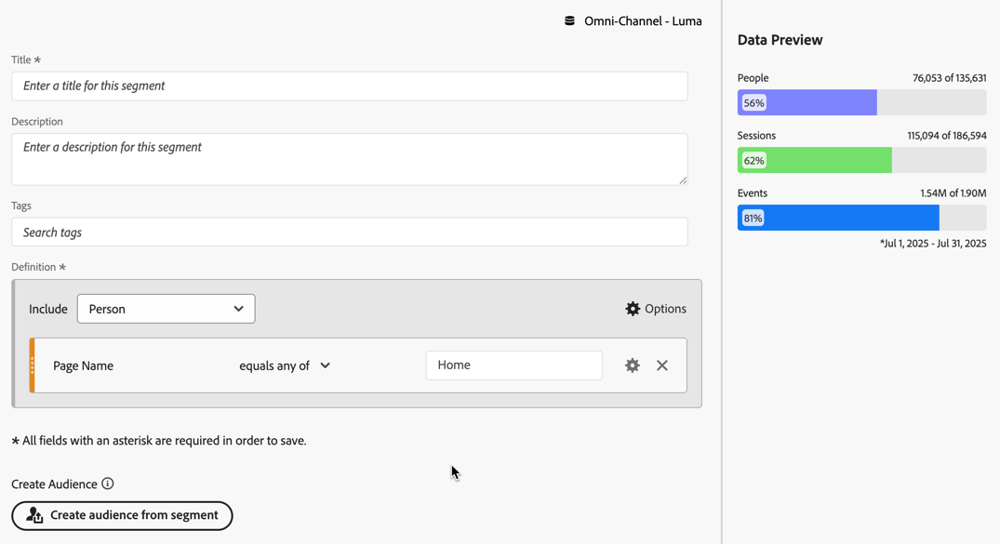

# Applicare i segmenti nell’analisi dell’abbandono

Puoi creare segmenti da un punto di contatto, aggiungere segmenti come punto di contatto e confrontare flussi di lavoro chiave tra vari segmenti in Analysis Workspace.

>[!IMPORTANT]
>
>I segmenti utilizzati come punti di controllo in Abbandono devono utilizzare un contenitore di livello inferiore rispetto al contesto generale della visualizzazione Abbandono. Con Fallout in contesto persona, i segmenti utilizzati come punti di controllo devono essere segmenti basati su sessione o eventi. Con Fallout in contesto di sessione, i segmenti utilizzati come punto di controllo devono essere segmenti basati su eventi. Se utilizzi una combinazione non valida, l’abbandono è del 100%. Quando aggiungi un segmento incompatibile come punto di contatto, nella visualizzazione Abbandono viene visualizzato un avviso. Alcune combinazioni di contenitori di segmenti non valide generano diagrammi di fallout non validi, ad esempio:
>
>* Utilizzo di un segmento basato su persona come punto di contatto all’interno di una visualizzazione Abbandono in un contesto persona.
>* Utilizzo di un segmento basato su persona come punto di contatto all’interno di una visualizzazione Abbandono in contesto di sessione.
>* Utilizzo di un segmento basato su sessione come punto di contatto all’interno di una visualizzazione Abbandono in contesto di sessione.

<!-- Should we add B2B context here?
* [!BADGE B2B Edition]{type=Informative url="https://experienceleague.adobe.com/it/docs/analytics-platform/using/cja-overview/cja-b2b/cja-b2b-edition" newtab=true tooltip="Customer Journey Analytics B2B Edition"} Usimg a B2B container based segment as a touchpoint inside a non-container based context Fallout visualization.
* -->

## Creare un segmento da un punto di contatto

1. Crea un segmento da un punto di contatto che ti interessa e che potrebbe essere utile da applicare ad altri rapporti. Fare clic con il pulsante destro del mouse sul punto di contatto e selezionare **[!UICONTROL Create segment from touchpoint]**.

   

   Verrà aperto [!UICONTROL Segment builder], precompilato con il segmento sequenziale predefinito che corrisponde al punto di contatto selezionato:

   

1. Assegna al segmento un titolo e una descrizione e salvalo.

   Ora puoi utilizzare questo segmento in qualsiasi progetto.

## Aggiungere un segmento come punto di contatto

Per vedere ad esempio come gli utenti USA influenzano le metriche di abbandono, trascina il segmento degli utenti USA nella sezione Abbandono:

Oppure puoi creare un punto di contatto AND trascinando il segmento degli utenti USA su un altro punto di controllo.

## Confrontare i segmenti in Abbandono

Puoi confrontare un numero illimitato di segmenti nella visualizzazione Abbandono.

1. Selezionare i segmenti da confrontare dal pannello [!UICONTROL Segment] a sinistra. Nell&#39;esempio vengono selezionati tre segmenti: *Dettagli volo: Pagina Versione A*, *Dettagli volo: Pagina Versione B* e *Dettagli volo: Pagina Versione C*.
1. Trascina i tre segmenti nella zona di rilascio Segmento, nella parte superiore della visualizzazione.

1. Facoltativo: è possibile mantenere *Tutti gli utenti* come contenitore predefinito o eliminare il contenitore.

   

1. Ora puoi confrontare l’abbandono tra i tre segmenti, ad esempio quando un segmento ha prestazioni migliori di un altro o altre informazioni.
