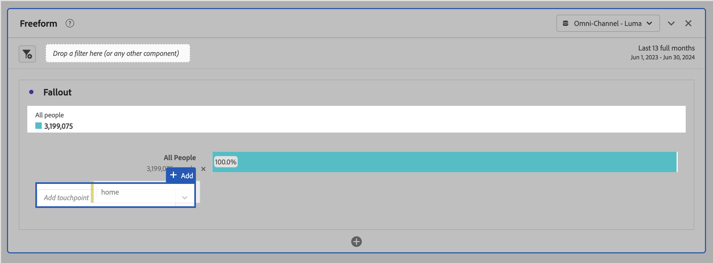

# Configurare una visualizzazione dell’abbandono {#configure-fallout-visualization}

Puoi specificare i punti di contatto per creare una sequenza di abbandono multidimensionale. Di solito, un punto di contatto è una pagina del sito. Tuttavia, i punti di contatto non sono limitati alle pagine. Ad esempio, puoi aggiungere eventi, come unità di misura, persone univoche e visite di ritorno. Puoi anche aggiungere dimensioni, come una categoria, un tipo di browser o un termine di ricerca interno.

Puoi anche aggiungere segmenti all’interno di un punto di contatto. Ad esempio, potrebbe essere utile confrontare segmenti, come gli utenti di iOS e Android™. Trascina i segmenti desiderati nella parte superiore dell’abbandono per aggiungere al rapporto le informazioni su di essi. Se desideri visualizzare solo tali segmenti, puoi rimuovere la linea di base Tutte le visite.

Non esiste alcun limite al numero di passaggi che è possibile aggiungere o al numero di dimensioni utilizzate.

Puoi eseguire la tracciatura di percorsi per dimensioni, metriche e segmenti. Ad esempio, supponiamo che qualcuno stia guardando &quot;scarpe, camicie&quot; su una pagina e che nella pagina successiva guardi &quot;camicie, calze&quot;. il prossimo rapporto di flusso dei prodotti da “scarpe” sarà “camicie” e “calze” e NON “camicie”.

## Utilizzo

1. Aggiungi una visualizzazione  **[!UICONTROL Fallout]**. Consulta [Aggiungere una visualizzazione a un pannello](../freeform-analysis-visualizations.md#add-visualizations-to-a-panel).
1. Trascina una pagina, ad esempio Home, dalla dimensione Pagina al menu a discesa *Aggiungi punto di contatto*.

   

   Passa il puntatore del mouse su un punto di contatto per vedere l’abbandono e altre informazioni su tale livello, come il nome del punto di contatto e il numero di persone a quel punto. E osserva il tasso di successo per quel punto di contatto (nonché confronta il tasso di successo con altri punti di contatto).

   I numeri cerchiati nella porzione grigia della barra mostrano l’abbandono tra i punti di contatto (non l’abbandono complessivo per quel punto). Il **[!UICONTROL punto di contatto %]** mostra il failover riuscito dal passaggio precedente al passaggio corrente nel report di abbandono.

   Puoi anche aggiungere una sola pagina al rapporto di abbandono, invece che l’intera dimensione. Fare clic sulla freccia destra  nella dimensione pagina per scegliere una pagina specifica da aggiungere al report Abbandono.

1. Continua ad aggiungere punti di contatto fino al completamento della sequenza.

   Puoi **combinare più punti di contatto** trascinando uno o più componenti aggiuntivi su un punto di contatto.

   >[!NOTE]
   >
   >Per unire più segmenti si usa l’operatore AND; per unire più elementi, ad esempio elementi dimensione, si usa l’operatore OR.

   

1. Puoi anche **vincolare singoli punti di contatto all&#39;evento successivo** (anziché *alla fine*) all&#39;interno del percorso. Sotto ogni punto di contatto è presente un selettore con le opzioni **[!UICONTROL Percorso finale]** e **[!UICONTROL Evento successivo]**, come illustrato di seguito:

   

   | Opzione | Descrizione |
   |---|---|
   | **[!UICONTROL Percorso finale]** (predefinito) | Vengono conteggiate le persone che *alla fine* approderanno sulla pagina successiva del percorso, ma non necessariamente sull&#39;evento successivo. |
   | **[!UICONTROL Prossimo evento]** | Vengono conteggiate le persone che arriveranno alla pagina successiva del percorso nel prossimo evento. |

## Impostazioni {#settings}

>[!CONTEXTUALHELP]
>id="workspace_fallout_container"
>title="Contenitore Fallout"
>abstract="Seleziona un contenitore per analizzare il percorso. Questa selezione ti consente di comprendere il tipo di coinvolgimento e vincola l’analisi al contenitore selezionato."

Come parte della visualizzazione, sono disponibili impostazioni specifiche.

| Contenitore Fallout | Descrizione |
|--- |--- |
| **[!UICONTROL Sessione]** o **[!UICONTROL Persona]** | Passa da [!UICONTROL Sessione] a [!UICONTROL Persona] per analizzare il percorso della persona. Il valore predefinito è [!UICONTROL Persona]. Queste impostazioni consentono di comprendere il coinvolgimento di persone a livello di persona singola (attraverso più sessioni) o di limitare l’analisi a una singola sessione. |

## Menu di scelta rapida

Come parte della visualizzazione, sono disponibili opzioni di menu di scelta rapida specifiche.

| Opzione | Descrizione |
|--- |--- |
| **[!UICONTROL Punto di contatto tendenza]** | Vedi i dati di tendenza per un punto di contatto in un grafico a linee, con alcuni dati predefiniti di rilevamento delle anomalie. |
| **[!UICONTROL Punto di contatto tendenza (%)]** | Genera tendenze sulla percentuale di abbandono totale. |
| **[!UICONTROL Tendenza di tutti i punti di contatto (%)]** | Genera tendenze su tutte le percentuali dei punti di contatto nell&#39;abbandono (tranne **[!UICONTROL Tutte le persone]**, se incluso) nello stesso grafico. |
| **[!UICONTROL Suddividi fallthrough in questo punto di contatto]** | Puoi vedere cosa hanno fatto le persone tra due punti di contatto (questo e quello successivo) se hanno continuato fino al punto di contatto successivo. In questo modo viene creata una tabella a forma libera che mostra le dimensioni. Potete sostituire le quote e altri elementi della tabella. Ad esempio, una tabella etichettata **[!UICONTROL Fallthrough: All People > Page è uguale a qualsiasi di home]** e contiene **[!UICONTROL Page]** come dimensione e **[!UICONTROL People]** segmentato dal [segmento rapido solo progetto](/help/components/segments/seg-quick.md) **[!UICONTROL Fallthrough: All People > Page è uguale a qualsiasi di home]** come metrica. Ispeziona il segmento per capire come viene determinato il segmento di fallthrough. |
| **[!UICONTROL Suddividere l&#39;abbandono in questo punto di contatto]** | Puoi vedere cosa hanno fatto, immediatamente dopo il passaggio selezionato, gli utenti che non hanno partecipato al passaggio in funnel. In questo modo viene creata una tabella a forma libera che mostra le dimensioni. Potete sostituire le quote e altri elementi della tabella. Ad esempio, una tabella etichettata **[!UICONTROL Abbandono: Persone > Pagina è uguale a qualsiasi di home]** e contiene **[!UICONTROL Pagina]** come dimensione e **[!UICONTROL Persone]** segmentate dal [segmento rapido solo progetto](/help/components/segments/seg-quick.md) **[!UICONTROL Abbandono: tutti i visitatori > Pagina è uguale a qualsiasi di home]** segmento come metrica. Ispeziona il segmento per capire come viene determinato il segmento di abbandono. |
| **[!UICONTROL Crea segmento da punto di contatto]** | Crea un nuovo segmento dal punto di contatto selezionato. |

>[!MORELIKETHIS]
>
>[Aggiungere una visualizzazione a un pannello](/help/analysis-workspace/visualizations/freeform-analysis-visualizations.md#add-visualizations-to-a-panel)
>[Impostazioni di visualizzazione](/help/analysis-workspace/visualizations/freeform-analysis-visualizations.md#settings)
>[Menu di scelta rapida della visualizzazione](/help/analysis-workspace/visualizations/freeform-analysis-visualizations.md#context-menu)
>

