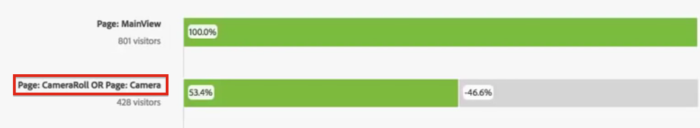

# Configurare una visualizzazione dell’abbandono

Puoi specificare i punti di contatto per creare una sequenza di abbandono multidimensionale. In genere, un punto di contatto è una pagina del sito. Tuttavia, i punti di contatto non sono limitati alle pagine. Ad esempio, puoi aggiungere eventi, come unità di misura, persone univoche e visite di ritorno. Puoi anche aggiungere dimensioni, ad esempio una categoria, un tipo di browser e un termine di ricerca interna.

Puoi perfino aggiungere filtri all’interno di un punto di contatto. Ad esempio, puoi confrontare filtri quali utenti iOS e utenti Android. Trascina i filtri desiderati nella parte superiore della sezione Abbandono per aggiungere al rapporto le informazioni su tali filtri. Per mostrare solo tali filtri, puoi rimuovere la linea di base Tutte le visite.

Non esiste alcun limite al numero di passaggi che puoi aggiungere o al numero di dimensioni che puoi usare.

Puoi eseguire il percorso sulle eVar, incluse le eVar di merchandising e [listVars](https://experienceleague.adobe.com/docs/analytics/implementation/vars/page-vars/page-variables.html?lang=it) (variabili che possono avere più valori per evento, come prodotti, listVars, eVar di merchandising e prop elenco). Ad esempio, se qualcuno sta guardando “scarpe, camicie” su una pagina e “camicie, calze” sulla pagina successiva, il prossimo rapporto di flusso dei prodotti da “scarpe” sarà “camicie” e “calze” e NON “camicie”.

1. Trascina una visualizzazione [!UICONTROL Fallout] (Abbandono) dal menu a discesa Visualizzazioni in una [!UICONTROL Freeform Table] (Tabella a forma libera).

1. Trascina la dimensione Pagina nella tabella a forma libera, trascina una pagina (in questo esempio, Home - JJEsquire) nel campo **[!UICONTROL Add TouchPoint]** (Aggiungi punto di contatto) come primo punto di contatto.

   

   Passa il puntatore del mouse su un punto di contatto per vedere l’abbandono e altre informazioni su tale livello, come il nome del punto di contatto, il conteggio delle persone a quel punto e il tasso di successo per quel punto di contatto (nonché per confrontare il tasso di successo con altri punti di contatto).

   I numeri cerchiati nella porzione grigia della barra mostrano l’abbandono tra i punti di contatto (non l’abbandono complessivo per quel punto). Punto di contatto % mostra il corretto proseguimento dal passaggio precedente verso il passaggio corrente nel rapporto di abbandono.

   Puoi anche aggiungere una sola pagina al rapporto di abbandono, invece che l’intera dimensione. Fai clic sulla freccia destra “>” sulla dimensione pagina per scegliere la specifica pagina da aggiungere al rapporto di abbandono.

1. Continua ad aggiungere punti di contatto fino a completare la sequenza.

   Per **combinare più punti di contatto**, trascinali su un punto di contatto.

   >[!NOTE]
   >
   >Per unire più filtri si usa l’operatore AND; per unire più elementi, ad esempio elementi dimensione e metriche, si usa l’operatore OR.

   

1. È inoltre possibile **vincolare singoli punti di contatto all’evento successivo** (anziché &quot;alla fine&quot;) all’interno del percorso. Sotto ogni punto di contatto, un selettore consente di scegliere tra le opzioni “Eventual Path” (Percorso finale) e “Next Hit” (Hit successivo), come illustrato di seguito:

   

<table id="table_A91D99D9364B41929CC5A5BC907E8985"> 
 <tbody> 
  <tr> 
   <td colname="col1"> 
Percorso finale 
 
(Impostazione predefinita) 
 </td> 
   <td colname="col2"> 
Vengono conteggiati i visitatori che "alla fine" atterreranno sulla pagina successiva del percorso, ma non necessariamente sull’evento successivo. 
 </td> 
  </tr> 
  <tr> 
   <td colname="col1"> 
Hit successivo 
 </td> 
   <td colname="col2"> 
Sono conteggiati i visitatori che arriveranno alla pagina successiva del percorso nel prossimo evento. 
 </td> 
  </tr> 
 </tbody> 
</table>

## Impostazioni di Abbandono {#section_0C7C89D72F0B4D6EB467F278AC979093}

| Impostazione | Descrizione |
|--- |--- |
| Contenitore Abbandono <ul><li>Visita</li><li>Visitatore</li></ul> | Consente di passare da Visita a Visitatore per analizzare il percorso della persona. Il valore predefinito è Visitatore.  Queste impostazioni aiutano a comprendere il coinvolgimento della persona a livello di persona (tra visite) o a vincolare l’analisi a una singola visita. |

Quando **fai clic con il pulsante destro del mouse su un punto di contatto**, vengono visualizzate le seguenti opzioni:

| Opzione | Descrizione |
|--- |--- |
| Tendenza punto di contatto | I dati di tendenza di un punto di contatto sono rappresentati in un grafico a linee, con alcuni dati di rilevamento anomalie pregenerati. |
| Tendenza punto di contatto (%) | Visualizza la tendenza della percentuale di abbandono totale. |
| Tendenza tutti i punti di contatto (%) | Visualizzare nello stesso grafico la tendenza di tutte le percentuali dei punti di contatto nell’abbandono (tranne Tutte le visite, se incluso). |
| Analizza il proseguimento in questo punto di contatto | Puoi vedere cosa hanno fatto le persone tra due punti di contatto (questo e quello successivo) se hanno continuato fino al punto di contatto successivo. Viene creata una tabella a forma libera in cui sono riportate le dimensioni. Puoi sostituire le dimensioni e altri elementi della tabella. |
| Analizza l’abbandono in questo punto di contatto | Puoi vedere cosa hanno fatto, immediatamente dopo il passaggio selezionato, i visitatori che hanno abbandonato. |
| Creare filtro da punto di contatto | Crea un nuovo filtro dal punto di contatto selezionato. |
