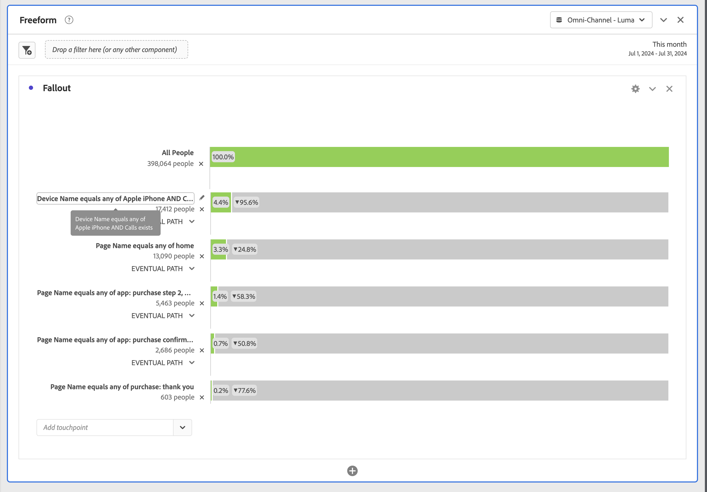

# Abbandono interdimensionale

Il fallout in Analysis Workspace consente di combinare dimensioni e metriche come punti di contatto in funnel e flussi di lavoro. I fallout offrono maggiore flessibilità nella definizione dei passaggi utente che si desidera esaminare.

Ad esempio, oltre a una dimensione Pagina, puoi aggiungere a una visualizzazione Abbandono altri elementi dimensionali (come un nome di dispositivo specifico dalla dimensione Nome dispositivo). La combinazione di dimensioni consente di visualizzare il modo in cui le pagine e alcune azioni si interagiscono nei percorsi dei clienti.

I dati di abbandono vengono automaticamente aggiornati e li puoi vedere per più dimensioni.

Puoi anche aggiungere metriche. Ad esempio, puoi aggiungere la metrica Chiamata per mostrare solo i percorsi per gli utenti per i quali esistono chiamate e che hanno contattato il call center:

Puoi combinare dimensioni e metriche. Trascina un’altra dimensione o metrica sopra una esistente. Ad esempio, per comprendere l’abbandono di persone che dispongono di un iPhone e che hanno contattato il call center.

