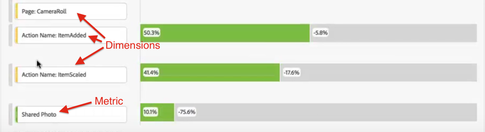

# Abbandono interdimensionale

La funzione di analisi dell’abbandono in Analysis Workspace permette di usare dimensioni e metriche diverse come punti di contatto nei funnel e flussi di lavoro e offre maggiore flessibilità nella definizione dei passaggi utente da analizzare.

Ad esempio, oltre a una dimensione Pagina, puoi aggiungere dimensioni basate su azioni a una visualizzazione Abbandono. In questo modo puoi vedere l’interrelazione tra pagine e determinate azioni nei percorsi dei clienti.

I dati di abbandono vengono automaticamente aggiornati e li puoi vedere per più dimensioni.

Puoi anche aggiungere delle metriche. In questo esempio, abbiamo aggiunto la metrica “Foto condivisa” per individuare il percorso seguito dai clienti:

Inoltre, puoi combinare dimensioni e metriche diverse in punti di contatto di tipo AND. È sufficiente trascinare un’altra dimensione o metrica su una esistente:

