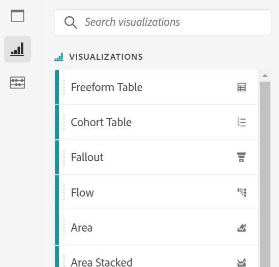

# Panoramica delle visualizzazioni

Workspace offre diverse visualizzazioni che consentono di generare rappresentazioni visive dei dati, ad esempio grafici a barre, grafici ad anello, istogrammi, grafici a linee, mappe, grafici a dispersione e altri. La maggior parte dei tipi di visualizzazione ti saranno familiari se utilizzi Customer Journey Analytics. Tuttavia, Analysis Workspace consente di configurare le impostazioni di visualizzazione e offre molti tipi di visualizzazioni nuovi o unici, con funzionalità interattive.

## Tipi di visualizzazione

In Analysis Workspace sono disponibili i seguenti tipi di visualizzazione:

| Nome della visualizzazione | Descrizione |
| --- | --- | 
| [Superfici](/help/analysis-workspace/visualizations/area.md)

 | È simile a un grafico a linee ma presenta una superficie colorata al di sotto della linea. Un grafico a superficie è utile quando si hanno diverse metriche e si desidera visualizzare l’area di intersezione di due o più metriche. |
| [Barre](/help/analysis-workspace/visualizations/bar.md) 

 | Mostra barre verticali che rappresentano diversi valori su una o più metriche. |
| [Grafico bullet](/help/analysis-workspace/visualizations/bullet-graph.md) 

 | Mostra come un valore desiderato si confronta con altre gamme di prestazioni (obiettivi). |
| [Tabella coorte](/help/analysis-workspace/visualizations/cohort-table/cohort-analysis.md)

 | Una *`cohort`* è un gruppo di persone che condividono le stesse caratteristiche per un determinato periodo di tempo. Cohort Analysis è utile per le analisi di fidelizzazione, abbandono o latenza. |
| [Anello](/help/analysis-workspace/visualizations/donut.md) 

 | Questa visualizzazione è simile al grafico a torta e presenta i dati come parti o filtri di un insieme. |
| [Abbandono](/help/analysis-workspace/visualizations/fallout/fallout-flow.md)

 | I rapporti di abbandono mostrano dove le persone hanno lasciato (abbandonato) e continuato (proseguito) attraverso una sequenza di pagine predefinite. Può essere impostato su sequenze finali o esatte. |
| [Flusso](/help/analysis-workspace/visualizations/c-flow/flow.md)

 | Mostra gli esatti percorsi dei clienti attraverso i siti web e le app. |
| [Tabella a forma libera](/help/analysis-workspace/visualizations/freeform-table/freeform-table.md)

 | Una tabella a forma libera non è semplicemente una tabella di dati, ma è soprattutto una visualizzazione interattiva. È la base per l’analisi dei dati in Workspace. |
| [Istogramma](/help/analysis-workspace/visualizations/histogram.md)

 | Un istogramma racchiude persone, visite o eventi in contenitori in base a un volume di metrica. |
| [Barre orizzontali](/help/analysis-workspace/visualizations/horizontal-bar.md)

 | Mostra barre orizzontali che rappresentano diversi valori su una o più metriche. |
| [Linee](/help/analysis-workspace/visualizations/line.md)

 | Rappresenta le metriche utilizzando una linea per mostrare il cambiamento dei valori nel corso di un intervallo di tempo. In un grafico a linee, l’asse X rappresenta il tempo. |
| [Grafico a dispersione](/help/analysis-workspace/visualizations/scatterplot.md) 

 | Mostra la relazione tra gli elementi dimensionali fino a tre metriche. |
| [Numero di riepilogo](/help/analysis-workspace/visualizations/summary-number-change.md)

 | Mostra la cella selezionata come un numero grande. |
| [Variazione di riepilogo](/help/analysis-workspace/visualizations/summary-number-change.md)

 | Mostra la variazione tra le celle selezionate come un numero o una percentuale grande. |
| [Testo](/help/analysis-workspace/visualizations/text.md)

 | Consente di aggiungere testo definito dall’utente al progetto Workspace. Utile per aggiungere ulteriore contesto alle analisi e alle informazioni, oltre a sfruttare le descrizioni di pannelli e visualizzazioni. |
| [Mappa ad albero](/help/analysis-workspace/visualizations/treemap.md)

 | Visualizza i dati gerarchici (con struttura ad albero) come un insieme di rettangoli nidificati. |
| [Venn](/help/analysis-workspace/visualizations/venn.md)

 | Utilizza dei cerchi per rappresentare la sovrapposizione delle metriche fino a 3 filtri. |

## Aggiungere visualizzazioni a un pannello

1. Apri il progetto Analysis Workspace in cui desideri aggiungere una visualizzazione.

1. Per aggiungere la visualizzazione, utilizza uno dei seguenti metodi:

   * Nella barra a sinistra, seleziona la **Visualizzare** icona <!-- add icon -->, quindi trascina una visualizzazione nel pannello in cui desideri aggiungerla.

     

   * Nel pannello in cui desideri aggiungere la visualizzazione, seleziona la **Più** , quindi scegli l’icona che rappresenta la visualizzazione da aggiungere. Passa il cursore del mouse sull’icona di ciascuna visualizzazione per visualizzarne il nome.

     

   * Aggiungi un [pannello vuoto](https://experienceleague.adobe.com/docs/analytics/analyze/analysis-workspace/panels/blank-panel.html?lang=it), quindi scegli la visualizzazione da aggiungere.

     

   * Fai clic con il pulsante destro del mouse su un pannello esistente nel progetto Analysis Workspace, quindi seleziona [!UICONTROL **Visualizzazione duplicata**] o [!UICONTROL **Copia visualizzazione**].

## Personalizzare le impostazioni di visualizzazione

Puoi personalizzare le impostazioni di visualizzazione per una singola visualizzazione o per tutte le visualizzazioni create.

### Personalizzare le impostazioni di visualizzazione per una singola visualizzazione

Per accedere a [!UICONTROL Visualization Settings] (Impostazioni di visualizzazione) per una singola visualizzazione:

1. In Analysis Workspace, passa il cursore sulla visualizzazione di cui desideri personalizzare le impostazioni.

1. Fai clic sull’icona dell’ingranaggio.

   Ogni tipo di visualizzazione dispone di impostazioni univoche che puoi personalizzare. Per informazioni sulle impostazioni disponibili, consulta la sezione [Impostazioni](#settings).

### Personalizzare le impostazioni di visualizzazione per tutte le visualizzazioni create

Puoi personalizzare le impostazioni per tutte le visualizzazioni create. Per ulteriori informazioni, consulta la sezione [Preferenze utente](/help/analysis-workspace/user-preferences.md).

## Impostazioni {#settings}

Ogni visualizzazione ha le proprie impostazioni che è possibile gestire. Per accedere alle impostazioni di visualizzazione, seleziona l’icona delle impostazioni .

| Impostazione | Descrizione |
| --- | --- |
| Tipo di visualizzazione | Modifica il tipo di elemento visivo utilizzato per rappresentare i dati. |
| Granularità | Per le visualizzazioni con tendenze, puoi modificare la granularità temporale (giorno, settimana, mese, ecc.) da questo elenco a discesa. Questa modifica si applica anche alla tabella dell’origine dati. |
| Percentuali | Visualizza i valori in percentuale. |
| Sovrapposizione 100% | Applicata alle visualizzazioni Superfici sovrapposte, Barre sovrapposte o Barre orizzontali sovrapposte, questa impostazione converte il grafico in una visualizzazione con sovrapposizione 100%. Esempio:  |
| Visualizzazione legenda | Consente di nascondere il testo di dettagli per la visualizzazione Numero di riepilogo/Variazione di riepilogo. |
| Limite massimo elementi | Consente di limitare il numero di elementi presentati in una visualizzazione. |
| Ancoraggio asse Y su zero | Se tutti i valori rappresentati sul grafico sono uniformemente al di sopra dello zero, per impostazione predefinita la parte inferiore dell’asse y sarà NON-ZERO. Attivando questa opzione, l’asse y verrà forzata sullo zero (e il grafico verrà ridisegnato). |
| Normalizzazione | Forza le metriche ad adeguarsi alle proporzioni. Questa funzione è utile quando le metriche tracciate hanno dimensioni molto diverse. |
| Visualizza asse doppia | Applicabile solo in presenza di due metriche. È possibile avere un asse y a sinistra (per una metrica) e un altro a destra (per l’altra metrica). Questa funzione è utile quando le metriche tracciate hanno dimensioni molto diverse. |
| Mostra anomalie | Completa i grafici a linee e le tabelle a forma libera con la visualizzazione del rilevamento delle anomalie. Il rilevamento delle anomalie nelle visualizzazioni a linee include un valore previsto (linea tratteggiata) e un intervallo previsto (banda ombreggiata). |
| Mostra previsione | Migliora i grafici a linee e le tabelle a forma libera visualizzando i valori di previsione. |

## Legend (Legenda) {#legend}

Una legenda consente di correlare la data in una tabella di origine alle serie tracciate nella visualizzazione. La legenda è interattiva: puoi fare clic su un elemento della legenda per mostrare o nascondere una serie nella visualizzazione. È utile se desideri semplificare i dati visualizzati.

Inoltre, puoi rinominare le etichette delle legende per facilitare la lettura dei grafici. Nota: la modifica della legenda **non** è disponibile per le visualizzazioni Mappa ad albero, Bullet, Variazione di riepilogo o Numero di riepilogo, Testo, Forma libera, Istogramma, Coorte o Flusso.

Per modificare un’etichetta di legenda:

1. Fai clic su una delle etichette della legenda.
1. Fai clic su **[!UICONTROL Edit Label]**.

   

1. Inserisci il nuovo testo dell’etichetta.
1. Fai clic su **[!UICONTROL Enter]** per salvare.

## Menu di scelta rapida {#right-click}

Ulteriori funzionalità per una visualizzazione sono disponibili facendo clic con il pulsante destro del mouse sull’intestazione della visualizzazione. Le impostazioni variano a seconda della visualizzazione. Alcune delle impostazioni disponibili sono:

| Impostazione | Descrizione |
| --- | --- |
| Inserisci visualizzazione/pannello copiato | Consente di incollare (inserire) l’elemento copiato altrove nello stesso progetto o in un altro progetto. |
| Copia visualizzazione | Consente di fare clic con il pulsante destro del mouse e copiare una visualizzazione in modo da poterla inserire in un’altra posizione all’interno del progetto o in un progetto completamente diverso. |
| [Scaricare i dati del progetto](/help/analysis-workspace/export/download-send.md) | Scarica come CSV fino a 50.000 elementi dimensionali per la dimensione selezionata. |
| [Scaricare i dati del progetto](/help/analysis-workspace/export/download-send.md) | Scarica come CSV l’origine dati della visualizzazione. |
| Duplica visualizzazione | Crea una copia della visualizzazione corrente, che potrai quindi modificare. |
| Modifica descrizione | Aggiungi (o modifica) un testo descrittivo per la visualizzazione. |
| Ottieni collegamento visualizzazione | Consente di indirizzare un utente a una specifica visualizzazione in un progetto. Quando si fa clic sul collegamento, al destinatario verrà richiesto di effettuare l’accesso prima di essere indirizzato all’esatta visualizzazione collegata. |
| Ricomincia | (Per Flusso, Venn, Istogramma) Elimina la configurazione della visualizzazione corrente in modo da poterla riconfigurare da zero. |

## Icona “Crea elemento visivo” {#quick-viz}

Se non sai quale visualizzazione scegliere, fai clic sull’icona **[!UICONTROL Create Visual]** in una delle righe della tabella (che appare quando vi si scorre sopra). Questo è il modo più veloce per aggiungere una visualizzazione. Facendo clic su di essa, Analysis Workspace cerca di fare una stima ragionata per individuare la visualizzazione più idonea ai tuoi dati. Ad esempio, se hai selezionato 1 riga, verrà creato un grafico a linee con tendenze. Se sono state selezionate 3 righe di filtri, verrà creato un diagramma di Venn.

