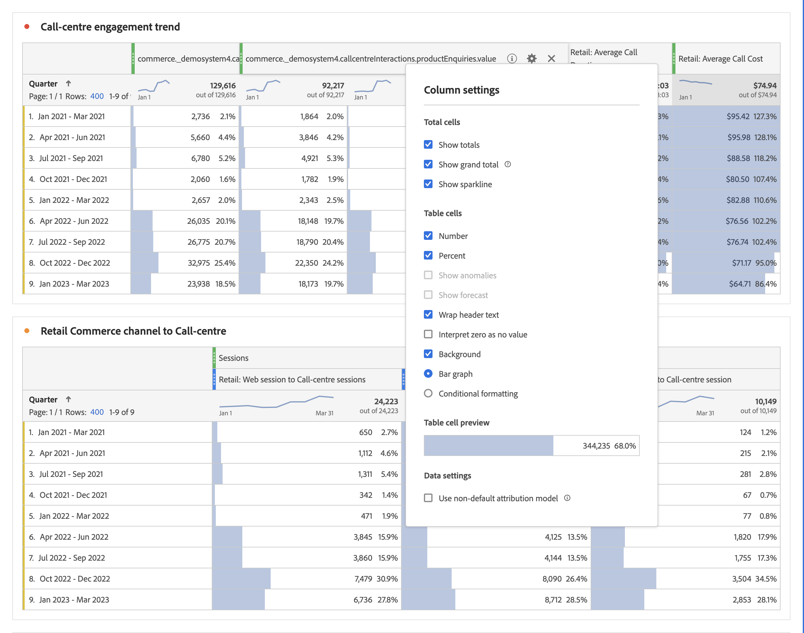
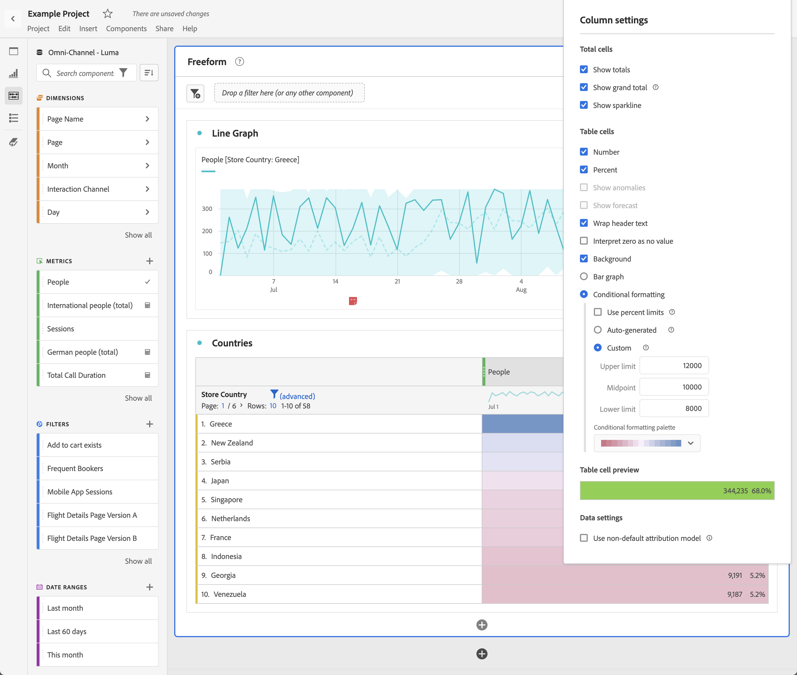

# Impostazioni colonna

[!UICONTROL Impostazioni colonna] consente di configurare la formattazione delle colonne, che può essere parzialmente condizionale.

>[!BEGINSHADEBOX]

Per un video demo, vedi  [Impostazioni riga e colonna in una tabella a forma libera](https://video.tv.adobe.com/v/40382/?quality=12&learn=on){target="_blank"}.

{{videoaa}}

>[!ENDSHADEBOX]

Per accedere alle [!UICONTROL Impostazioni colonna], selezionare  nell&#39;intestazione della colonna.

È possibile modificare le impostazioni per più colonne contemporaneamente. Selezionare più colonne e selezionare  in una delle colonne selezionate. Qualsiasi modifica apportata viene applicata a tutte le colonne in cui sono selezionate celle.

| Opzione | Descrizione |
| --- | --- |
| **[!UICONTROL Mostra totale]** | Mostra una somma lato client della colonna. Questo totale **non** deduplica metriche quali sessioni o persone. |
| **[!UICONTROL Mostra totale complessivo]** | Mostra una somma lato server della colonna. Il totale complessivo deduplica metriche quali sessioni o persone. |
| **[!UICONTROL Mostra sparkline]** | Mostra un grafico a linee nell’intestazione della colonna. |
| **[!UICONTROL Numero]** | Determina se mostrare/nascondere il valore numerico di una metrica nella cella. Ad esempio, se la metrica è Visualizzazioni pagina, il valore numerico corrisponde al numero di visualizzazioni di pagina per l’elemento riga. |
| **[!UICONTROL Percentuale]** | Determina se mostrare/nascondere il valore percentuale di una metrica nella cella. Ad esempio, se la metrica è Visualizzazioni pagina, il valore percentuale corrisponde al numero di visualizzazioni di pagina per l’elemento riga, diviso per il totale delle visualizzazioni di pagina per la colonna.  Nota: per garantire la precisione, è possibile usare percentuali superiori al 100%. Il limite superiore può essere spostato a 1.000% per evitare che la larghezza delle colonne diventi troppo grande. |
| **[!UICONTROL Mostra anomalie]** | Determina se eseguire il rilevamento delle anomalie sui valori di questa colonna. |
| **[!UICONTROL Mostra previsione]** | Determina se i valori di previsione sono visualizzati in questa colonna. |
| **[!UICONTROL Testo a capo nelle intestazioni]** | Racchiudi il testo dell’intestazione nelle tabelle a forma libera per rendere le intestazioni più leggibili e le tabelle più condivisibili. Il wrapping è utile per il rendering PDF e per le metriche con nomi lunghi. Abilitato per impostazione predefinita. |
| **[!UICONTROL Interpreta zero come nessun valore]** | Per le celle con un valore 0, determinare se visualizzare una cella vuota o 0. Questa interpretazione è utile quando si esaminano i dati per ogni giorno di un mese e alcuni giorni sono futuri.  Invece di visualizzare valori 0 per le date future, vengono visualizzate celle vuote. I grafici rispettano anche questa impostazione, ovvero non visualizzano una linea o una barra con valori pari a 0. |
| **[!UICONTROL Informazioni di base]** | Determina se mostrare o nascondere tutta la formattazione della cella, inclusi il grafico a barre e la formattazione condizionale. |
| **[!UICONTROL Grafico a barre]** | Mostra un grafico a barre orizzontale che rappresenta il valore della cella rispetto al totale della colonna. |
| **[!UICONTROL Formattazione condizionale]** | Utilizza la formattazione condizionale. Vedi la [sezione](#conditional-formatting) seguente. |
| **[!UICONTROL Anteprima cella tabella]** | Anteprima di ogni cella con le opzioni di formattazione attualmente selezionate applicate. |
| **[!UICONTROL Usa modello di attribuzione non predefinito]** | Utilizza un modello di attribuzione non predefinito. Vedi la [sezione](#use-non-default-attribution-model) seguente. |

## Formattazione condizionale {#conditional-formatting}

La formattazione condizionale applica la formattazione ai limiti superiori e inferiori e ai punti intermedi definiti dall’utente. L&#39;applicazione della formattazione condizionale nelle tabelle a forma libera viene abilitata automaticamente anche nelle suddivisioni, a meno che non venga selezionata l&#39;opzione per limiti [!UICONTROL Personalizzati].

| Opzioni di formattazione condizionale | Descrizione |
| --- | --- |
| **[!UICONTROL Usa limiti percentuali]** | Modifica l’intervallo di limiti in modo che sia basato su percentuali anziché su valori assoluti. L’intervallo dei limiti di percentuale funziona per metriche basate esclusivamente sulle percentuali (come Bounce Rate, o Percentuale non recapitate) e per metriche basate su conteggio e percentuale (come Visualizzazioni di pagina). |
| **[!UICONTROL Generazione automatica]** | Calcola automaticamente i limiti superiori/medi/inferiori in base ai dati. Il limite superiore è il valore più grande di questa colonna. Il limite inferiore è il più basso e il punto intermedio è la media dei limiti superiore e inferiore. |
| **[!UICONTROL Personalizzato]** | Assegna manualmente **[!UICONTROL Limite superiore]**, **[!UICONTROL Punto intermedio]** e **[!UICONTROL Limite inferiore]**. I limiti forniscono la flessibilità necessaria per determinare quando un valore di colonna diventa buono, medio o scarso. |
| **[!UICONTROL Tavolozza di formattazione condizionale]** | Applica un set di colori preconfigurato alle celle. A seconda delle quattro combinazioni di colori selezionate, a valori alti, intermedi e bassi vengono assegnati colori diversi.   La sostituzione di una dimensione nella tabella ridefinisce i limiti della formattazione condizionale. La sostituzione di un dato ricalcola i limiti per la colonna (dove il dato si trova sull’asse X e la dimensione sull’asse Y). |

## Usa modello di attribuzione non predefinito {#use-non-default-attribution-model}

<!-- markdownlint-disable MD034 -->

>[!CONTEXTUALHELP]
>id="workspace_freeformtable_column_usenondefaultattributionmodel"
>title="Usa modello di attribuzione non predefinito"
>abstract="Abilita un modello di attribuzione non predefinito per le colonne selezionate."

<!-- markdownlint-enable MD034 -->

<!-- markdownlint-disable MD034 -->

>[!CONTEXTUALHELP]
>id="workspace_freeformtable_column_usenondefaultattributionmodel_disabled"
>title="Usa modello di attribuzione non predefinito"
>abstract="Per questa metrica non è disponibile un modello di attribuzione non predefinito."

<!-- markdownlint-enable MD034 -->

È possibile sostituire il modello di attribuzione predefinito configurato in [Visualizzazioni dati](/help/data-views/component-settings/attribution.md).

>[!NOTE]
>
>Quando abiliti un modello di attribuzione non predefinito su una metrica, considera quanto segue:
>
>* **Quando si utilizza la metrica in un report con *una singola dimensione*:** L&#39;attribuzione della metrica ha la precedenza sul modello di allocazione impostato sulla dimensione. Ad esempio, una metrica con attribuzione &quot;primo contatto&quot; sostituisce l’allocazione di dimensione &quot;più recente&quot;.
>
>* **Quando si utilizza la metrica in un report con *più dimensioni*:** L&#39;attribuzione della metrica viene applicata sopra il modello di allocazione per ogni dimensione. Ad esempio, una metrica con attribuzione &quot;primo contatto&quot; viene applicata all’allocazione di una dimensione &quot;più recente&quot;.
>
> Per ulteriori informazioni sull’allocazione, consulta [Impostazioni dei componenti di persistenza](/help/data-views/component-settings/persistence.md).

Per utilizzare un modello di attribuzione non predefinito per una metrica in un Analysis Workspace:

1. Selezionare **[!UICONTROL Usa modello di attribuzione non predefinito]**. Se è già selezionato, utilizza **[!UICONTROL Modifica]** per modificare il modello di attribuzione. Oppure deseleziona per tornare al modello di attribuzione predefinito.

   

2. In **[!UICONTROL Column attribution model]**, selezionare un **[!UICONTROL Model]** e un **[!UICONTROL intervallo di lookback]**. L’intervallo di lookback determina l’intervallo di attribuzione dei dati applicato per ogni conversione.

   

### Modelli di attribuzione

{{attribution-models-details}}

### Contenitore

{{attribution-container}}

### Intervallo di lookback

{{attribution-lookback-window}}

### Esempio

{{attribution-example}}

>[!MORELIKETHIS]
>
>* [Gestione delle origini dati](/help/analysis-workspace/visualizations/t-sync-visualization.md)
