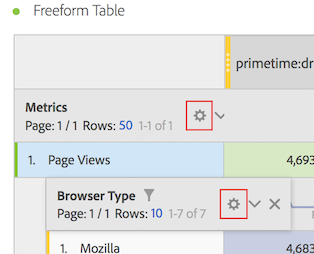
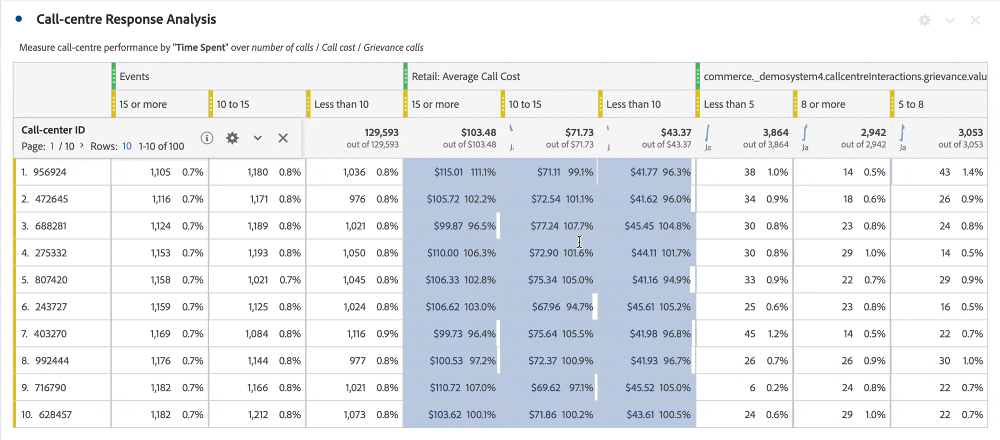
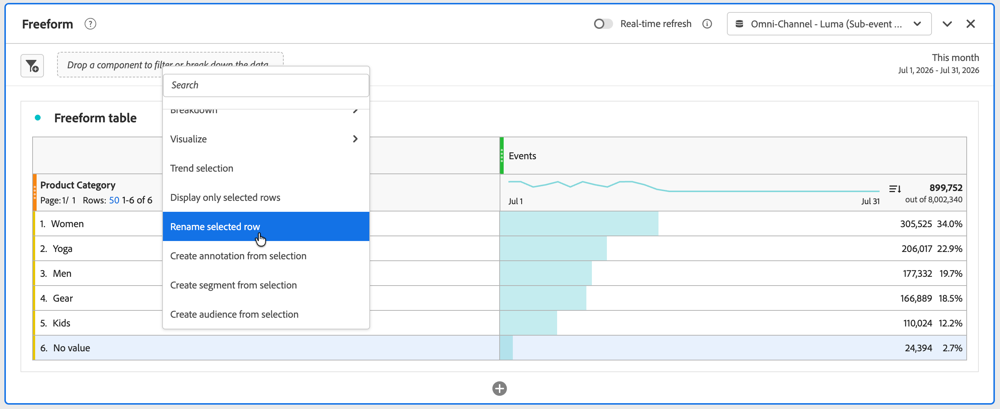
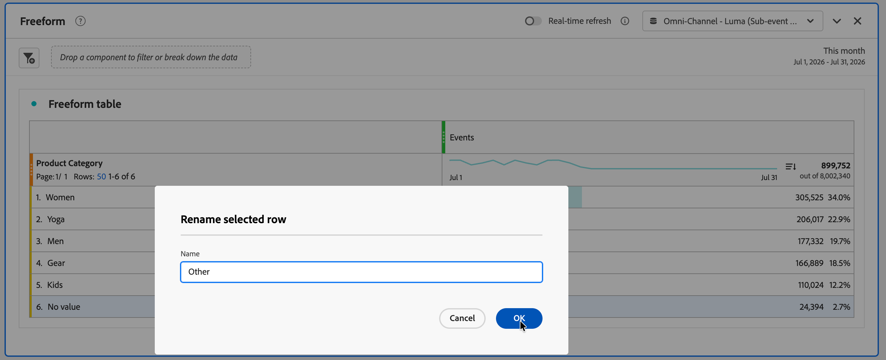
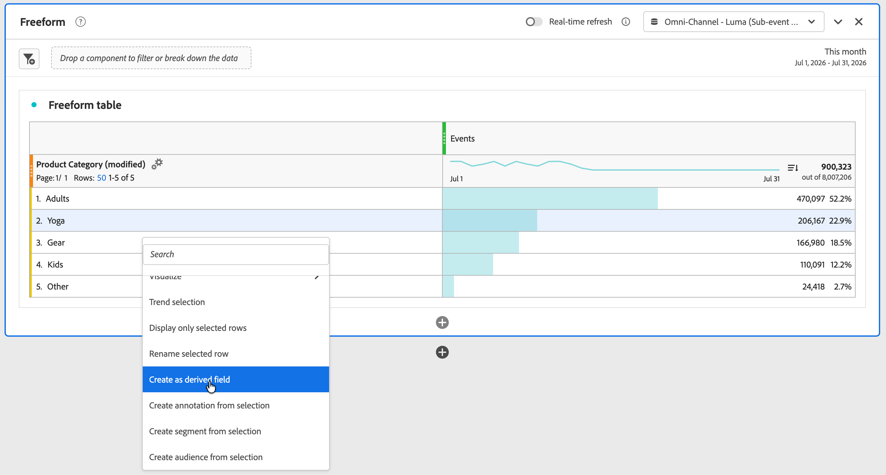
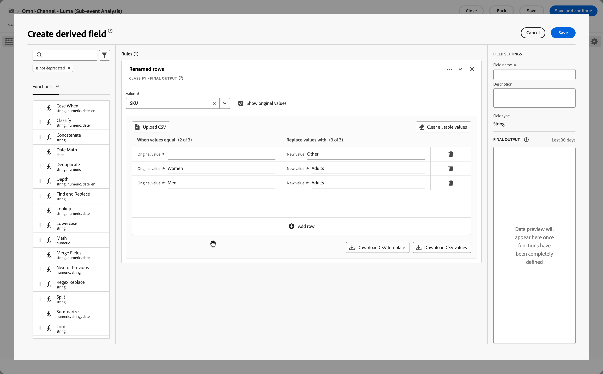
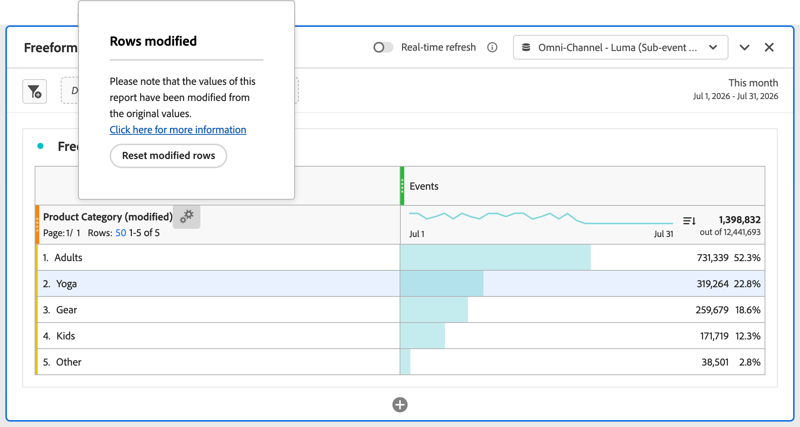

# Impostazioni riga

Le Impostazioni riga variano a seconda del componente che hai trascinato all’interno della tabella. Per accedere alle impostazioni delle righe della tabella, selezionare  **[!UICONTROL Impostazioni]** accanto a una dimensione, a un segmento, a una metrica, a un periodo di tempo o a un raggruppamento all&#39;interno di ciascuno di questi oggetti.

| Impostazione | Descrizione |
| --- | --- |
| **[!UICONTROL Raggruppamento per posizione]** | Per impostazione predefinita, questa impostazione è disabilitata e i raggruppamenti sono fissati su elementi di riga statici. Ad esempio, immagina di suddividere i primi 3 elementi dimensionali di pagina (Home page, Risultati ricerca, Pagamento) per canale di marketing. Poi abbandoni il progetto per due settimane. Quando lo riapri, le prime 3 pagine sono cambiate e ora Home page, Risultati ricerca e Pagamento sono le prime 4-6 pagine. Per impostazione predefinita, i raggruppamenti per canale di marketing vengono ancora visualizzati in Home page, Risultati ricerca e Pagamento, anche se ora si trovano nelle righe 4-6.   Al contrario, **Raggruppamento per posizione** raggruppa sempre i primi 3 elementi, indipendentemente da quali siano. Facendo riferimento all’esempio, quando riapri il progetto, i raggruppamenti per canale di marketing sono legati alle prime 3 pagine della tabella. E non alla homepage, ai risultati della ricerca e al checkout, che ora si trovano nelle righe 4-6. |
| **[!UICONTROL Percentuali]** | **Calcola percentuali per colonna** (impostazione predefinita): le percentuali visibili in una cella vengono calcolate in base al totale della colonna.  **Calcola percentuali per riga**: le percentuali nelle celle vengono calcolate in una riga, anziché in una colonna, con il totale complessivo come denominatore. Questo calcolo è utile per le percentuali di tendenza. |
| **[!UICONTROL Totali colonne]** | Queste impostazioni sono disponibili solo per le [righe statiche](/help/analysis-workspace/visualizations/freeform-table/column-row-settings/manual-vs-dynamic-rows.md).   **Mostra come somma delle righe correnti** mostra una somma lato client delle righe nella tabella, il che significa che il totale *non* deduplica metriche quali visite o persone.   **Mostra totale** mostra una somma lato server, che indica il totale delle metriche deduplicate. |

>[!BEGINSHADEBOX]

Per un video demo, vedi  [Impostazioni riga e colonna in una tabella a forma libera](https://experienceleague.adobe.com/en/docs/analytics-learn/tutorials/analysis-workspace/building-freeform-tables/row-and-column-settings-in-freeform-tables){target="_blank"}.

{{videoaa}}

>[!ENDSHADEBOX]

## Modificare conteggio righe

Per modificare il numero di righe visualizzate:

1. Fai clic sul numero accanto a **[!UICONTROL Righe]** nella parte superiore della prima colonna della tabella.

   

1. Dal menu a discesa, seleziona il numero di righe che si desidera visualizzare nella tabella.

## Menu di scelta rapida

Quando si seleziona l’intestazione della dimensione, sono disponibili le seguenti opzioni del menu di scelta rapida.

| Opzione | Descrizione |
| --- | --- |
| **[!UICONTROL Copia selezione negli Appunti]** | Copia la selezione dalla visualizzazione negli appunti. |
| **[!UICONTROL Scarica elementi come CSV (*nome dimensione*)]** | Scarica immediatamente gli elementi dimensionali (fino a un massimo di 50.000) della visualizzazione sul dispositivo locale. Un massimo di 50.000 elementi dimensionali per la dimensione selezionata. |
| **[!UICONTROL Scarica la selezione come CSV]** | Scarica immediatamente gli elementi dimensionali della visualizzazione sul dispositivo locale. |
| **[!UICONTROL Crea collegamento ipertestuale per tutti gli elementi della dimensione]** | Crea collegamenti ipertestuali per tutti gli elementi dimensionali. Vedi [Collegamenti ipertestuali per le dimensioni in una tabella a forma libera](../freeform-table-hyperlinks.md) |
| **[!UICONTROL Modifica collegamento ipertestuale per tutti gli elementi dimensionali]** | Modifica i collegamenti ipertestuali per tutti gli elementi dimensionali. Vedi [Collegamenti ipertestuali per le dimensioni in una tabella a forma libera](../freeform-table-hyperlinks.md) |
| **[!UICONTROL Rimuovi collegamento ipertestuale per tutti gli elementi dimensione]** | Rimuove i collegamenti ipertestuali per tutti gli elementi dimensionali. Vedi [Collegamenti ipertestuali per le dimensioni in una tabella a forma libera](../freeform-table-hyperlinks.md) |
| **[!UICONTROL Elimina]** | Elimina la dimensione dalla tabella. |
| **[!UICONTROL Visualizza]** | Visualizza la dimensione utilizzando una qualsiasi delle visualizzazioni disponibili. |
| **[!UICONTROL Visualizza solo le righe selezionate]** | Visualizza solo gli elementi selezionati nella visualizzazione. |
| **[!UICONTROL Crea annotazione da selezione]** | Apri **[!UICONTROL Dettagli annotazione]** per aggiungere un&#39;annotazione. |

Quando si selezionano uno o più elementi dimensionali (prima colonna) o una o più celle singole nella tabella a forma libera, sono disponibili le seguenti opzioni aggiuntive del menu di scelta rapida.

| Opzione | Descrizione |
| --- | --- |
| **[!UICONTROL Copia selezione negli Appunti]** | Copia le informazioni nelle celle selezionate della tabella a forma libera. |
| **[!UICONTROL Scarica elementi come CSV (*nome dimensione*)]** | Scarica immediatamente gli elementi dimensionali (fino a un massimo di 50.000) della visualizzazione sul dispositivo locale. Un massimo di 50.000 elementi dimensionali per la dimensione selezionata. |
| **[!UICONTROL Crea collegamento ipertestuale]** | Crea un collegamento ipertestuale per l&#39;elemento. Vedi [Collegamenti ipertestuali per le dimensioni in una tabella a forma libera](../freeform-table-hyperlinks.md) |
| **[!UICONTROL Modifica collegamento ipertestuale]** | Modificare un collegamento ipertestuale per l&#39;elemento. Vedi [Collegamenti ipertestuali per le dimensioni in una tabella a forma libera](../freeform-table-hyperlinks.md) |
| **[!UICONTROL Rimuovi collegamento ipertestuale]** | Rimuove un collegamento ipertestuale per l&#39;elemento. Vedi [Collegamenti ipertestuali per le dimensioni in una tabella a forma libera](../freeform-table-hyperlinks.md) |
| **[!UICONTROL Scarica la selezione come CSV]** | Scarica immediatamente gli elementi dimensionali della visualizzazione sul dispositivo locale. |
| **[!UICONTROL Elimina selezionati]** | Elimina le righe selezionate. |
| **[!UICONTROL Crea avviso da selezione]** | Apri [Generatore di avvisi](/help/components/c-intelligent-alerts/alert-builder.md) per generare un avviso dalla selezione. |
| **[!UICONTROL Raggruppamento]** | Suddividi l’elemento dimensione. Seleziona dall&#39;elenco di **[!UICONTROL Dimensioni]**, **[!UICONTROL Metriche]**, **[!UICONTROL Segmenti]** o **[!UICONTROL Intervalli di date]**. Ricerca alternativa per un componente, utilizzando *Ricerca*. |
| **[!UICONTROL Visualizza]** | Visualizza la selezione utilizzando una qualsiasi delle visualizzazioni disponibili. |
| **[!UICONTROL Selezione tendenze]** | Crea una visualizzazione con grafico a linee di tendenza per la selezione. |
| **[!UICONTROL Visualizza solo le righe selezionate]** | Visualizza solo le righe selezionate nella visualizzazione. |
| **[!UICONTROL Visualizza tutte le righe]** | Visualizza tutte le righe della visualizzazione. |
| **[!UICONTROL Rinomina la riga selezionata]** | Rinomina la riga selezionata. Immetti un **[!UICONTROL Nome]** nella **[!UICONTROL finestra di dialogo Rinomina riga selezionata]**. Seleziona **[!UICONTROL OK]** per confermare o **[!UICONTROL Annulla]** per annullare. Una volta rinominata una riga in una tabella a forma libera, al nome della dimensione nella colonna di intestazione vengono aggiunti **[!UICONTROL (modificato)]** e un&#39;icona  è disponibile per reimpostare le righe modificate nella colonna di intestazione della dimensione. Vedi [Classificazioni in linea](#inline-classifications). |
| **[!UICONTROL Combina righe selezionate]** | Combina le righe selezionate. Immetti un **[!UICONTROL Nome]** nella finestra di dialogo **[!UICONTROL Combina righe selezionate]**. Seleziona **[!UICONTROL OK]** per confermare o **[!UICONTROL Annulla]** per annullare. Una volta combinate le righe di una tabella a forma libera, al nome della dimensione nella colonna di intestazione vengono aggiunti **[!UICONTROL (modificato)]** e un&#39;icona  è disponibile per reimpostare le righe modificate nella colonna di intestazione della dimensione. Vedi [Classificazioni in linea](#inline-classifications). |
| **[!UICONTROL Crea righe modificate come campo derivato]** | *Per visualizzare questa opzione del menu di scelta rapida, è necessario essere un amministratore di prodotto Customer Journey Analytics.*  Disponibile su qualsiasi riga selezionata di una tabella a forma libera modificata in seguito alla ridenominazione o alla combinazione di righe. Se questa opzione è selezionata, viene aperta l&#39;[Interfaccia campo derivato](/help/data-views/derived-fields/derived-fields.md#create-a-derived-field) con le modifiche apportate alla tabella a forma libera già precompilata. Vedi [Classificazioni in linea](#inline-classifications). |
| **[!UICONTROL Crea annotazione da selezione]** | Apri [Generatore di annotazioni](/help/components/annotations/create-annotations.md#annotation-builder) per creare un&#39;annotazione per la selezione. |
| **[!UICONTROL Crea segmento da selezione]** | Apri [Generatore di segmenti](/help/components/segments/seg-builder.md) per creare un segmento dalla selezione. |
| **[!UICONTROL Crea pubblico da selezione]** | Apri [Generatore di pubblico](/help/components/audiences/publish.md#audience-builder) per creare un pubblico dalla selezione. |

Quando si seleziona un’intestazione di colonna di una metrica, sono disponibili le seguenti opzioni aggiuntive del menu di scelta rapida.

| Opzione | Descrizione |
|---|---|
| **[!UICONTROL Crea metrica da selezione]** | Crea una nuova metrica dalla metrica selezionata. La metrica può essere Media, Media, Colonna max, Colonna min, Somma colonna. Puoi anche selezionare Apri nel generatore di metriche calcolate per creare una metrica calcolata. |
| **[!UICONTROL Aggiungi colonna periodo di tempo]** | Aggiungi una colonna Periodo di tempo. Sono disponibili diverse opzioni, in cui l&#39;intervallo di calendario del pannello determina l&#39;*intervallo di date*: <ul><li>**[!UICONTROL Precedente *intervallo di date* a questo intervallo di date]**</li><li>**[!UICONTROL Questo *intervallo di date* va a questo intervallo]**.</li><li>**[!UICONTROL Intervallo date personalizzato per questo intervallo di date]**. Apre **[!UICONTROL Generatore di intervalli di date]** per specificare l&#39;intervallo di date.</li></ul>Per ulteriori informazioni, consulta [Confronto date](/help/components/date-ranges/time-comparison.md). |
| **[!UICONTROL Confronta periodi di tempo]** | Aggiunge le colonne del periodo di tempo di confronto. Disponibile solo quando la dimensione non è basata sul tempo. Sono disponibili diverse opzioni che determinano l&#39;*intervallo di date*: <ul><li>**[!UICONTROL Precedente *intervallo di date* a questo intervallo di date]**</li><li>**[!UICONTROL Intervallo date personalizzato per questo intervallo di date]**. Apre **[!UICONTROL Generatore di intervalli di date]** per specificare l&#39;intervallo di date.</li></ul>Per ulteriori informazioni, consulta [Confronto date](/help/components/date-ranges/time-comparison.md). |
| **[!UICONTROL Modifica modelli di attribuzione]** | Modifica il modello di attribuzione per la colonna. |
| **[!UICONTROL Confronta modello di attribuzione]** | Specifica un nuovo modello di attribuzione e confrontalo con il modello di attribuzione per la colonna selezionata. Viene aggiunta una nuova colonna con le nuove metriche del modello di attribuzione. Inoltre, viene aggiunta una colonna Percentuale di variazione per il confronto. |
| **[!UICONTROL Reimposta larghezza colonne]** | Ripristina la larghezza predefinita delle colonne. |
| **[!UICONTROL Crea annotazione da selezione]** | Apri **[!UICONTROL Dettagli annotazione]** per aggiungere un&#39;annotazione. |
| **[!UICONTROL Crea segmento da selezione]** | Apri **[!UICONTROL Generatore di segmenti]** per creare un segmento dalla selezione. |
| **[!UICONTROL Crea pubblico da selezione]** | Apri la finestra di dialogo **[!UICONTROL Crea pubblico]** per creare un pubblico dalla selezione. |

## Modificare l&#39;altezza delle righe

È possibile impostare la [densità di visualizzazione](https://experienceleague.adobe.com/en/docs/analytics-platform/using/cja-workspace/build-workspace-project/view-density) di un progetto su **[!UICONTROL Compatto]**, **[!UICONTROL Comoda]** e **[!UICONTROL Espansa]**.

## Classificazioni in linea

Le classificazioni in linea consentono di rinominare o combinare le righe in una tabella a forma libera. E per creare un campo derivato dalle righe modificate di una tabella.

L&#39;esempio seguente illustra come utilizzare le opzioni del menu di scelta rapida **[!UICONTROL Rinomina riga selezionata]**, **[!UICONTROL Combina righe selezionate]** e **[!UICONTROL Crea come campo derivato]**. E come ripristinare la tabella a forma libera modificata.

* Rinomina **[!UICONTROL Nessun valore]** riga in **[!UICONTROL Altro]**.

  1. Selezionare **[!UICONTROL Rinomina riga selezionata]** dal menu di scelta rapida nella riga **[!UICONTROL Nessun valore]** selezionata.

     

  1. Nella finestra di dialogo **[!UICONTROL Rinomina riga selezionata]**:

     

     1. Immetti <code>Altro</code> per **[!UICONTROL Name]**.
     1. Selezionare **[!UICONTROL OK]**.

* Combina **[!UICONTROL righe da uomo]** a **[!UICONTROL da donna]** in una **[!UICONTROL da adulto]**.

  1. Selezionare la riga **[!UICONTROL Uomini]** e **[!UICONTROL Donne]**.
  1. Selezionare **[!UICONTROL Combina righe selezionate]** dal menu di scelta rapida da una delle righe selezionate.

     

  1. Nella finestra di dialogo **[!UICONTROL Combina righe selezionate]**:

     

     1. Immetti <code> adulti</code> per **[!UICONTROL Name]**.
     1. Selezionare **[!UICONTROL OK]**.

* Crea un campo derivato dalle modifiche nella tabella a forma libera.

  1. Selezionare **[!UICONTROL Crea righe modificate come campo derivato]** dal menu di scelta rapida per ogni riga selezionata nella tabella modificata.

     

  1. Ispeziona, modifichi e salva la definizione del campo derivato in base a tutte le modifiche apportate nella tabella.

     

* Ripristina lo stato della tabella a forma libera prima delle modifiche.

  1. Seleziona  accanto a **[!UICONTROL _nome dimensione _(modificato)]**.
  1. Selezionare **[!UICONTROL Reimposta righe modificate]** dal popup **[!UICONTROL Righe rinominate]**.

     
