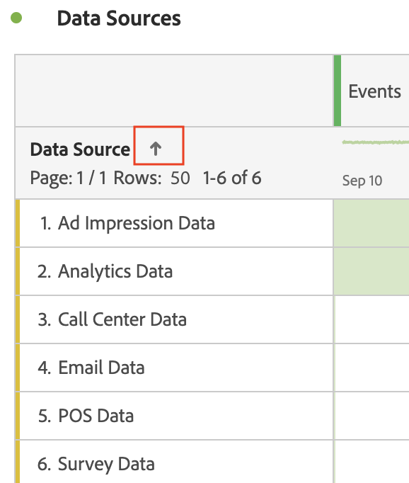

# Filtrare e ordinare tabelle

Le tabelle a forma libera in Analysis Workspace sono la base dell’analisi interattiva dei dati. In quanto tali, possono contenere migliaia di righe di informazioni. Filtrare e ordinare i dati può essere fondamentale per far emergere in modo efficace le informazioni più importanti.

<!--The following video covers filter and sort options in Analysis Workspace, in addition to pagination options:

>[!VIDEO](https://video.tv.adobe.com/v/23968)-->

## Filtrare le tabelle {#section_36E92E31442B4EBCB052073590C1F025}

I filtri in Analysis Workspace ti aiutano a far emergere le informazioni più importanti.

>[!NOTE]
>
> Solo gli elementi dimensionali dinamici possono essere filtrati come descritto in questa sezione. Gli elementi dimensionali statici non possono essere filtrati. Per ulteriori informazioni, consulta [Elementi dimensionali dinamici e statici nelle tabelle a forma libera](/help/analysis-workspace/visualizations/freeform-table/column-row-settings/manual-vs-dynamic-rows.md).

Per filtrare i dati nelle tabelle a forma libera:

1. Nella tabella a forma libera, passa il cursore del mouse sulla colonna contenente i dati da filtrare. <!--only some types of columns show the filter... Which? Just Dimensions?-->

1. Seleziona l’icona **Filtro** quando viene visualizzata.

   

1. Nel campo [!UICONTROL **Cerca parola o frase**], specifica una parola o una frase in base a cui applicare il filtro. Vengono visualizzate solo le righe contenenti la parola o la frase esatta specificata.

1. (Facoltativo) Per filtrare in base a criteri diversi o a più criteri, seleziona [!UICONTROL **Mostra avanzate**].

   Sono disponibili le seguenti opzioni

   | Opzione | Funzione |
   |---------|----------|
   | [!UICONTROL **Includi non specificato (nessuno)**] | Selezionare questa opzione per visualizzare nella tabella i dati che non rientrano in alcuna delle dimensioni disponibili. <!--what is this?--> |
   | [!UICONTROL **Corrispondenza**] | 
Scegli [!UICONTROL **Se sono soddisfatti tutti i criteri**] per mostrare solo i dati che soddisfano tutti i criteri specificati. In genere, questa opzione genera dati più precisi.
 
Scegli [!UICONTROL **Se sono soddisfatti i criteri**] per mostrare i dati che soddisfano tutti i criteri di filtro specificati. Di solito, questa opzione genera dati meno precisi.
 |
   | [!UICONTROL **Criteri**] | 
Seleziona tra le opzioni filtro seguenti:

(Seleziona [!UICONTROL **Aggiungi riga**] per aggiungere più criteri di filtro. L’opzione selezionata nella sezione [!UICONTROL **Corrispondenza**] determina se tutti i criteri aggiunti devono essere soddisfatti o meno.)
<ul><li>
[!UICONTROL **Contiene la frase**]: nei risultati filtrati vengono inclusi solo i dati che contengono la frase esatta specificata. Le parole devono essere nell’ordine specificato nel [!UICONTROL **campo Cerca parola o frase**].
Questa è l’impostazione predefinita quando si esegue una ricerca semplice.

</li><li>
[!UICONTROL **Contiene qualsiasi termine**]: nei risultati filtrati sono inclusi solo i dati contenenti una o più parole della frase specificata. 
</li><li>
[!UICONTROL **Contiene tutti i termini**]: nei risultati filtrati sono inclusi solo i dati che contengono tutte le parole della frase specificata. Le parole non devono necessariamente essere nell&#39;ordine specificato nel [!UICONTROL **campo Cerca parola o frase**].
</li><li>
[!UICONTROL **Non contiene alcun termine**]: nei risultati filtrati sono inclusi solo i dati che non contengono le parole della frase specificata. 
</li><li>
[!UICONTROL **Non contiene la frase**]: nei risultati filtrati sono inclusi solo i dati che non contengono la frase esatta specificata. Le parole devono essere nell’ordine specificato nel [!UICONTROL **campo Cerca parola o frase**].
</li><li>
[!UICONTROL **È uguale a**]: nei risultati filtrati vengono inclusi solo i dati che corrispondono esattamente alla frase specificata. 
</li><li>
[!UICONTROL **Non è uguale a**]: nei risultati filtrati vengono inclusi solo i dati che non corrispondono esattamente alla frase specificata. 
</li><li>
[!UICONTROL **Inizia con**]: nei risultati filtrati sono inclusi solo i dati che iniziano con la parola o la frase esatta specificata. 
</li><li>
[!UICONTROL **Termina con**]: nei risultati filtrati sono inclusi solo i dati che terminano con la parola o la frase esatta specificata. 
</li></ul> |
   | [!UICONTROL **Escludi sempre gli elementi**] | Specifica il nome degli elementi da escludere dai dati filtrati. |

1. Seleziona [!UICONTROL **Applica**] per filtrare i dati.

   L’icona **Filtro**  diventa blu quando un filtro viene applicato alla tabella.

## Ordinare le tabelle

Puoi ordinare i dati di una tabella a forma libera in base a qualsiasi colonna di Analysis Workspace che può essere una dimensione oppure una metrica.

Icona con freccia giù  è visibile nell’intestazione della colonna in base alla quale i dati vengono ordinati.

1. In una tabella a forma libera in Analysis Workspace, fai clic sulla freccia accanto al nome della dimensione o della metrica.

   Eseguendo l’ordinamento, tieni presente quanto segue:

   * La freccia giù ordina in ordine decrescente e la freccia su (impostazione predefinita) in ordine crescente.
   * Puoi ordinare le dimensioni in ordine alfabetico o numerico. Ad esempio, è possibile che in un flusso di lavoro siano presenti passaggi numerati e che si desideri ordinare in base al numero del passaggio. Puoi ordinare una dimensione relativa alla data in base alla data. Oppure puoi ordinare alfabeticamente le origini dati, come nell‘immagine seguente.

   

