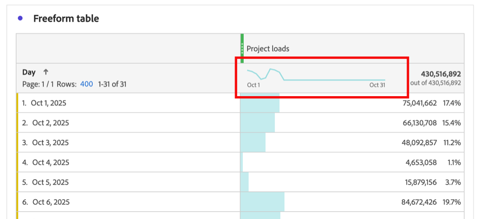
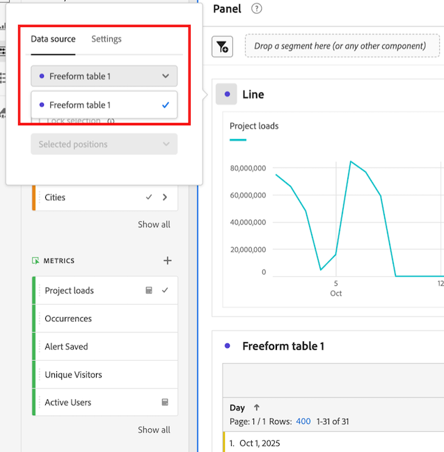
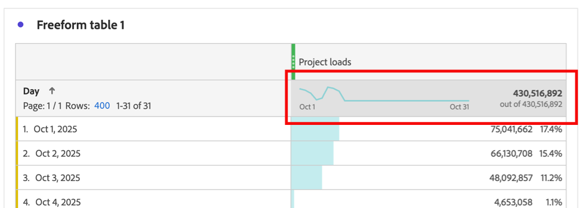

# Visualizzare i dati con tendenze per una tabella a forma libera

È possibile visualizzare la tendenza dei dati inclusi in una tabella a forma libera. Questi dati con tendenze sono visualizzati nelle seguenti aree in Analysis Workspace:

* [Grafici sparkline](#use-sparklines-to-view-trended-data)

* [Visualizzazioni delle linee](#use-line-visualizations-to-view-trended-data)

## Utilizza i grafici sparkline per visualizzare i dati con tendenze

I grafici sparkline sono visualizzati nell’intestazione della colonna delle metriche delle tabelle a forma libera.

I grafici sparkline includono sempre:

* Dati con tendenze per tutti i dati nella colonna

* Qualsiasi criterio di filtro di ricerca applicato alla dimensione tabella

  Per ulteriori informazioni, vedere [Filtro e ordinamento](/help/analysis-workspace/visualizations/freeform-table/filter-and-sort.md).

## Utilizzare le visualizzazioni a linee per visualizzare i dati con tendenze

Le visualizzazioni [Line](/help/analysis-workspace/visualizations/line.md) visualizzano i dati della tabella a forma libera a cui sono connesse.

### Connettere una visualizzazione a linee a una tabella a forma libera

A seconda di come e quando la visualizzazione delle linee è stata aggiunta al progetto, potrebbe già essere connessa alla tabella a forma libera desiderata. Utilizza i seguenti passaggi per verificare o per collegarlo manualmente:

1. Aggiungi una visualizzazione a linee a un progetto Analysis Workspace.

1. Seleziona il punto accanto al nome della visualizzazione, seleziona la scheda **[!UICONTROL Origine dati]**, quindi seleziona il nome della tabella a forma libera da connettere alla visualizzazione a linee.

   

### Scegli i dati inclusi nella visualizzazione delle linee

I dati inclusi nella visualizzazione della linea connessa differiscono, a seconda della cella selezionata nella tabella a forma libera.

Per visualizzare una tendenza di tutti i dati nella tabella a forma libera, seleziona la cella sparkline nella tabella a forma libera.

Quando la cella sparkline è selezionata, viene visualizzata in grigio scuro.

Quando la cella sparkline della tabella connessa è selezionata, le visualizzazioni delle linee includono:

* Dati con tendenze per tutti i dati nella colonna

* Qualsiasi criterio di filtro di ricerca applicato alla dimensione tabella

  Per ulteriori informazioni, vedere [Filtro e ordinamento](/help/analysis-workspace/visualizations/freeform-table/filter-and-sort.md).

Quando il grafico sparkline della tabella connessa non è selezionato, le visualizzazioni delle linee includono:

* Dati per la riga selezionata nella tabella connessa. Se non è selezionata alcuna riga, vengono visualizzati i dati solo per la prima dimensione della tabella connessa.

* Qualsiasi criterio di filtro di ricerca applicato alla dimensione tabella viene ignorato

  Per ulteriori informazioni, vedere [Filtro e ordinamento](/help/analysis-workspace/visualizations/freeform-table/filter-and-sort.md).

## Includere i criteri di filtro nelle visualizzazioni delle linee connesse

Per informazioni su quando i criteri di filtro sono inclusi nelle visualizzazioni delle linee connesse, vedi [Includere i criteri di filtro nei dati con tendenze nelle visualizzazioni delle linee sparkline e delle linee](/help/analysis-workspace/visualizations/freeform-table/filter-and-sort.md#include-filter-criteria-in-trended-data-in-sparklines-and-line-visualizations)
