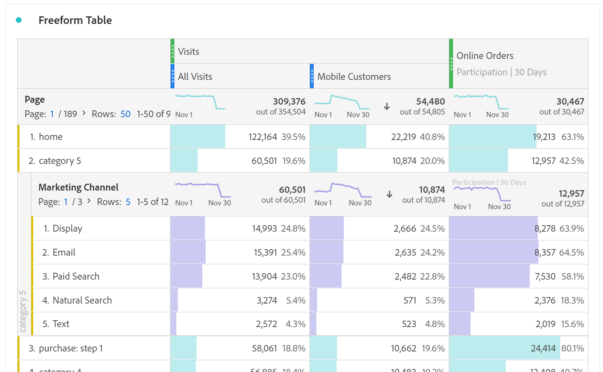
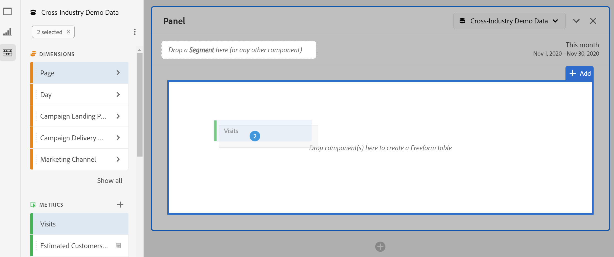
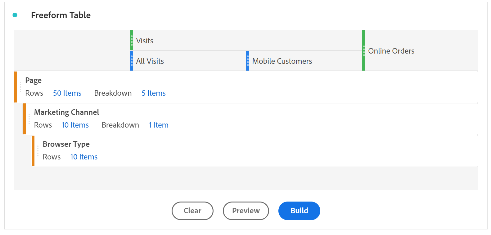

# Panoramica della tabella a forma libera {#freeform-table-overview}

<!-- markdownlint-disable MD034 -->

>[!CONTEXTUALHELP]
>id="workspace_freeformtable_button"
>title="Tabella a forma libera"
>abstract="Crea una visualizzazione vuota delle tabelle a forma libera che puoi realizzare utilizzando dimensioni, segmenti, metriche e intervalli di date. Puoi utilizzare la tabella a forma libera come base per altre visualizzazioni."

<!-- markdownlint-enable MD034 -->

>[!BEGINSHADEBOX]

_Questo articolo documenta la visualizzazione della tabella a forma libera in_  _**Customer Journey Analytics**._ _Consulta la [tabella a forma libera](https://experienceleague.adobe.com/it/docs/analytics/analyze/analysis-workspace/visualizations/freeform-table/freeform-table) per la_  _**Adobe Analytics** versione di questo articolo._

>[!ENDSHADEBOX]

In Analysis Workspace, una  **[!UICONTROL Tabella a forma libera]** è la base per l&#39;analisi dei dati interattivi. Puoi trascinare una combinazione di [componenti](/help/components/overview.md) nelle righe e nelle colonne per creare una tabella personalizzata per l’analisi. Man mano che ciascun componente viene rilasciato, la tabella viene aggiornata immediatamente e puoi subito analizzarla e approfondire i dati.

Per creare e configurare una [!UICONTROL tabella a forma libera]:

* Aggiungi una visualizzazione  **[!UICONTROL Tabella a forma libera]**. Consulta [Aggiungere una visualizzazione a un pannello](../freeform-analysis-visualizations.md#add-visualizations-to-a-panel).

## Tabelle automatizzate

Il modo più rapido per creare una tabella consiste nel trascinare i componenti direttamente in un progetto o pannello vuoto o in una tabella a forma libera. Una tabella a forma libera viene creata per te in un formato consigliato. [Guarda il tutorial](https://experienceleague.adobe.com/it/docs/analytics-learn/tutorials/analysis-workspace/building-freeform-tables/auto-build-freeform-tables-in-analysis-workspace).

## Generatore di tabelle a forma libera

Se prima preferisci aggiungere diversi componenti alla tabella, quindi eseguire il rendering dei dati, puoi selezionare **[!UICONTROL Abilita generatore tabelle]**. Con il generatore abilitato, puoi trascinare dimensioni, raggruppamenti, metriche e segmenti per creare tabelle che rispondano a domande più complesse. Aggiornamenti dei dati dopo aver selezionato **[!UICONTROL Build]**.

## Interazioni

Puoi interagire con una tabella a forma libera e personalizzarla in diversi modi:

### Filtrare e ordinare

* Puoi [filtrare e ordinare](filter-and-sort.md) i dati in una tabella.

### Righe

* Puoi rapidamente [creare una nuova visualizzazione](../freeform-analysis-visualizations.md#visualize) da una o più righe utilizzando .
* È possibile inserire più righe in una singola schermata regolando la [densità di visualizzazione](/help/analysis-workspace/build-workspace-project/view-density.md) del progetto.
* Prima dell’impaginazione ogni riga delle dimensioni può visualizzare fino a 400 righe. Selezionare il numero accanto a **[!UICONTROL Rows]** nell&#39;intestazione della prima colonna per visualizzare più righe in una pagina. Passa a una pagina diversa utilizzando  nell’intestazione della prima colonna.
* Puoi suddividere le righe per componenti aggiuntivi. Per suddividere più righe alla volta, seleziona più righe e quindi trascina il componente successivo sopra le righe selezionate. Scopri di più sui [raggruppamenti](/help/components/dimensions/t-breakdown-fa.md).
* Le righe possono essere [segmentate](/help/components/segments/seg-overview.md) per visualizzare un set ridotto di elementi. Impostazioni aggiuntive sono disponibili in [Impostazioni riga](/help/analysis-workspace/visualizations/freeform-table/column-row-settings/table-settings.md).

### Colonne

* I componenti possono essere impilati all’interno di colonne per creare metriche segmentate, analisi incrociate e altro ancora.
* La visualizzazione di ogni colonna può essere regolata nelle [impostazioni della colonna](/help/analysis-workspace/visualizations/freeform-table/column-row-settings/column-settings.md).
* Sono disponibili diverse azioni tramite il [menu di scelta rapida](/help/analysis-workspace/visualizations/freeform-analysis-visualizations.md#context-menu). A seconda dell’elemento selezionato (intestazione, righe o colonne della tabella), il menu fornisce azioni diverse.

## Impostazioni

Selezionare  per visualizzare **[!UICONTROL Impostazioni tabella]**. Sono disponibili le seguenti [impostazioni](../freeform-analysis-visualizations.md#settings) di visualizzazione specifiche:

### Origine dati

| Opzione | Descrizione |
|---|---|
| **[!UICONTROL Visualizzazione collegata]**. | Elenca tutte le visualizzazioni collegate. |
| **[!UICONTROL Mostra origine dati]** | Se è deselezionata, la tabella a forma libera che funge da origine dati per la visualizzazione è nascosta in Workspace. |

### Impostazioni

| Opzione | Descrizione |
|---|---|
| **[!UICONTROL Allinea le date di ogni colonna affinché inizino tutte sulla stessa riga]** | Per allineare o non allineare le date di ogni colonna affinché inizino tutte sulla stessa riga. |

## Menu di scelta rapida

Le seguenti opzioni del [menu di scelta rapida](../freeform-analysis-visualizations.md#context-menu) sono disponibili nell’intestazione della visualizzazione:

| Opzione | Descrizione |
| --- | --- |
| **[!UICONTROL Inserisci visualizzazione copiata]** | Incolla (inserisci) una visualizzazione copiata altrove nello stesso progetto o in un altro progetto. |
| **[!UICONTROL Copia dati negli Appunti]** | Copia i dati dalla visualizzazione negli appunti. |
| **[!UICONTROL Copia selezione negli Appunti]** | Copia la selezione dalla visualizzazione negli appunti. |
| **[!UICONTROL Scarica elementi come CSV (*nome dimensione*)]** | Scarica immediatamente gli elementi dimensionali (fino a un massimo di 50.000) della visualizzazione sul dispositivo locale. Un massimo di 50.000 elementi dimensionali per la dimensione selezionata. |
| **[!UICONTROL Copia visualizzazione]** | Copia la visualizzazione, in modo da poterla inserire in un’altra posizione all’interno del progetto o in un progetto diverso. |
| **[!UICONTROL Scarica CSV dati]** | Scarica immediatamente i dati visualizzati della visualizzazione sul dispositivo locale. |
| **[!UICONTROL Esporta tabella completa...]** | Esporta la tabella completa in posizioni cloud designate. Consulta [Esporta i rapporti di Customer Journey Analytics nel cloud](../../export/export-cloud.md) |
| **[!UICONTROL Visualizzazione duplicata]** | Crea un duplicato esatto della visualizzazione. |
| **[!UICONTROL Modifica descrizione]** | Aggiungi (o modifica) una descrizione di testo per la visualizzazione. Consulta [Testo](../text.md). |
| **[!UICONTROL Ottieni collegamento visualizzazione]** | Copia e condividi un collegamento direttamente alla visualizzazione. La finestra di dialogo Condividi collegamento consente di visualizzare il collegamento. Seleziona Copia per copiare il collegamento negli appunti. |
| **[!UICONTROL Ricomincia]** | Elimina la configurazione della visualizzazione corrente in modo da poterla riconfigurare da zero. |

>[!MORELIKETHIS]
>
>[Aggiungi una visualizzazione a un pannello](/help/analysis-workspace/visualizations/freeform-analysis-visualizations.md#add-visualizations-to-a-panel)
>[Impostazioni di visualizzazione](/help/analysis-workspace/visualizations/freeform-analysis-visualizations.md#settings)
>[Menu di scelta rapida della visualizzazione](/help/analysis-workspace/visualizations/freeform-analysis-visualizations.md#context-menu)
>
