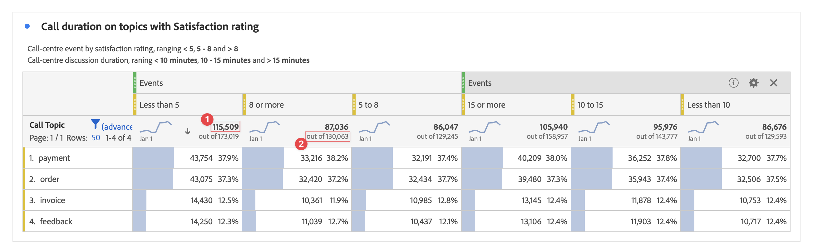

# Totali {#workspace-totals}

>[!CONTEXTUALHELP]
>id="workspace_freeformtable_grandtotal"
>title="Totale complessivo"
>abstract="Il totale complessivo non è supportato per tabelle o raggruppamenti con righe statiche."

Nelle tabelle a forma libera viene visualizzata una riga del totale a ogni livello di raggruppamento, la quale può mostrare due totali:

* **[!UICONTROL Totale tabella]** ➊ - Questo totale è in genere uguale o un sottoinsieme del [!UICONTROL Totale complessivo]. Il totale riflette tutti i segmenti di tabella applicati nella tabella a forma libera, inclusa l&#39;opzione [!UICONTROL Includi nessuno].
* **[!UICONTROL Totale complessivo]** (**[!UICONTROL su]** *numero*) ➋ - Questo totale rappresenta tutti gli eventi raccolti. Quando un segmento viene applicato a livello di pannello o nella tabella a forma libera, il totale viene regolato in modo da riflettere tutti gli eventi che corrispondono ai criteri del segmento.

## Visualizzare i totali

In  **[!UICONTROL Impostazioni colonna]** sono disponibili le opzioni **[!UICONTROL Mostra totali]** e **[!UICONTROL Mostra totale complessivo]**. Se queste impostazioni non sono selezionate, i totali vengono rimossi dalla tabella, il che può essere utile nei casi in cui i totali non abbiano senso.

In una tabella a forma libera che contiene [righe statiche](/help/analysis-workspace/visualizations/freeform-table/column-row-settings/manual-vs-dynamic-rows.md), i totali si comportano in modo diverso. E sono controllati tramite  **[!UICONTROL Impostazioni riga]**.

| Opzione | Descrizione |
|---|---|
| **[!UICONTROL Mostra la somma delle righe correnti come totale]** | Mostra una somma lato client delle righe nella tabella. Questo totale **non** deduplica metriche quali sessioni o persone. |
| **[!UICONTROL Mostra totale complessivo]** | Mostra una somma lato server. Questo totale deduplica metriche quali sessioni o persone. |

Consulta [Elementi dimensionali dinamici e statici nelle tabelle a forma libera](column-row-settings/manual-vs-dynamic-rows.md).

## Domande frequenti

| Domande | Risposta |
|---|---|
| Su quale *totale* si basano le percentuali delle colonne grigie? | Questo *totale* dipende dalla selezione dell&#39;impostazione **[!UICONTROL Percentuali]** in **[!UICONTROL Impostazioni riga]**:<ul><li>Calcola le percentuali per colonna: questa impostazione è quella predefinita. Le percentuali saranno basate sul totale della tabella.</li><li>Calcola le percentuali per riga: le percentuali saranno basate sul totale complessivo.</li></ul> |
| In che modo l&#39;impostazione **[!UICONTROL Includi &quot;Nessun valore&quot;]** influisce sui totali? | Se l&#39;impostazione **[!UICONTROL Includi &quot;Nessun valore&quot;]** non è selezionata, la riga **[!UICONTROL Nessun valore]** viene rimossa dalla tabella, ovvero dal totale della tabella, e viene eseguita qualsiasi metrica calcolata che utilizza i tipi di metrica [*Totale*](/help/components/calc-metrics/cm-workflow/m-metric-type-alloc.md). |
| Se a una tabella a forma libera vengono applicati dei segmenti di tabella personalizzati, a questi vengono applicate tutte le metriche calcolate e la formattazione condizionale? | Al momento no. **[!UICONTROL Includi &quot;Nessun valore&quot;]** è un account per, ma i segmenti di tabella personalizzati non influiscono sui seguenti elementi:<ul><li>Intervallo max/min delle colonne utilizzato per la formattazione condizionale considera tutti i dati.</li><li>Metriche calcolate che sfruttano i tipi di metrica **[!UICONTROL Totale complessivo]**.</li><li>Metriche calcolate con funzioni che si calcolano considerando le righe di una tabella a forma libera, ad esempio Column Sum (Somma colonna), Column max (Massimo colonna), Column min (Minimo colonna), Count (Conteggio), Mean (Media), Median (Mediana), Percentile (Percentile), Quartile (Quartile), Row Count (Conteggio righe), Standard Deviation (Deviazione standard), Variance (Varianza), Cumulative (Cumulativa), Cumulative Average (Media cumulativa), Regression variants (Varianti di regressione), T-Score, T-Test, Z-Score e Z-Test.</li></ul> |
| In Metriche calcolate, cosa riflette il tipo di metrica **[!UICONTROL Totale complessivo]**? | **[!UICONTROL Totale complessivo]** continua a fare riferimento al **[!UICONTROL Totale complessivo]** e non riflette i segmenti applicati a una tabella o il **[!UICONTROL Totale tabella]**. |
| Qual totale viene visualizzato quando i dati vengono copiati e incollati da una tabella a forma libera o scaricati tramite CSV? | La riga del totale riflette solo il **[!UICONTROL totale tabella]** e rispetta l&#39;impostazione **[!UICONTROL Mostra totali]** della colonna. |
