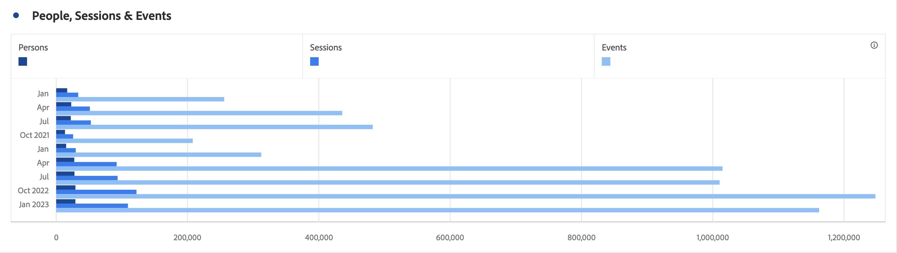
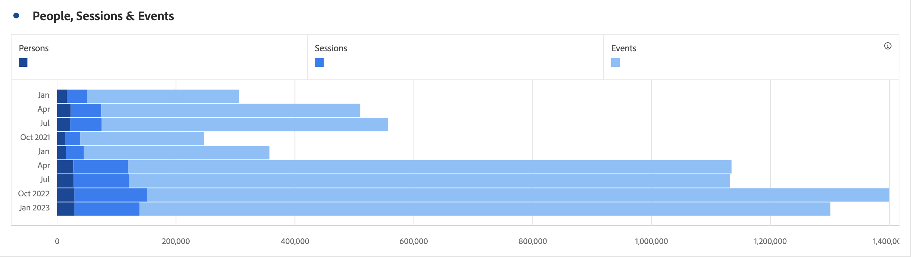
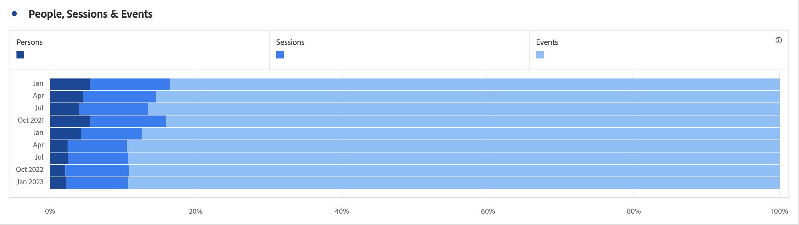

# Barre orizzontali (sovrapposte)

>[!BEGINSHADEBOX]

_In questo articolo vengono documentate le visualizzazioni Barre orizzontali e Barre orizzontali sovrapposte in_  _&#x200B;**Customer Journey Analytics**._ _Vedere [Barre orizzontali e Barre orizzontali sovrapposte](https://experienceleague.adobe.com/it/docs/analytics/analyze/analysis-workspace/visualizations/horizontal-bar) per la versione_  _&#x200B;**Adobe Analytics** di questo articolo._

>[!ENDSHADEBOX]

La visualizzazione a barre orizzontali ha un’opzione standard e sovrapposta.

## A barre orizzontali {#horizontal-bar}

<!-- markdownlint-disable MD034 -->

>[!CONTEXTUALHELP]
>id="workspace_horizontalbar_button"
>title="A barre orizzontali"
>abstract="Crea una visualizzazione a barre orizzontali per rappresentare diversi valori per una o più metriche."

<!-- markdownlint-enable MD034 -->

La visualizzazione  **[!UICONTROL Barra orizzontale]** mostra barre orizzontali che rappresentano diversi valori in una o più metriche.

## Barre orizzontali sovrapposte {#horizontal-bar-stacked}

<!-- markdownlint-disable MD034 -->

>[!CONTEXTUALHELP]
>id="workspace_horizontalbarstacked_button"
>title="Barre orizzontali sovrapposte"
>abstract="Crea una visualizzazione a barre orizzontali per rappresentare diversi valori per una o più metriche sovrapposte."

<!-- markdownlint-enable MD034 -->

La visualizzazione  **[!UICONTROL Barre orizzontali sovrapposte]** è simile alla [!UICONTROL Barre orizzontali], ma le barre della serie sono sovrapposte.

Utilizza l&#39;opzione **[!UICONTROL 100% in pila]** in  **[!UICONTROL Impostazioni]** per trasformare il grafico in una visualizzazione con pila 100%.

>[!BEGINSHADEBOX]

Per un video demo, consulta  [Visualizzazione area](https://experienceleague.adobe.com/it/docs/customer-journey-analytics-learn/tutorials/analysis-workspace/visualizations/add-bar-visualizations){target="_blank"}.

>[!ENDSHADEBOX]

>[!MORELIKETHIS]
>
>[Aggiungi una visualizzazione a un pannello](/help/analysis-workspace/visualizations/freeform-analysis-visualizations.md#add-visualizations-to-a-panel)
>[Impostazioni di visualizzazione](/help/analysis-workspace/visualizations/freeform-analysis-visualizations.md#settings)
>[Menu di scelta rapida della visualizzazione](/help/analysis-workspace/visualizations/freeform-analysis-visualizations.md#context-menu)
>

