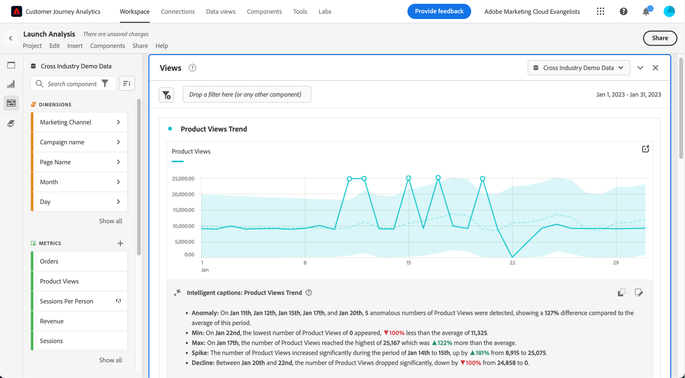

# Sottotitoli intelligenti

{{release-limited-testing}}

I sottotitoli intelligenti utilizzano la scienza dei dati per fornire informazioni in linguaggio naturale utili per le visualizzazioni di Workspace. La versione iniziale fornisce informazioni generate automaticamente per [Linea](line.md) visualizzazione. Seguiranno altre visualizzazioni.

I sottotitoli intelligenti sono rivolti a:

* Analisti che hanno bisogno di storie da condividere con altri utenti. Gli analisti hanno bisogno di queste informazioni per poter fornire contesto ai loro utenti.
* Utenti aziendali che desiderano scoprire rapidamente attività di alto livello.

I sottotitoli sono disponibili per tutti gli utenti di CJA e non richiedono autorizzazioni speciali.

## Lancio di sottotitoli intelligenti {#launch}

Per avviare i sottotitoli generati automaticamente per una visualizzazione delle linee, fai clic sul pulsante **[!UICONTROL Intelligent captions]** in alto a destra nella visualizzazione.

Ora vengono generate informazioni in linguaggio naturale.

Se salvi il progetto a questo punto e lo ricarichi in seguito, le didascalie vengono aggiornate automaticamente con nuovi dati. Lo stesso vale per i progetti pianificati e i file PDF esportati da questo progetto.

## Visualizzare e interpretare le didascalie {#view}

Di seguito è riportato un esempio dell’aspetto delle didascalie:

## Copia negli Appunti {#copy}

È possibile copiare le didascalie negli Appunti e incollarle in un Powerpoint o in un altro strumento. Trova il **[!UICONTROL Copy captions to clipboard]** in alto a destra nella finestra di dialogo didascalie.

## Modificare le didascalie {#edit}

È possibile modificare le didascalie, ad esempio nascondere o nascondere una particolare categoria di informazioni. Ad esempio, se non desideri informazioni sull’ordine minimo, puoi solo nasconderlo e fare clic su applica e non verrà più visualizzato.

1. Fai clic su **[!UICONTROL Edit intelligent captions display]** accanto all’icona Appunti.

1. Nella finestra di dialogo di modifica, fai clic sull’icona occhio accanto alle informazioni da nascondere.

1. Fai clic su **[!UICONTROL Apply]** (Usa modello di attribuzione non predefinito).

Utilizza lo stesso processo per visualizzare le didascalie.

## Esportare i sottotitoli {#export}

È possibile **esportare sottotitoli tramite PDF**, purché il progetto venga salvato con le didascalie generate.

## Disattiva didascalie {#toggle}

Se preferisci non generare didascalie intelligenti, puoi disattivare questa funzione andando nelle preferenze di visualizzazione e deselezionando **[!UICONTROL Show intelligent captions]**.

## Riordinare le didascalie {#reorder}

Per riordinare la visualizzazione delle didascalie, trascinare una didascalia in una nuova posizione.