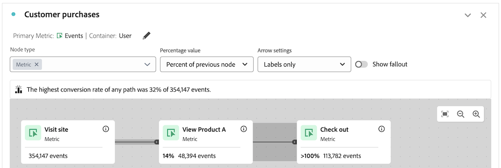

# Risoluzione dei problemi dell’area di lavoro del percorso

La visualizzazione area di lavoro Percorso consente di analizzare e ottenere informazioni approfondite sui percorsi forniti a utenti e clienti.

Per ulteriori informazioni sull&#39;area di lavoro Percorso, vedere [Panoramica sull&#39;area di lavoro Percorso](/help/analysis-workspace/visualizations/journey-canvas/journey-canvas.md) e [Configurare una visualizzazione dell&#39;area di lavoro Percorso](/help/analysis-workspace/visualizations/journey-canvas/configure-journey-canvas.md).

Le seguenti informazioni possono essere utili per risolvere eventuali problemi non desiderati, ad esempio i nodi che arrivano in un secondo momento nel percorso e che presentano un conteggio percentuale o numerico più elevato rispetto ai nodi che arrivano in un secondo momento nel percorso.

## Nodi con una percentuale o un valore superiore rispetto ai nodi precedenti

Nell’area di lavoro del Percorso, i nodi che si trovano in una fase successiva del percorso possono mostrare un conteggio percentuale o numerico più elevato rispetto ai nodi che si trovano in una fase precedente del percorso.

In altre parole, a differenza delle visualizzazioni Abbandono, che sono sempre a forma di funnel (con una partecipazione che diminuisce con ogni passaggio), le visualizzazioni Area di lavoro Percorso possono avere una partecipazione più elevata nei passaggi successivi del percorso rispetto ai passaggi precedenti.

Ciò può verificarsi nei seguenti scenari:

* Quando si utilizza una metrica primaria diversa da Persone o Sessioni

* Quando più percorsi convergono in un singolo nodo

### Il percorso utilizza una metrica primaria diversa da Persone o Sessione

Poiché l’area di lavoro del Percorso consente di utilizzare qualsiasi metrica come metrica principale, ciò può comportare la visualizzazione di nodi che arrivano in un secondo momento nel percorso e mostrano un conteggio percentuale o numerico più elevato rispetto ai nodi che arrivano in un primo momento nel percorso.

Il percorso utilizzato negli scenari seguenti è configurato con queste impostazioni:

* **[!UICONTROL Person]** è impostato come contenitore

* **[!UICONTROL Event]** è impostato come metrica principale

#### Scenario 1: l&#39;utente A segue il percorso del percorso nella prima sessione. In una sessione successiva, l’utente dispone di un evento che corrisponde solo a un nodo successivo.

Supponiamo che l’utente A visiti il sito e completi il percorso (Nodo 1: &quot;Visita il sito&quot; > Nodo 2: &quot;Visualizza il prodotto A&quot; > Nodo 3: &quot;Estrai&quot;). Poiché l’utente A aveva un evento che corrispondeva a ciascun nodo del percorso in ordine, viene conteggiato un evento su ciascun nodo del percorso.

Ora, supponiamo che l’utente A visiti di nuovo il sito in una sessione successiva. Poiché l&#39;utente A ha già completato il percorso in una sessione precedente seguendo il percorso del percorso, ciò significa che ogni volta che l&#39;utente A ha un evento che corrisponde a qualsiasi nodo del percorso, anche se l&#39;utente A non ha seguito il percorso del percorso nella sessione corrente, viene conteggiato un evento sul nodo pertinente del percorso. Ad esempio, se l’utente A estrae, viene conteggiato un evento sul nodo &quot;Estrai&quot;. Questo può comportare una percentuale e un numero più elevati sul nodo &quot;Check-out&quot; rispetto al nodo precedente, &quot;Visualizza prodotto A&quot;.

In questo esempio, l’impostazione contenitore del percorso &quot;Persona&quot; svolge un ruolo fondamentale nel determinare che l’evento sul terzo nodo (&quot;Check-out&quot;) viene conteggiato nella sessione successiva.

In alternativa, se l’impostazione del contenitore fosse stata impostata su &quot;Session&quot; (Sessione), l’evento che si è verificato solo sul terzo nodo nella visita successiva non sarebbe stato conteggiato nel percorso, perché le statistiche mostrate nel percorso sarebbero state vincolate a una singola sessione definita per una determinata persona. Per ulteriori informazioni sull&#39;impostazione del contenitore, vedere [Inizia a creare una visualizzazione dell&#39;area di lavoro del Percorso](/help/analysis-workspace/visualizations/journey-canvas/configure-journey-canvas.md#begin-building-a-journey-canvas-visualization) nell&#39;articolo [Configura una visualizzazione dell&#39;area di lavoro del Percorso](/help/analysis-workspace/visualizations/journey-canvas/configure-journey-canvas.md)

<!-- The time allotted for users to move along the path is determined by the container setting. Because "Person" is selected as the container setting in this example, people who followed the journey's path in one session (moving from Node 1 to Node 2 and to Node 3) met the criteria of the journey. On any subsequent visits to the site, any event they have that matches any node on the journey is counted on that node. -->

#### Scenario 2: l&#39;utente B esce dal percorso

Supponiamo che l’utente B visiti il sito e non completi il percorso (visita il sito, visualizza il prodotto B e quindi estrae). In questo caso, un evento viene conteggiato per il nodo iniziale del percorso, &quot;Visita sito&quot;, ma un evento non viene conteggiato per i nodi rimanenti e l’utente B esce dal percorso. Anche se l&#39;utente B è stato estratto, un evento non viene conteggiato sul terzo nodo (&quot;Check-out&quot;) perché l&#39;utente B non ha completato il percorso visualizzando il prodotto A prima del check-out.

Questo perché gli eventi vengono conteggiati per ogni nodo solo quando le persone seguono il &quot;percorso finale&quot; del percorso. Ciò significa che gli eventi vengono conteggiati solo se la persona alla fine si sposta da un nodo all’altro, indipendentemente da eventuali eventi che si verificano tra i 2 nodi.

### Il percorso ha più percorsi che convergono in un singolo nodo

L’area di lavoro di percorso consente di includere più nodi iniziali in un singolo percorso, con conseguente molteplicità dei percorsi. Questi percorsi possono convergere in un nodo comune, facendo sì che i nodi che arrivano più avanti nel percorso mostrino un conteggio percentuale o numero più alto rispetto ai nodi che arrivano prima nel percorso.

<!--

The journey used in the following scenarios is configured with the following settings:

* **[!UICONTROL Person]** is set as the container

* **[!UICONTROL Event]** is set as the primary metric

#### Scenario 

When a journey contains multiple paths that converge into a single node, the two paths are combined into the single node using the OR operator. This can result in the

-->

### Percentuali percorsi

Anche se i numeri visualizzati su ciascun nodo di un percorso rimangono costanti indipendentemente da ciò che è selezionato nel campo **[!UICONTROL Percentage value]**, le percentuali stesse possono cambiare.

Le sezioni seguenti mostrano come le percentuali possono cambiare per lo stesso percorso, a seconda di quale delle seguenti opzioni è selezionata nel campo **[!UICONTROL Percentage value]**:

+++Percentuale del nodo iniziale

I nodi di questo percorso contengono le statistiche seguenti quando il campo **[!UICONTROL Percentage value]** è impostato su **[!UICONTROL Percent of start node]**:

| Nodo | Statistics (Statistiche) |
|---------|----------|
| Nodo 1: &quot;Visita sito&quot; | In questo percorso, c&#39;erano 354.147 eventi sul sito all&#39;interno dell&#39;intervallo di date di reporting, come mostrato nel nodo iniziale del percorso, &quot;Visita sito&quot;. |
| Nodo 2 - &quot;Visualizza prodotto A&quot; | Del numero totale di eventi visualizzati nel nodo iniziale, il 14% (48.394) corrispondeva ai criteri del secondo nodo del percorso, &quot;Visualizza prodotto A&quot;. |
| Nodo 3: &quot;Estrai&quot; | Del numero totale di eventi visualizzati nel nodo iniziale, il 32% (113.782) corrispondeva ai criteri del terzo nodo del percorso, &quot;Check-out&quot;. |

+++

+++Percentuale del nodo precedente

I nodi di questo percorso contengono le statistiche seguenti quando il campo **[!UICONTROL Percentage value]** è impostato su **[!UICONTROL Percent of previous node]**:

| Nodo | Statistics (Statistiche) |
|---------|----------|
| Nodo 1: &quot;Visita sito&quot; | In questo percorso, c&#39;erano 354.147 eventi sul sito all&#39;interno dell&#39;intervallo di date di reporting, come mostrato nel nodo iniziale del percorso, &quot;Visita sito&quot;. |
| Nodo 2 - &quot;Visualizza prodotto A&quot; | Del numero totale di eventi visualizzati nel nodo precedente, il 14% (48.394) corrispondeva ai criteri del secondo nodo del percorso, &quot;Visualizza prodotto A&quot;. |
| Nodo 3: &quot;Estrai&quot; | Del numero totale di eventi visualizzati nel nodo precedente, più del 100% (113.782) corrispondeva ai criteri del terzo nodo del percorso, &quot;Check-out&quot;. |

+++

+++Percentuale del totale

I nodi di questo percorso contengono le statistiche seguenti quando il campo **[!UICONTROL Percentage value]** è impostato su **[!UICONTROL Percent of total]**:

| Nodo | Statistics (Statistiche) |
|---------|----------|
| Nodo 1: &quot;Visita sito&quot; | In questo percorso, c&#39;erano 354.147 eventi sul sito all&#39;interno dell&#39;intervallo di date di reporting, come mostrato nel nodo iniziale del percorso, &quot;Visita sito&quot;. |
| Nodo 2 - &quot;Visualizza prodotto A&quot; | Sul numero totale di eventi, meno dell’1% (48.394) corrispondeva ai criteri del secondo nodo del percorso, &quot;Visualizza prodotto A&quot;. |
| Nodo 3: &quot;Estrai&quot; | Del numero totale di eventi, l&#39;1% (113.782) corrispondeva ai criteri del terzo nodo del percorso, &quot;Check-out&quot;. |

+++

## Compatibilità tra la metrica contenitore e la metrica principale

Puoi configurare il contenitore dell’area di lavoro del Percorso come Persona (che utilizza la metrica Persone) o Sessione (che utilizza la metrica Sessioni).

Assicurati di scegliere una metrica principale compatibile con la metrica contenitore attualmente selezionata. La maggior parte delle metriche è compatibile con le metriche contenitore disponibili. Tuttavia, è necessario evitare alcune combinazioni di metriche contenitore e metriche primarie.

Ad esempio, l’utilizzo di Persona come contenitore con Sessione come metrica principale può causare risultati non desiderati.

<!--

## Percentages that exceed 100%

The following configurations can result in nodes that show percentages that exceed 100%:

* When the **[!UICONTROL Percentage value]** field is set to **[!UICONTROL Percent of total]** or **[!UICONTROL Percent of start node]**, and a primary metric is selected that results in less data for the start node than on subsequent nodes.

  For example, if Revenue is selected as the primary metric, and no revenue is being realized on the primary metric, then on any node where revenue is being realized will show as exceeding 100%. 

-->
