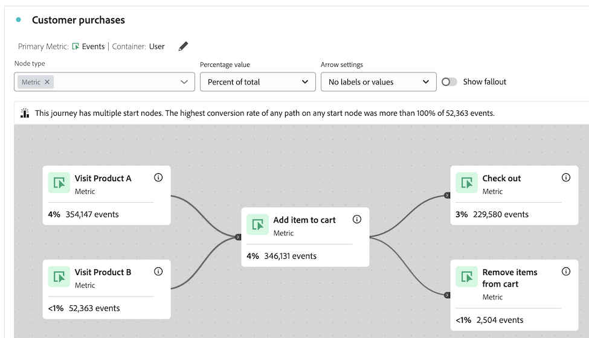

# Panoramica dell’area di lavoro del percorso {#journey-canvas-overview}

<!-- markdownlint-disable MD034 -->

>[!CONTEXTUALHELP]
>id="cja_journeycanvas_button"
>title="Area di lavoro del percorso"
>abstract="Mostra il modo in cui le persone procedono attraverso o escono da una serie di punti di contatto. Da utilizzare per percorsi con più punti di ingresso e percorsi o per analizzare percorsi creati in Journey Optimizer."

<!-- markdownlint-enable MD034 -->

<!-- markdownlint-disable MD034 -->

>[!CONTEXTUALHELP]
>id="cja_journeycanvas_panel"
>title="Area di lavoro del percorso"
>abstract="Analizza il modo in cui le persone procedono attraverso o escono da un percorso definito. Crea analisi dei percorsi degli utenti creando un grafico flessibile con nodi e frecce che rappresentano qualsiasi combinazione di eventi, elementi della dimensione e segmenti. Trascina i nodi nell’area di lavoro per riorganizzare gli eventi e le condizioni del percorso. Man mano che procedi, i dati vengono aggiornati di conseguenza.   La clientela con accesso ad Adobe Journey Optimizer può analizzare i percorsi di Journey Optimizer esistenti."

<!-- markdownlint-enable MD034 -->

<!-- markdownlint-disable MD034 -->

>[!CONTEXTUALHELP]
>id="journeycanvas_button"
>title="Area di lavoro del percorso"
>abstract="Mostra il modo in cui le persone procedono attraverso o escono da una serie di punti di contatto. Da utilizzare per percorsi con più punti di ingresso e percorsi o per analizzare percorsi creati in Journey Optimizer."

<!-- markdownlint-enable MD034 -->

<!-- markdownlint-disable MD034 -->

>[!CONTEXTUALHELP]
>id="journeycanvas_panel"
>title="Area di lavoro del percorso"
>abstract="Analizza il modo in cui le persone procedono attraverso o escono da un percorso definito. Crea analisi dei percorsi degli utenti creando un grafico flessibile con nodi e frecce che rappresentano qualsiasi combinazione di eventi, elementi della dimensione e segmenti. Trascina i nodi nell’area di lavoro per riorganizzare gli eventi e le condizioni del percorso. Man mano che procedi, i dati vengono aggiornati di conseguenza.   La clientela con accesso ad Adobe Journey Optimizer può analizzare i percorsi di Journey Optimizer esistenti."

<!-- markdownlint-enable MD034 -->

>[!BEGINSHADEBOX]

_Questo articolo descrive la visualizzazione dell’area di lavoro del percorso in_  _&#x200B;**Customer Journey Analytics** Nessuna visualizzazione equivalente in **Adobe Analytics**._

>[!ENDSHADEBOX]

La visualizzazione dell’area di lavoro del percorso consente di analizzare e ottenere informazioni approfondite sui percorsi forniti agli utenti e alla clientela. Consente di definire un percorso da zero o di visualizzarne uno da Journey Optimizer, quindi di vedere in che modo le persone hanno lasciato (abbandonato) o continuato (proseguito) il percorso.

Puoi [generare analisi di percorsi di utenti](/help/analysis-workspace/visualizations/journey-canvas/configure-journey-canvas.md) utilizzando qualsiasi combinazione di eventi, elementi dimensionali, segmenti e intervalli di date per creare nodi di percorso. Connetti i nodi per creare il flusso del percorso e includi più percorsi e punti di decisione. Trascina i nodi nell’area di lavoro per riorganizzare gli eventi e le condizioni del percorso. I dati vengono aggiornati in tempo reale man mano che apporti le modifiche.

[I nodi sono connessi](/help/analysis-workspace/visualizations/journey-canvas/configure-journey-canvas.md#logic-when-connecting-nodes) come un “percorso finale”, il che significa che i visitatori vengono conteggiati finché si spostano da un nodo all’altro, indipendentemente dagli eventi che si verificano tra i due nodi. Il tempo assegnato agli utenti per spostarsi lungo il percorso è determinato dalle impostazioni del contenitore.

## Funzioni chiave

Le funzioni chiave della visualizzazione dell’area di lavoro del percorso includono:

* Analisi approfondita dell’abbandono e del fallthrough che consente di gestire i percorsi degli utenti più complessi.

* Area di lavoro per la mappatura e la visualizzazione dei vari punti di ingresso, nodi e percorsi di un percorso utente.

* Interazioni tramite trascinamento per l’aggiunta di componenti all’area di lavoro e il riposizionamento dei nodi esistenti.

* Opzione per creare analisi di percorsi degli utenti all’interno dell’area di lavoro del percorso o per crearli automaticamente in base ai percorsi Journey Optimizer.

## Informazioni approfondite potenziali

L’area di lavoro del percorso fornisce informazioni approfondite fruibili per i percorsi più complessi.

### Percorso con il tasso di conversione più alto {#conversion-rate-caption}

L’approfondimento più rilevante in Area di lavoro del percorso viene visualizzata come una didascalia nella parte superiore dell’area stessa.

Questa didascalia riepiloga quale di tutti i percorsi, nel percorso, ha avuto il più alto tasso di conversione.

Se il percorso contiene più nodi iniziali, la didascalia avrà l’aspetto seguente:

Quando il percorso contiene un singolo nodo iniziale, la didascalia si presenta così:

Nell’interpretare questa opzione, prendi in considerazione quanto segue:

* Un _percorso_ è definito come un nodo iniziale connesso tramite frecce a un nodo finale, con un numero qualsiasi di nodi connessi tra loro.

* Il calcolo del tasso di conversione dipende dal tipo di percorso (il numero di nodi iniziali e finali contenuti nel percorso e se i percorsi sono intersecati tra loro).

  La tabella seguente descrive come vengono calcolati i tassi di conversione in base al tipo di percorso:

  | Tipo di percorso | Calcolo del tasso di conversione | Esempio |
  |---------|----------|---------|
  | **Un singolo nodo iniziale e un singolo nodo finale** | Il tasso di conversione viene calcolato dividendo il numero del nodo finale per quello del nodo iniziale. |  |
  | **Un singolo nodo iniziale e più nodi finali** | Il tasso di conversione viene calcolato individuando il nodo finale con il numero più alto e dividendo tale numero per quello del nodo iniziale. |  |
  | **Più percorsi autonomi, ognuno contenente un singolo nodo iniziale e un singolo nodo finale** | Il tasso di conversione viene calcolato dividendo il numero del nodo finale per quello del nodo iniziale. Il percorso con il tasso di conversione più alto è descritto nella didascalia. |  |
  | **Più nodi iniziali che in qualsiasi punto del percorso convergono in un nodo comune** | Il tasso di conversione viene calcolato individuando il nodo finale con il numero più alto e dividendo tale numero per quello del nodo iniziale con il numero più basso. |  |

### Fallthrough, abbandono e altro ancora

Di seguito sono riportati alcuni esempi di altri approfondimenti che l’area di lavoro del percorso può fornire. Puoi scegliere se basare questi approfondimenti su tutte le persone nella visualizzazione dati, su tutte le persone che hanno iniziato il percorso o su tutte le persone del nodo precedente del percorso.

#### Fallthrough

* Numero e percentuale di persone che hanno completato il percorso (arrivate al nodo finale)

* Numero e percentuale di persone arrivate a un determinato nodo del percorso

* Passaggio più comune che segue o precede un dato nodo del percorso

#### Abbandono

* Nodi del percorso in cui le persone generalmente sono uscite dal percorso (non sono mai arrivate ai nodi immediatamente successivi)

#### Dati aggiuntivi per ogni nodo

* Aggiungi una dimensione di raggruppamento su qualsiasi nodo del percorso per visualizzare ulteriori dati per quel nodo specifico

## Scegli tra le visualizzazioni Area di lavoro del percorso, Abbandono o Flusso

La visualizzazione Area di lavoro del percorso presenta analogie con la [visualizzazione Abbandono](/help/analysis-workspace/visualizations/fallout/fallout-flow.md) e la [visualizzazione Flusso](/help/analysis-workspace/visualizations/c-flow/flow.md), ma con differenze importanti.

### Comprendere le differenze

<!-- Information in this snippet is shared between Journey canvas, Fallout, and Flow visualization docs -->

{{journey-visualization-comparisons}}

### Quando utilizzare l’Area di lavoro del percorso

L’Area di lavoro del percorso è essenziale per:

* Analisi dell’abbandono che coinvolge percorsi con più punti di ingresso e percorsi.

* Percorsi non lineari con più punti di ingresso e percorsi, con una sequenza di pagine predefinita.

* Analisi esplorativa ad hoc basata su un percorso predefinito.

* Analisi che richiede una metrica primaria diversa da Sessione, Persona o Occorrenze.

* Analisi più approfondita dei percorsi originati in Adobe Journey Optimizer.

Utilizza [la tabella precedente](#understand-the-differences) per comprendere le differenze tra le visualizzazioni Area di lavoro del percorso, Abbandono e Flusso.

## Analizzare i percorsi Journey Optimizer

>[!NOTE]
>
>Se la tua organizzazione non ha accesso a Journey Optimizer, puoi comunque [generare analisi nell’Area di lavoro del percorso](#build-analyses-in-customer-journey-analytics).

L’analisi dei percorsi Journey Optimizer nell’Area di lavoro del percorso fornisce informazioni approfondite e fruibili sul modo in cui le persone interagiscono con un percorso.

Quando analizzi un percorso Journey Optimizer nell’Area di lavoro del percorso, il percorso viene visualizzato con ordine, sequenza e struttura che sono gli stessi di Journey Optimizer. Se apporti modifiche significative a un percorso nell’Area di lavoro del percorso, [le modifiche non saranno più sincronizzate con Journey Optimizer](#synchronization-between-journey-optimizer-and-journey-canvas).

### Vantaggi dell’analisi dei percorsi Journey Optimizer con l’Area di lavoro del percorso

L’Area di lavoro del percorso fornisce un’analisi approfondita e completa che non è possibile eseguire in Journey Optimizer.

L’utilizzo dell’Area di lavoro del percorso per analizzare i percorsi creati in Journey Optimizer offre diversi vantaggi:

* Crea eventi utilizzando qualsiasi dimensione, metrica, segmento o intervallo di date di Customer Journey Analytics.

  In Journey Optimizer, un utente tecnico deve creare un evento prima di poterlo aggiungere a un percorso.

* Crea tipi di pubblico in base a un nodo personalizzato che hai creato (avvia Audience builder in Customer Journey Analytics).

  In Journey Optimizer, puoi creare tipi di pubblico solo per attività predefinite.

* Analizzare fallthrough e abbandono

* Suddividere gli eventi con qualsiasi dimensione

* Combinare gli eventi

* Connettere gli eventi

* Rinominare ed eliminare gli eventi

* Molto altro

### Sincronizzazione tra Journey Optimizer e Area di lavoro del percorso

Per comprendere la sincronizzazione tra Journey Optimizer e l’area di lavoro del Percorso, considera i seguenti comportamenti:

* **La sincronizzazione dei dati è unidirezionale**

  Dopo aver creato un’analisi di un percorso Journey Optimizer nell’Area di lavoro del percorso, i dati vengono sincronizzati in una sola direzione, da Journey Optimizer all’Area di lavoro del percorso. Ciò significa che le modifiche apportate a un percorso nell’Area di lavoro del percorso non vengono mai riflesse in Journey Optimizer.

* **La modifica di un percorso nell&#39;area di lavoro del Percorso interrompe la sincronizzazione**

  Le modifiche apportate a un percorso in Journey Optimizer vengono sincronizzate con l&#39;area di lavoro del Percorso [solo se il percorso non è stato modificato in modo significativo nell&#39;area di lavoro del Percorso](#differences-after-modifying-a-journey-in-journey-canvas). Dopo aver modificato un percorso nell’Area di lavoro del percorso, tutte le modifiche apportate al percorso in Journey Optimizer non vengono riportate nell’Area di lavoro del percorso. Per visualizzare le modifiche riflesse nell’Area di lavoro del percorso, puoi eliminare e [ricreare il percorso nell’Area di lavoro del percorso](/help/analysis-workspace/visualizations/journey-canvas/configure-journey-canvas.md).

* **L&#39;utilizzo di un collegamento &quot;Condividi con chiunque&quot; richiede che il progetto venga salvato in Customer Journey Analytics dopo le modifiche apportate in Journey Optimizer**

  Quando si utilizza un collegamento &quot;Condividi con qualcuno&quot;, le modifiche apportate in Journey Optimizer non vengono riportate nell’area di lavoro del Percorso fino a quando il progetto non viene salvato in Customer Journey Analytics.

  Per ulteriori informazioni sui collegamenti &quot;Condividi con chiunque&quot;, vedi [Condividi un progetto con qualcuno (non è più necessario)](/help/analysis-workspace/curate-share/share-projects.md#share-a-project-with-anyone-no-login-required) in [Condividi progetti](/help/analysis-workspace/curate-share/share-projects.md).

### Differenze dopo la modifica di un percorso nell’Area di lavoro del percorso {#differences-after-modifying}

Dopo che hai modificato un percorso Journey Optimizer nell’Area di lavoro del percorso, possono verificarsi modifiche nell’elaborazione dei dati, nelle funzioni disponibili e nel comportamento di sincronizzazione.

Se apporti una modifica significativa a un percorso Journey Optimizer nell’Area di lavoro del percorso, possono verificarsi modifiche nell’elaborazione dei dati, nelle funzioni disponibili e nel comportamento di sincronizzazione. Una modifica significativa include uno dei seguenti elementi:

* Aggiunta o rimozione di un nodo

* Aggiunta o rimozione di una freccia tra nodi

* Modifica dei componenti su un nodo

Se apporti altre modifiche a un percorso Journey Optimizer nell’Area di lavoro del percorso, ad esempio se trascini un nodo o aggiungi un raggruppamento, le differenze descritte nelle sezioni seguenti non sono applicabili.

>[!NOTE]
>
>Per ripristinare lo stato originale del percorso, puoi premere Ctrl+z dopo aver apportato la prima modifica nell’Area di lavoro del percorso. In alternativa, puoi eliminare e [ricreare il percorso nell’Area di lavoro del percorso](/help/analysis-workspace/visualizations/journey-canvas/configure-journey-canvas.md)

#### Differenze di elaborazione dati

Dopo aver modificato un percorso Journey Optimizer nell’Area di lavoro del percorso, potresti notare delle modifiche ai dati se il percorso contiene metriche con modelli di attribuzione non predefiniti.

Questo perché, a differenza di Journey Optimizer, l’Area di lavoro del percorso consente di applicare più dimensioni all’interno di un singolo percorso. Questa funzionalità indica che [l’attribuzione metrica](/help/data-views/component-settings/attribution.md) non è supportata.

#### Differenze nelle funzioni

Dopo aver modificato un percorso Journey Optimizer nell&#39;area di lavoro del Percorso, le opzioni disponibili nel campo a discesa [!UICONTROL **Impostazioni freccia**] variano a seconda delle modifiche apportate. Per ulteriori informazioni, consulta [Configurare le impostazioni](/help/analysis-workspace/visualizations/journey-canvas/configure-journey-canvas.md).

Il campo [!UICONTROL **Tipo di nodo**] è disponibile solo in Journey Optimizer. Non è disponibile quando visualizzi un percorso Journey Optimizer nell’Area di lavoro del percorso, indipendentemente dal fatto che tu apporti modifiche al percorso nell’Area di lavoro del percorso.

#### Differenze di sincronizzazione

Le modifiche apportate a un percorso in Journey Optimizer vengono sincronizzate con l’Area di lavoro del percorso solo se il percorso rimane invariato nell’Area di lavoro del percorso.

Dopo aver modificato un percorso Journey Optimizer nell’Area di lavoro del percorso, tutte le modifiche apportate al percorso in Journey Optimizer non vengono riportate nell’Area di lavoro del percorso. Per visualizzare le modifiche riflesse nell’Area di lavoro del percorso, puoi eliminare e [ricreare il percorso nell’Area di lavoro del percorso](/help/analysis-workspace/visualizations/journey-canvas/configure-journey-canvas.md).

### Differenze di terminologia tra Journey Optimizer e Customer Journey Analytics

Alcuni termini che significano una cosa in Journey Optimizer significano qualcosa di diverso in Customer Journey Analytics. Quando si utilizza un’Area di lavoro del percorso, vengono utilizzati i termini di Customer Journey Analytics.

| Termine | Area di lavoro del percorso | Journey Optimizer |
|---------|----------|---------|
| **Evento** | Una delle diverse metriche standard disponibili in Customer Journey Analytics. Questa metrica conta elementi quali ricavi, abbonamenti o lead generate. | Categoria di attività che attiva un percorso personalizzato, ad esempio un acquisto online. |

### Analizzare un percorso Journey Optimizer nell’Area di lavoro del percorso

Per informazioni sull’analisi di un percorso Journey Optimizer nell’Area di lavoro del percorso, consulta [Configurare una visualizzazione dell’Area di lavoro del percorso](/help/analysis-workspace/visualizations/journey-canvas/configure-journey-canvas.md).

## Generare analisi nell’Area di lavoro del percorso

Puoi generare analisi nell’Area di lavoro del percorso basate su qualsiasi dimensione o metrica disponibile in Analysis Workspace. In alternativa, puoi analizzare i percorsi creati in Journey Optimizer. Per ulteriori informazioni, consulta [Configurare le visualizzazioni in un’Area di lavoro del percorso](/help/analysis-workspace/visualizations/journey-canvas/configure-journey-canvas.md).

>[!MORELIKETHIS]
>
> * [Guida alla visualizzazione Area di lavoro Percorsi in Adobe Customer Journey Analytics](https://experienceleaguecommunities.adobe.com/t5/adobe-analytics-blogs/a-guide-to-journey-canvas-visualization-in-adobe-customer/ba-p/737857)

