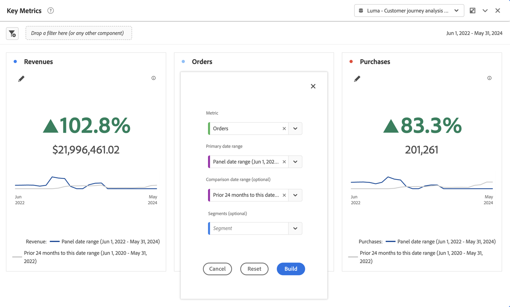

# Riepilogo delle metriche chiave {#key-metric-summary}

>[!CONTEXTUALHELP]
>id="workspace_keymetricsummary_button"
>title="Riepilogo delle metriche chiave"
>abstract="Crea una visualizzazione che combina grafici a linee, a variazione di riepilogo e a numero di riepilogo. Utilizza questa visualizzazione per confrontare la tendenza delle metriche importanti tra due periodi di tempo."

>[!BEGINSHADEBOX]

_Questo articolo descrive la visualizzazione del riepilogo delle metriche chiave in_  _&#x200B;**Customer Journey Analytics**._ _Consulta [Riepilogo delle metriche chiave](https://experienceleague.adobe.com/it/docs/analytics/analyze/analysis-workspace/visualizations/key-metric) per la versione_  _&#x200B;**Adobe Analytics** di questo articolo._

>[!ENDSHADEBOX]

La visualizzazione  **[!UICONTROL Riepilogo metriche chiave]** consente di vedere come si presenta una metrica importante in un singolo arco temporale. Consente inoltre di confrontare le prestazioni delle metriche in due archi temporali. Fornisce i vantaggi di più visualizzazioni combinate in un’unica visualizzazione:

* La visualizzazione **[!UICONTROL Riga]** mostra la tendenza della metrica per gli intervalli di date principali e di confronto

* **[!UICONTROL Variazione percentuale di riepilogo]** mostra l&#39;aumento o la diminuzione della metrica tra gli intervalli di date principali e di confronto

* Valore totale corrente ([!UICONTROL **numero di riepilogo**]) per la metrica

## Casi d’uso

Questa visualizzazione tratta diversi casi d’uso comuni, tra cui:

* Un analista che cerca di capire l’aspetto della creazione di opportunità questo mese rispetto allo stesso arco temporale dello scorso anno.

* Un addetto al marketing che esplora in che modo la generazione di lead per uno specifico tipo di lead è cambiata da questo mese all’ultimo mese.

* Un dirigente che vuole capire come sono cambiate le prenotazioni da questo trimestre all’ultimo trimestre.

## Utilizzo

1. Aggiungi una visualizzazione  **[!UICONTROL Riepilogo metriche chiave]**. Consulta [Aggiungere una visualizzazione a un pannello](freeform-analysis-visualizations.md#add-visualizations-to-a-panel).

1. Configura la visualizzazione selezionando una **[!UICONTROL metrica]**, un **[!UICONTROL intervallo di date primario]**, un **[!UICONTROL intervallo di date di confronto]** (facoltativo) e un **[!UICONTROL segmento]** (facoltativo):

   

   | Opzione | Descrizione |
   | --- | --- |
   | **[!UICONTROL Metrica]** | Seleziona la metrica da esaminare. Sono supportate tutte le metriche. |
   | **[!UICONTROL Intervallo date primario]** | L’intervallo di date corrente per la tabella a forma libera.
Scegli uno degli intervalli di date disponibili nella visualizzazione dati.
 
Scegli [!UICONTROL **Intervallo date del pannello**] se desideri utilizzare lo stesso intervallo di date utilizzato nel pannello in cui si trova la visualizzazione.
 |
   | **[!UICONTROL Intervallo date di confronto]** | L’intervallo di date che desideri confrontare con l’intervallo di date principale. |
   | **[!UICONTROL Segmento (facoltativo)]** | Eventuale segmento che ti interessa per questo riepilogo. |

   {style="table-layout:auto"}

   >[!NOTE]
   >
   >Quando il campo [!UICONTROL **Intervallo date primario**] è impostato su [!UICONTROL **Intervallo date pannello**], l&#39;intervallo di date **[!UICONTROL Confronto]** può essere aggiornato automaticamente, a seconda che l&#39;opzione **[!UICONTROL Intervallo date confronto]** scelta sia relativa all&#39;intervallo date primario o fissa.
   >
   >* **Relativo:** Se il campo **[!UICONTROL Intervallo date di confronto]** è impostato su un&#39;opzione relativa all&#39;intervallo date primario (ad esempio [!UICONTROL **Giorno precedente**], [!UICONTROL **Stesso giorno ultima settimana**], [!UICONTROL **Stesso giorno 4 settimane prima**] e così via), eventuali aggiornamenti al campo [!UICONTROL **Intervallo date primario**] causeranno l&#39;aggiornamento automatico dell&#39;intervallo date di confronto **[!UICONTROL 13&rbrace; al periodo immediatamente successivo all&#39;intervallo date del pannello.]**
   >* **Fisso:** se il campo [!UICONTROL **Intervallo date di confronto**] è impostato su un intervallo di date fisso (ad esempio **3 febbraio 2023**), le modifiche apportate al campo [!UICONTROL **Intervallo di date principale**] o all’intervallo date del pannello non hanno alcun effetto sull’[!UICONTROL **Intervallo date di confronto**]. Tuttavia, eventuali aggiornamenti all’intervallo di date del pannello causano l’aggiornamento automatico dell’[!UICONTROL **Intervallo di date principale**].

1. Seleziona **[!UICONTROL Genera]**.

<!--
## How the Key Metric Summary visualization handles the comparison date range

(This will probably release in January. Per Jaden Howell)

* If the primary date range is set to the panel date range, there are 2-6 options that are considered 'relative' to the primary date range. These usually include the previous period (same amount of time immediately proceeding the primary date range), and 52 weeks prior to that date range.

* If the comparison date range is set to one of the 'relative' options, upon updating the primary date range, the comparison date range updates to the period immediate preceding the panel date range.

* If your comparison date range is *not* set to a 'relative' option, then updating the panel date range changes your primary date range, but has no effect on the comparison date range.

**Example 1**

Primary date range is set to the panel's date range: 'Yesterday'
Comparison date range is set to a relative date range, one of: 'Previous day', 'Same day last week', 'Same day 4 weeks prior', 'Same day last month', 'Same day last year', or 'Same day 52 weeks prior'.
When I change the panel's date range to 'This month', the comparison date range will update to 'Previous month'.

**Example 2**
 
Primary date range is set to the panel's date range: 'Yesterday'
Comparison date range is set to a non-relative date range, such as 'Feb 2nd, 2022', 'Highest sales day', 'Last week', etc. 

>[!NOTE]
>
>Last week is relative to the day the project is opened on, but it is not based on the panel's date range of 'Yesterday'. In other cases, such as if the panel's date range was 'This week', it may be relative.

When you change the panel's date range to '4 days ago', the comparison date range remains at the previous selection. 
-->

L’output del riepilogo delle metriche chiave è simile al seguente:

Quando visualizzi questo output, prendi in considerazione quanto segue:

* Il grafico a linee **[!UICONTROL Periodo precedente]** (sempre visualizzato in grigio) corrisponde all&#39;**[!UICONTROL Intervallo date di confronto]** nel passaggio di configurazione.

* Se durante la configurazione non viene specificato un intervallo di date di confronto o se questo è nascosto nelle impostazioni di visualizzazione, viene visualizzato solo il grafico a linee per l’intervallo di date principale. La variazione di riepilogo sarà nascosta.

* Da qui, puoi passare il puntatore sui grafici a linee per vedere le statistiche dei singoli giorni:

## Configurare

Dopo aver creato la visualizzazione, puoi modificare la configurazione originale.

1. Seleziona  **[!UICONTROL Configura visualizzazione]** nella parte superiore della visualizzazione.

   Sarai riportato alla finestra di dialogo della configurazione originale.

1. Modifica le impostazioni come preferisci. Selezionare **[!UICONTROL Reimposta]** per reimpostare le impostazioni correnti. Seleziona **[!UICONTROL Build]** per ricreare la visualizzazione.

## Impostazioni

Come parte delle impostazioni di visualizzazione, sono disponibili impostazioni specifiche di riepilogo delle metriche chiave.

| Impostazione | Descrizione |
| --- | --- |
| **[!UICONTROL Enfatizza variazione percentuale]** | Visualizzare la modifica di riepilogo in grassetto prominente al centro della visualizzazione |
| **[!UICONTROL Enfatizza valore numero]** | Visualizzare il numero di riepilogo in grassetto prominente al centro della visualizzazione |
| **[!UICONTROL Visualizzazione legenda]** | Mostrare o nascondere la legenda nella parte inferiore della visualizzazione |
| **[!UICONTROL Mostra annotazioni]** | Mostrare o nascondere le annotazioni aggiunte da un amministratore |
| **[!UICONTROL Nascondi titolo]** | Nascondi il titolo della visualizzazione. |
| **[!UICONTROL Percentuali]** | Visualizza la visualizzazione in percentuale anziché con un numero. |
| **[!UICONTROL Mostra linee di tendenza]** | Mostra le linee di tendenza nella visualizzazione. |
| **[!UICONTROL Mostra max e min sulle linee di tendenza]** | Mostrare o nascondere valori minimi e massimi nei grafici a linee principali e a linee di confronto |
| **[!UICONTROL Mostra percentuale di confronto e linea di tendenza]** | Mostra o nascondi i dati di confronto. Quando sono nascosti, non vengono visualizzati gli oggetti Grafico a linee di confronto e Variazione di riepilogo. |
| **[!UICONTROL Mostra numero totale]** | Mostrare o nascondere il numero di riepilogo |
| **[!UICONTROL Mostra differenza raw]** | Mostra o nascondi la differenza non elaborata tra il valore totale della metrica nell’intervallo di date principale e l’intervallo di date secondario. |
| **[!UICONTROL Abbrevia valore]** | Seleziona **[!UICONTROL Abbrevia valore]** per abbreviare in modo intelligente il valore numerico. Se questa opzione è selezionata, immetti un numero per definire la quantità di abbreviazione. Ad esempio: <table><tr><td>**Valore originale**</td><td>**Abbreviazione**</td><td>**Risultato**</td></tr><tr><td>12.011.141,25 $</td><td>Non selezionato</td><td align="right">12.011.141,25 $</td></tr><tr><td>12.011.141,25 $</td><td>Selezionato, impostato su 1</td><td align="right">12 milioni $</td></tr><tr><td>12.011.141,25 $</td><td>Selezionato, impostato su 2</td><td align="right">12,0 milioni $</td></tr><tr><td>12.011.141,25 $</td><td>Selezionato, impostato su 2</td><td align="right">12,011 milioni $</td></tr><tr><td>12.011.141,25 $</td><td>Seleziona, imposta su 3</td><td align="right">12,011 milioni $</td></tr></table> |

## Visualizzazione Modifica

Dopo aver generato la visualizzazione, puoi modificare la configurazione originale.

1. Seleziona  nell&#39;angolo superiore destro della visualizzazione.

   Ora ritorni alla [visualizzazione di configurazione](#configure) originale.

1. Modifica la metrica, l’intervallo di date primario, l’intervallo di date del confronto o il segmento come preferisci.

>[!MORELIKETHIS]
>
>[Aggiungere una visualizzazione a un pannello](/help/analysis-workspace/visualizations/freeform-analysis-visualizations.md#add-visualizations-to-a-panel)
>[Impostazioni di visualizzazione](/help/analysis-workspace/visualizations/freeform-analysis-visualizations.md#settings)
>[Menu di scelta rapida della visualizzazione](/help/analysis-workspace/visualizations/freeform-analysis-visualizations.md#context-menu)
