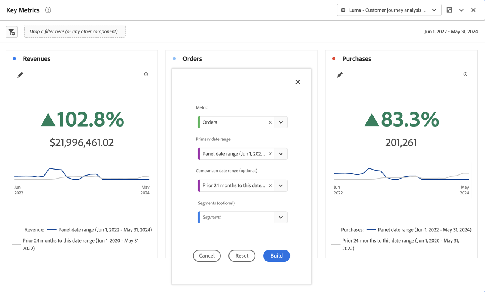

# Riepilogo delle metriche chiave {#key-metric-summary}

<!-- markdownlint-disable MD034 -->

>[!CONTEXTUALHELP]
>id="cja_workspace_keymetricsummary_button"
>title="Riepilogo delle metriche chiave"
>abstract="Crea una visualizzazione simile a una combinazione dei grafici a linee, a variazione di riepilogo e a numero di riepilogo. Utilizza questa visualizzazione per confrontare la tendenza delle metriche importanti tra due periodi di tempo."

<!-- markdownlint-enable MD034 -->

La visualizzazione  **[!UICONTROL Key metric summary]** ti consente di vedere come si presenta una metrica importante in un singolo arco temporale. Consente inoltre di confrontare le prestazioni delle metriche in due archi temporali. Fornisce i vantaggi di più visualizzazioni combinate in un’unica visualizzazione:

* La visualizzazione **[!UICONTROL Line]** mostra la tendenza della metrica per gli intervalli di date principali e di confronto

* **[!UICONTROL Summary percent change]** mostra l&#39;aumento o la diminuzione della metrica tra gli intervalli di date principali e di confronto

* Valore totale corrente ([!UICONTROL **numero di riepilogo**]) per la metrica

Questa visualizzazione tratta diversi casi d’uso comuni, tra cui:

* Un analista che cerca di capire l’aspetto della creazione di opportunità questo mese rispetto allo stesso arco temporale dello scorso anno.

* Un addetto al marketing che esplora in che modo la generazione di lead per uno specifico tipo di lead è cambiata da questo mese all’ultimo mese.

* Un dirigente che vuole capire come sono cambiate le prenotazioni da questo trimestre all’ultimo trimestre.

## Seleziona

1. Aggiungi una visualizzazione  **[!UICONTROL Key metric summary]**. Vedi [Aggiungere una visualizzazione a un pannello](freeform-analysis-visualizations.md#add-visualizations-to-a-panel).

1. Configura la visualizzazione selezionando un **[!UICONTROL Metric]**, un **[!UICONTROL Primary date range]**, un **[!UICONTROL Comparison date range]** (facoltativo) e un **[!UICONTROL Filter]** (facoltativo):

   

   | Opzione | Descrizione |
   | --- | --- |
   | **[!UICONTROL Metric]** | Seleziona la metrica da esaminare. Sono supportate tutte le metriche. |
   | **[!UICONTROL Primary date range]** | L’intervallo di date corrente per la tabella a forma libera. |
   | **[!UICONTROL Comparison date range]** | L’intervallo di date a cui si desidera confrontare l’intervallo di date principale. |
   | **[!UICONTROL Filter (optional)]** | Qualsiasi filtro a cui sei interessato in modo specifico per questo riepilogo. |

   {style="table-layout:auto"}

1. Seleziona **[!UICONTROL Build]**.

<!--## How the Key Metric Summary visualization handles the comparison date range

(This will probably release in January. Per Jaden Howell)

* If the primary date range is set to the panel date range, there are 2-6 options that are considered 'relative' to the primary date range. These usually include the previous period (same amount of time immediately proceeding the primary date range), and 52 weeks prior to that date range.

* If the comparison date range is set to one of the 'relative' options, upon updating the primary date range, the comparison date range updates to the period immediate preceding the panel date range.

* If your comparison date range is *not* set to a 'relative' option, then updating the panel date range changes your primary date range, but has no effect on the comparison date range.

**Example 1**

Primary date range is set to the panel's date range: 'Yesterday'
Comparison date range is set to a relative date range, one of: 'Previous day', 'Same day last week', 'Same day 4 weeks prior', 'Same day last month', 'Same day last year', or 'Same day 52 weeks prior'.
When I change the panel's date range to 'This month', the comparison date range will update to 'Previous month'.

**Example 2**
 
Primary date range is set to the panel's date range: 'Yesterday'
Comparison date range is set to a non-relative date range, such as 'Feb 2nd, 2022', 'Highest sales day', 'Last week', etc. 

>[!NOTE]
>
>Last week is relative to the day the project is opened on, but it is not based on the panel's date range of 'Yesterday'. In other cases, such as if the panel's date range was 'This week', it may be relative.

When you change the panel's date range to '4 days ago', the comparison date range remains at the previous selection. -->

L’output del riepilogo delle metriche chiave è simile al seguente:

* Il grafico a linee **[!UICONTROL Previous period]** (sempre visualizzato in grigio) corrisponde a **[!UICONTROL Comparison date range]** nel passaggio di configurazione.

* Se durante la configurazione non viene specificato un intervallo di date di confronto o se questo è nascosto nelle impostazioni di visualizzazione, viene visualizzato solo il grafico a linee per l’intervallo di date principale. La modifica di riepilogo è nascosta.

* Da qui, puoi passare il cursore del mouse sui grafici a linee per vedere le statistiche dei singoli giorni:

## Configurare

Dopo aver creato la visualizzazione, puoi modificare la configurazione originale.

1. Seleziona  **[!UICONTROL Configure visualization]** nella parte superiore della visualizzazione.

   Viene visualizzata di nuovo la finestra di dialogo di configurazione originale.

1. Modifica le impostazioni come preferisci. Selezionare **[!UICONTROL Reset]** per ripristinare le impostazioni correnti. Seleziona **[!UICONTROL Build]** per ricreare la visualizzazione.

## Impostazioni

Come parte delle impostazioni di visualizzazione, sono disponibili impostazioni specifiche di riepilogo delle metriche chiave.

| Impostazione | Descrizione |
|---|---|
| **[!UICONTROL Summary display type]** | Seleziona tra **[!UICONTROL Emphasize percent change]** o **[!UICONTROL Emphasize number value]**. |
| **[!UICONTROL Show trendlines]** | Mostra le linee di tendenza nella visualizzazione. |
| **[!UICONTROL Show max and min on trendlines]** | Mostra il valore massimo e minimo sulle linee di tendenza. |
| **[!UICONTROL Show comparison percentage and trendline]** | Mostra percentuale di confronto con linea di tendenza. Se non sono selezionati, entrambi sono nascosti. |
| **[!UICONTROL Number value options]** | **[!UICONTROL Show total number]** o **[!UICONTROL Show raw difference]** per il valore numerico. |
| **[!UICONTROL Abbreviate value]** | Selezionare **[!UICONTROL Abbreviate value]** per abbreviare in modo intelligente il valore numerico. Se questa opzione è selezionata, immettere un numero per definire la quantità di abbreviazione. Esempio: <table><tr><td>**Valore originale**</td><td>**Abbreviazione**</td><td>**Risultato**</td></tr><tr><td>12.011.141,25 $</td><td>Non selezionato</td><td  align="right">12.011.141,25 $</td></tr><tr><td>12.011.141,25 $</td><td>Selezionato, impostato su 1</td><td align="right">$ 12 milioni</td></tr><tr><td>12.011.141,25 $</td><td>Selezionato, impostato su 2</td><td  align="right">$ 12,0 milioni</td></tr><tr><td>12.011.141,25 $</td><td>Selezionato, impostato su 2</td><td align="right">$ 12,011 milioni</td></tr><tr><td>12.011.141,25 $</td><td>Seleziona, imposta su 3</td><td align="right">$ 12,011 milioni</td></tr></table> |

>[!MORELIKETHIS]
>
>[Aggiungi una visualizzazione a un pannello](/help/analysis-workspace/visualizations/freeform-analysis-visualizations.md#add-visualizations-to-a-panel)
>[Impostazioni visualizzazione](/help/analysis-workspace/visualizations/freeform-analysis-visualizations.md#settings)
>[Menu di scelta rapida visualizzazione](/help/analysis-workspace/visualizations/freeform-analysis-visualizations.md#context-menu)
>
