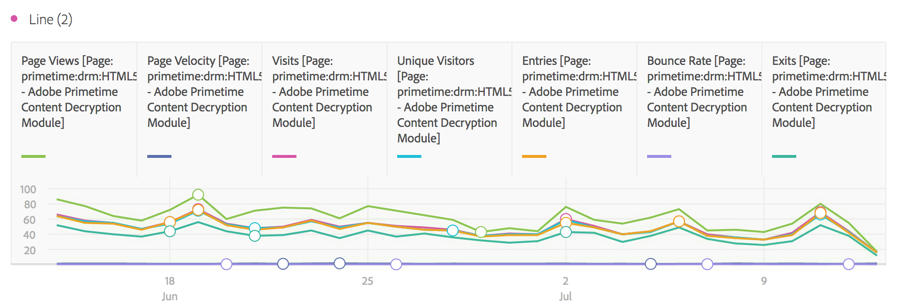

# Linee

>[!NOTE]
>
>Stai visualizzando la documentazione per  Analysis Workspace in Customer Journey Analytics. Il set di funzioni è leggermente diverso da [Analysis Workspace in Adobe  Analytics](https://docs.adobe.com/content/help/it-IT/analytics/analyze/analysis-workspace/home.html)tradizionale. [Ulteriori informazioni...](/help/getting-started/cja-aa.md)

Questa visualizzazione rappresenta le metriche con linee che mostrano come cambiano i valori nel tempo. Un grafico a linee può essere usato solo con una dimensione temporale.

Nelle [impostazioni di visualizzazione](/help/analysis-workspace/visualizations/freeform-analysis-visualizations.md#section_D3BB5042A92245D8BF6BCF072C66624B), un elenco a discesa di granularità permette di cambiare una visualizzazione con tendenza (ad esempio un grafico a linee) da base giornaliera a settimanale, mensile e così via.

