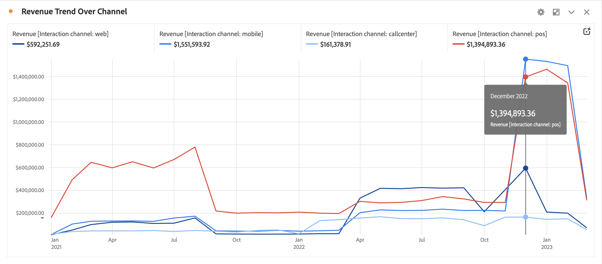
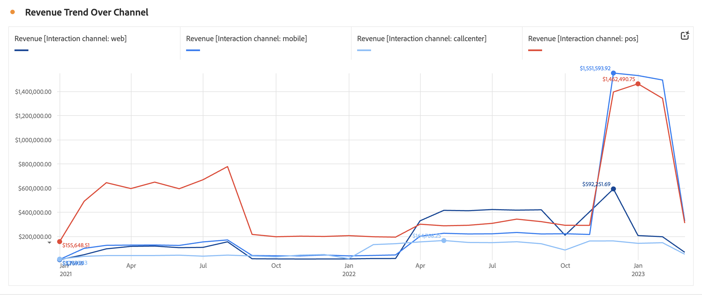
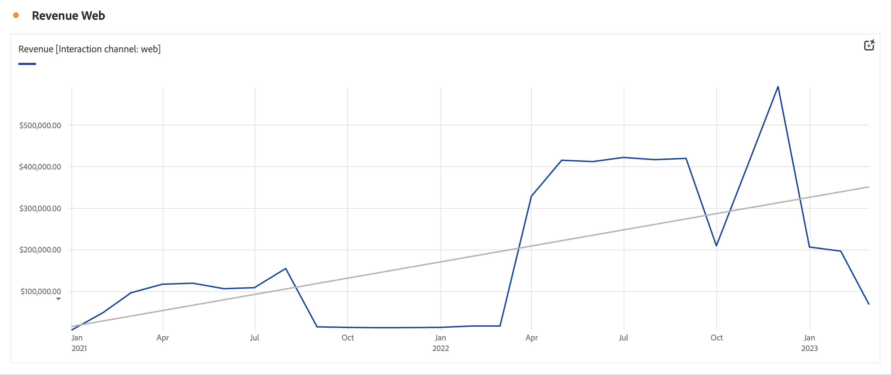

# Linee {#line}

<!-- markdownlint-disable MD034 -->

>[!CONTEXTUALHELP]
>id="workspace_line_button"
>title="Linee"
>abstract="Crea una visualizzazione a linee che mostra come cambiano i valori in un periodo di tempo. Una visualizzazione a linee può essere utilizzata solo quando si usa la dimensione tempo."

<!-- markdownlint-enable MD034 -->

>[!BEGINSHADEBOX]

_In questo articolo viene documentata la visualizzazione Linee in_  _**Customer Journey Analytics**._ _Vedere [Line](https://experienceleague.adobe.com/it/docs/analytics/analyze/analysis-workspace/visualizations/line) per la_  _**Adobe Analytics** versione di questo articolo._

>[!ENDSHADEBOX]

La visualizzazione  **[!UICONTROL Line]** rappresenta le metriche che utilizzano una linea per mostrare il cambiamento dei valori nel tempo. Una visualizzazione a linee può essere utilizzata solo quando è utilizzata la dimensione temporale.

## Impostazioni

Come parte delle [impostazioni di visualizzazione](freeform-analysis-visualizations.md#settings), sono disponibili impostazioni specifiche di visualizzazione a linee.

| Impostazione | Descrizione |
|---|---|
| **[!UICONTROL Granularity (Granularità)]** | Seleziona dall’elenco a discesa Granularità per cambiare una visualizzazione con tendenza da giornaliera a settimanale, mensile e così via. La granularità viene aggiornata anche nella tabella dell’origine dati. |
| **[!UICONTROL Mostra min]**  **[!UICONTROL Mostra max ]** | Puoi sovrapporre un’etichetta di valore minimo e massimo per evidenziare i valori minimo e massimo in una metrica. I valori minimo/massimo sono derivati dai punti di dati visibili nella visualizzazione e non dall’intero insieme di valori all’interno di una dimensione.  |
| **[!UICONTROL Mostra linea di tendenza]** | Puoi scegliere di aggiungere alla serie di linee una linea di tendenza di regressione o di media mobile. Le linee di tendenza consentono di rappresentare un pattern più chiaro nei dati. Quando è selezionata, seleziona un modello dall’elenco. Consulta [Modelli](#models) per una panoramica e una descrizione dei modelli disponibili. .
**SUGGERIMENTO:** si consiglia di applicare le linee di tendenza ai dati che non includono le date attuali (dati parziali) o future. Le date odierne o future alterano la linea di tendenza. Tuttavia, se devi includere date future, rimuovi gli zeri dai dati per evitare distorsioni per quei giorni. Vai alla tabella dell&#39;origine dati della visualizzazione, scegli la colonna della metrica, quindi abilita **[!UICONTROL Impostazioni colonna]** > **[!UICONTROL Interpreta zero come nessun valore]**.
 |

### Modelli

Tutte le linee di tendenza del modello di regressione sono adattabili utilizzando i minimi quadrati ordinari:

| Modello | Descrizione |
| --- | --- |
| **[!UICONTROL Lineare]** | Crea una linea retta di adattamento ottimale per set di dati lineari semplici, utile quando i dati aumentano o diminuiscono a un tasso costante. Equazione: `y = a + b * x` |
| **[!UICONTROL Logaritmica]** | Crea una linea curva di adattamento ottimale, utile quando il tasso di variazione nei dati aumenta o diminuisce rapidamente e poi si stabilizza. Una linea di tendenza logaritmica può utilizzare valori negativi e positivi. Equazione: `y = a + b * log(x)` |
| **[!UICONTROL Esponenziale]** | Crea una linea curva, utile quando i dati aumentano o diminuiscono a tassi costantemente crescenti. Questa opzione non deve essere utilizzata se i dati contengono valori zero o negativi. Equazione: `y = a + e^(b * x)` |
| **[!UICONTROL Potenza]** | Crea una linea curva, utile per i set di dati che confrontano misurazioni che aumentano a un tasso specifico. Questa opzione non deve essere utilizzata se i dati contengono valori zero o negativi. Equazione: `y = a * x^b` |
| **[!UICONTROL Quadratico]** | Trova l’adattamento ottimale per un set di dati a forma di parabola (concava verso l’alto o verso il basso). Equazione: `y = a + b * x + c * x^2` |
| **[!UICONTROL Media mobile]** | Crea una linea di tendenza uniforme basata su un insieme di medie. Anche nota come media continua, la media mobile utilizza un numero specifico di punti di dati (determinati dalla selezione di [!UICONTROL Granularità]), ne calcola la media e utilizza tale media come punto sulla linea. Alcuni esempi includono una media mobile di 7 giorni o di 4 settimane. |

>[!BEGINSHADEBOX]

Per un video demo, consulta  [Riga](https://experienceleague.adobe.com/it/docs/customer-journey-analytics-learn/tutorials/analysis-workspace/visualizations/line-visualization){target="_blank"}.

>[!ENDSHADEBOX]

>[!MORELIKETHIS]
>
>[Aggiungi una visualizzazione a un pannello](/help/analysis-workspace/visualizations/freeform-analysis-visualizations.md#add-visualizations-to-a-panel)
>[Impostazioni di visualizzazione](/help/analysis-workspace/visualizations/freeform-analysis-visualizations.md#settings)
>[Menu di scelta rapida della visualizzazione](/help/analysis-workspace/visualizations/freeform-analysis-visualizations.md#context-menu)
>

