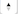

# Mappa {#map}

<!-- markdownlint-disable MD034 -->

>[!CONTEXTUALHELP]
>id="workspace_map_button"
>title="Mappa"
>abstract="Questa visualizzazione rappresenta le metriche sovrapponendole su una mappa. Questo è utile per identificare i dati tra diverse aree geografiche."

<!-- markdownlint-enable MD034 -->

<!-- markdownlint-disable MD034 -->

>[!CONTEXTUALHELP]
>id="workspace_map_bubbles"
>title="Bolle"
>abstract="Traccia gli eventi utilizzando le bolle."

<!-- markdownlint-enable MD034 -->

<!-- markdownlint-disable MD034 -->

>[!CONTEXTUALHELP]
>id="workspace_map_heatmap"
>title="Heatmap"
>abstract="Traccia gli eventi utilizzando una mappa termica."

<!-- markdownlint-enable MD034 -->

{{release-limited-testing}}

>[!BEGINSHADEBOX]

_Questo articolo documenta la visualizzazione Mappa in_  _&#x200B;**Customer Journey Analytics**._ _Vedi [Mappa](https://experienceleague.adobe.com/it/docs/analytics/analyze/analysis-workspace/visualizations/map-visualization) per la_  _&#x200B;**Adobe Analytics** versione di questo articolo._

>[!ENDSHADEBOX]

La visualizzazione  **[!UICONTROL Map]** in Analysis Workspace consente di creare una mappa visiva di qualsiasi metrica (comprese le metriche calcolate). È utile per identificare e confrontare i dati delle metriche tra diverse aree geografiche.

## Prerequisiti

### Aggiungere etichette di contesto alle visualizzazioni dati

Nelle impostazioni delle visualizzazioni dati di Customer Journey Analytics, gli amministratori possono aggiungere [etichette di contesto](/help/data-views/component-settings/overview.md) a una dimensione o a una metrica e i servizi Customer Journey Analytics come la visualizzazione [!UICONTROL map] possono utilizzare queste etichette per i loro scopi.

#### Etichette di contesto richieste per la visualizzazione mappa

Le etichette di contesto sono necessarie per il funzionamento della visualizzazione mappa. Se non sono presenti le seguenti etichette di contesto, la visualizzazione mappa non funziona, perché non vi sono dati di latitudine e longitudine con cui lavorare.

* [!UICONTROL Geo: Latitude]
* [!UICONTROL Geo: Longitude]

Per aggiungere queste etichette di contesto:

1. In Customer Journey Analytics, seleziona **[!UICONTROL Data Management]** > **[!UICONTROL Data views]**.

1. Nella pagina Visualizzazioni dati, seleziona la visualizzazione dati che contiene i dati da analizzare nella visualizzazione mappa.

1. Selezionare la scheda **[!UICONTROL Components]**, quindi selezionare la dimensione contenente i dati di longitudine.

1. Nella sezione **[!UICONTROL Component settings]** della barra a destra, nel campo **[!UICONTROL Context labels]**, inizia a digitare `Longitude`, quindi selezionalo dal menu a discesa.

   

1. Ripetere questo processo per aggiungere l&#39;etichetta di contesto **[!UICONTROL Latitude]** alla dimensione che contiene i dati di latitudine.

1. Seleziona **[!UICONTROL Save and continue]** > **[!UICONTROL Save and finish]**.

#### Etichette di contesto richieste per i modelli geografici

Adobe fornisce diversi [modelli predefiniti](/help/analysis-workspace/templates/use-templates.md#web-audience) che utilizzano la visualizzazione mappa. Per utilizzare ogni modello, è necessario aggiungere l’etichetta di contesto corrispondente a una dimensione nella visualizzazione dati.

Di seguito sono riportati i modelli e l’etichetta di contesto richiesta. Se queste etichette non sono presenti, i modelli non funzionano, perché non vi sono dati geografici con cui lavorare.

| Nome modello | Etichetta di contesto richiesta |
|---------|----------|
| Paesi geografici | [!UICONTROL Geo: Geo Country] |
| Aree geografiche | [!UICONTROL Geo: Geo Region] |
| Città geografiche | [!UICONTROL Geo: Geo City] |
| Stati Geo US | [!UICONTROL Geo: Geo State] |
| DMA Geo US | [!UICONTROL Geo: Geo Dma] |

Per aggiungere queste etichette di contesto:

1. In Customer Journey Analytics, seleziona **[!UICONTROL Data Management]** > **[!UICONTROL Data views]**.

1. Nella pagina Visualizzazioni dati, seleziona la visualizzazione dati che contiene i dati da analizzare con modelli predefiniti che utilizzano la visualizzazione mappa. In questa visualizzazione dati verranno scelte cinque dimensioni, una con i dati del paese, una con i dati dell&#39;area geografica, una con i dati della città, una con i dati dello stato e una con i dati DMA. Quindi etichetterai tali dimensioni con l’etichetta di contesto corrispondente.

1. Selezionare la scheda **[!UICONTROL Components]**, quindi selezionare la dimensione che contiene i dati del paese.

1. Nella sezione **[!UICONTROL Component settings]** della barra a destra, nel campo **[!UICONTROL Context labels]**, inizia a digitare `Geo Country`, quindi selezionalo dal menu a discesa.

   

1. Ripetere questo processo per aggiungere l&#39;etichetta di contesto **[!UICONTROL Geo: Geo Region]**, **[!UICONTROL Geo: Geo City]**, **[!UICONTROL Geo: Geo State]** e **[!UICONTROL Geo: Dma]** a ogni dimensione che contiene i dati corrispondenti.

1. Seleziona **[!UICONTROL Save and continue]** > **[!UICONTROL Save and finish]**.

### I driver di grafica devono supportare il rendering WebGL

La visualizzazione mappa utilizza WebGL per la visualizzazione grafica. Se i driver di grafica non supportano il rendering WebGL, potrebbe essere necessario aggiornare i driver.

## Visualizzazione mappa in Customer Journey Analytics e Adobe Analytics

La visualizzazione mappa in Customer Journey Analytics differisce dalla visualizzazione mappa in Adobe Analytics nei seguenti modi:

| Funzione | Customer Journey Analytics | Adobe Analytics |
|---------|----------|---------|
| Origine dati | Utilizza qualsiasi segmento disponibile nella visualizzazione dati come origine dati. | Fornisce le seguenti opzioni: <ul><li>Mobile lat/long</li><li>Dimension geografico Rappresenta i dati di segmentazione geografica sulla posizione del visitatore in base all&#39;indirizzo IP del visitatore. </li></ul> |
| Precisione | Per i set di dati con precisione profonda, puoi configurare le dimensioni nella visualizzazione dati in modo da visualizzare fino a 5 posizioni decimali. Questo consente di ottenere una visualizzazione accurata della mappa in un singolo metro. 
Per ulteriori informazioni, vedere [Configurare posizioni precise per le dimensioni](#configure-precise-locations-for-dimensions).
 | I dati sono precisi al livello [!UICONTROL Country], [!UICONTROL Region] e [!UICONTROL City]. (Non viene spostato a livello di DMA o CAP). |
| Creare un segmento da una selezione | Crea un segmento basato su un’area specifica selezionata nella visualizzazione mappa. 
Per ulteriori informazioni, consulta [Creare un segmento dalla visualizzazione mappa](#create-a-segment-from-the-map-visualization).
 | Crea un segmento in base ai dati riportati nella visualizzazione mappa in generale. |
| Creare un pubblico da una selezione | Crea un pubblico in base a un’area specifica selezionata nella visualizzazione mappa. 
Per ulteriori informazioni, consulta [Creare un pubblico dalla visualizzazione mappa](#create-an-audience-from-the-map-visualization). | Impossibile creare un pubblico dalla visualizzazione mappa. |
| Creare una tendenza da una selezione | Crea una visualizzazione con grafico a linee di tendenza in base a un’area specifica selezionata nella visualizzazione Mappa. 
Per ulteriori informazioni, vedere [Creare un grafico a linee con tendenze dalla visualizzazione mappa](#create-a-trended-line-chart-from-the-map-visualization). <!-- is this correct? --> | Impossibile creare una tendenza dalla visualizzazione mappa. |
| Aggiungere un raggruppamento da una selezione | Suddividi un elemento dimensione, una metrica, un segmento o un intervallo di date specifico all’interno di un’area specifica selezionata nella visualizzazione Mappa. 
Per ulteriori informazioni, consulta [Aggiungere un raggruppamento dalla visualizzazione mappa](#add-a-breakdown-from-the-map-visualization). | Impossibile aggiungere un raggruppamento dalla visualizzazione mappa. |

## Iniziare a creare una visualizzazione mappa {#begin-building-map}

<!-- markdownlint-disable MD034 -->

>[!CONTEXTUALHELP]
>id="workspace_map_panel"
>title="Configurare la visualizzazione mappa"
>abstract="Scegli la metrica o la metrica calcolata utilizzata come base per la visualizzazione mappa. Puoi anche aggiungere un segmento se desideri concentrarti su un sottoinsieme specifico di dati.
Puoi aggiornare queste informazioni in qualsiasi momento dopo il rendering della visualizzazione.
"

<!-- markdownlint-enable MD034 -->

1. Seleziona l&#39;icona [!UICONTROL **Visualizzazioni**] nella barra a sinistra, quindi trascina la visualizzazione **[!UICONTROL Map]**  in un pannello che contiene una tabella a forma libera.

   Oppure

   Aggiungi una visualizzazione mappa in uno dei modi descritti nella sezione [Aggiungere visualizzazioni a un pannello](/help/analysis-workspace/visualizations/freeform-analysis-visualizations.md#add-visualizations-to-a-panel) in [Panoramica delle visualizzazioni](/help/analysis-workspace/visualizations/freeform-analysis-visualizations.md).

   {width="50%"}

1. Specifica le seguenti informazioni di base per configurare la visualizzazione mappa:

   * **[!UICONTROL Add metric]**: nell&#39;elenco a discesa delle metriche selezionare una metrica o una metrica calcolata. Puoi anche trascinare una metrica dalla barra a sinistra.

     >[!IMPORTANT]
     >
     >Se scegli una metrica alla quale è applicata l&#39;[attribuzione](/help/data-views/component-settings/attribution.md#attribution-models), la stessa attribuzione viene applicata alle coppie di latitudine e longitudine all&#39;interno del riquadro di visualizzazione corrente della visualizzazione mappa.
     >

     <!-- Only choose metrics that use Last Touch as the [attribution model](/help/data-views/component-settings/attribution.md#attribution-models) (this is the default attribution model for all metrics). Choosing a metric that has an attribution model other than Last Touch results in inaccurate map data, because attribution is applied to the latitude and longitude pairs. -->

   * **[!UICONTROL Add segment]**: (facoltativo) nell&#39;elenco a discesa dei segmenti selezionare un segmento. Oppure trascina un segmento dall’elenco dei segmenti.

   Puoi aggiornare queste informazioni dopo aver creato la visualizzazione selezionando l&#39;icona di modifica  nell&#39;intestazione della visualizzazione.

1. Seleziona **[!UICONTROL Build]**.

   Viene generata una visualizzazione con mappa del mondo con bolle.

   

1. Continuare con [Visualizzare una visualizzazione mappa](#view-a-map-visualization) e [Configurare le impostazioni di visualizzazione](#configure-visualization-settings).

## Visualizzare una mappa

1. Se non lo hai già fatto, crea una visualizzazione mappa come descritto in [Inizia a creare una visualizzazione mappa](#begin-building-a-map-visualization).

1. Nella visualizzazione mappa di Analysis Workspace, effettua una delle seguenti operazioni:

   * **Zoom in**: è possibile ingrandire la mappa per ingrandire determinate aree in uno dei modi seguenti:

      * Fare doppio clic sulla mappa con il mouse.

      * Usa la rotellina del mouse o un&#39;azione simile sul trackpad.

      * Seleziona l&#39;icona più  nella visualizzazione mappa.

     La mappa si ingrandisce di conseguenza. La dimensione richiesta (paese > stato > città) viene aggiornata automaticamente in base al livello di zoom.

   * **Zoom indietro**: è possibile ridurre la visualizzazione della mappa per visualizzare aree più grandi in uno dei modi seguenti:

      * Tenere premuto il tasto Maiusc e fare doppio clic sulla mappa con il mouse.

      * Usa la rotellina del mouse o un&#39;azione simile sul trackpad.

      * Seleziona l&#39;icona meno  nella visualizzazione mappa.

     La mappa si ingrandisce di conseguenza. La dimensione richiesta (paese > stato > città) viene aggiornata automaticamente in base al livello di zoom.

   * **Ruota**: puoi ruotare la mappa in 2D o 3D tenendo premuto il tasto [!UICONTROL Ctrl] mentre trascini la mappa con il mouse.

     Per ripristinare l&#39;allineamento a nord originale della mappa, selezionare l&#39;icona della bussola .

   * **Strumento di selezione**: è possibile selezionare un&#39;area della mappa per [creare un segmento](#create-a-segment-from-the-map-visualization), [creare una tendenza](#create-a-trended-line-chart-from-the-map-visualization) o [aggiungere una suddivisione](#add-a-breakdown-from-the-map-visualization).

     Fai clic sull&#39;icona dello strumento di selezione , quindi trascina il mouse per selezionare l&#39;area desiderata.

   * **Confronta**: puoi confrontare due o più visualizzazioni di mappe nello stesso progetto posizionandole una accanto all&#39;altra.

   * **Mostra confronti periodo su periodo (ad esempio anno su anno)**:

      * Mostra numeri negativi.

        Ad esempio, per rappresentare una metrica annuale, la mappa può visualizzare -33% per New York.

      * Con metriche di tipo *percent*, il clustering calcola la media delle percentuali insieme.

      * Una combinazione di colori verde e rosso indica positivo e negativo.

   * **Altre impostazioni di visualizzazione**: seleziona l&#39;icona Impostazioni  nell&#39;intestazione della visualizzazione per visualizzare le impostazioni aggiuntive per la visualizzazione mappa. Per ulteriori informazioni, consulta [Configurare le impostazioni di visualizzazione](#configure-visualization-settings).

1. **Salva** il progetto per salvare tutte le impostazioni della mappa (coordinate, zoom, rotazione).
1. (Facoltativo) La tabella a forma libera sotto la visualizzazione può essere compilata trascinando dimensioni e metriche della posizione dalla barra a sinistra.

## Configurare le impostazioni di visualizzazione

Per configurare le impostazioni per la visualizzazione mappa:

1. In Analysis Workspace, apri una visualizzazione mappa esistente oppure [creane una nuova](#begin-building-a-map-visualization).

1. Passa il puntatore del mouse sulla visualizzazione mappa, quindi seleziona l&#39;icona Impostazioni  nell&#39;intestazione della visualizzazione.

   Sono disponibili le seguenti opzioni:

   | Sezione | Impostazione | Descrizione |
   | --- |--- |--- |
   | **[!UICONTROL Map type]** | | |
   | | **[!UICONTROL Bubbles]** | Traccia gli eventi tramite una rappresentazione a bolle. Un grafico a bolle è un grafico con più variabili, un incrocio tra un grafico a dispersione e un grafico a superfici proporzionali. Questa è l&#39;impostazione predefinita. |
   | | **[!UICONTROL Heatmap]** | Traccia gli eventi tramite una mappa di calore. Si tratta di una rappresentazione grafica in cui i singoli valori di una matrice sono rappresentati da colori. |
   | **[!UICONTROL Styles]** | | |
   | | **[!UICONTROL Color theme]** | Mostra lo schema di colori utilizzato per la mappa di calore e le bolle. Puoi scegliere tra Corallo, Rossi, Verdi e Blu. L&#39;impostazione predefinita è Coral. |
   | | **[!UICONTROL Map style]** | È possibile scegliere tra Basic, Streets, Bright, Light, Dark e Satellite. |
   | | **[!UICONTROL Cluster radius]** | Raggruppa i dati che si trovano entro un certo numero di pixel. Il valore predefinito è 50.
Questa opzione è disponibile solo quando **[!UICONTROL Bubbles]** è selezionato come **[!UICONTROL Map type]**.
 |
   | | **[!UICONTROL Custom max value]** | Consente di modificare la soglia per il valore massimo per la mappa. Regolando questo valore si regola la scala per le bolle o i valori della mappa di calore (colore e dimensione) rispetto al valore massimo personalizzato impostato. |
   | | **[!UICONTROL Show annotations]** | Mostra le annotazioni effettuate per questa visualizzazione. |
   | | **[!UICONTROL Hide title]** | Nasconde il titolo della visualizzazione. |

## Configurare posizioni precise per le dimensioni

Se disponi di set di dati personalizzati con precisione profonda, puoi configurare la visualizzazione mappa per ottenere la precisione della posizione entro un singolo metro.

1. In Customer Journey Analytics, seleziona **[!UICONTROL Data Management]** > **[!UICONTROL Data views]**.

1. Seleziona la visualizzazione dati che contiene le dimensioni da configurare per utilizzare posizioni più precise.

1. Nella visualizzazione dati, seleziona la scheda **[!UICONTROL Components]**.

1. Seleziona la dimensione da configurare.

1. Configura il livello di precisione per la dimensione:

   1. Con la dimensione da configurare ancora selezionata, espandi la sezione **[!UICONTROL Format]** nella barra a destra.

      

   1. Nel campo **[!UICONTROL Decimal places]**, modificare il numero di decimali per riflettere il livello di precisione desiderato:

      * **0:** Preciso rispetto al livello di area geografica o paese nella visualizzazione mappa. Mostra 0 posizioni decimali nei rapporti di Workspace.

      * **1:** Preciso al livello di regione o città grande nella visualizzazione mappa.  Mostra 1 cifra decimale nei rapporti di Workspace.

      * **2:** Preciso al livello di città o codice postale nella visualizzazione mappa. Mostra 2 posizioni decimali nei rapporti di Workspace.

        Questa è la selezione predefinita.

      * **3:** Preciso al livello di città o quartiere molto piccolo nella visualizzazione mappa. Mostra 3 posizioni decimali nei rapporti di Workspace.

      * **4:** Preciso rispetto a una specifica particella di terreno o livello di edificio nella visualizzazione mappa. Mostra 4 posizioni decimali nei rapporti di Workspace.

      * **5:** Precisione di un solo metro nella visualizzazione mappa. Mostra 5 posizioni decimali nei rapporti di Workspace.

1. Seleziona **[!UICONTROL Save and continue]** > **[!UICONTROL Save and finish]**.

## Creare un segmento dalla visualizzazione mappa {#map-create-segment}

Puoi creare un segmento basato su un’area specifica selezionata nella visualizzazione mappa. Quando crei un segmento basato su un’area selezionata, tutti i dati che si trovano entro la latitudine e la longitudine della selezione vengono inclusi nel segmento.

Per creare un segmento dalla visualizzazione mappa:

1. (Facoltativo) Ingrandisci l’area specifica della mappa che contiene i dati da utilizzare per il segmento.

1. Fai clic sull&#39;icona dello strumento di selezione , quindi trascina il mouse per selezionare l&#39;area desiderata.

1. Selezionare **[!UICONTROL Create segment from selection]** dal menu a discesa visualizzato.

1. Utilizza il Generatore di segmenti per definire il nuovo segmento. Per ulteriori informazioni, consulta [Generatore di segmenti](/help/components/segments/seg-builder.md).

## Creare un pubblico dalla visualizzazione mappa

Puoi creare un pubblico in base a un’area specifica selezionata nella visualizzazione mappa.

Per creare un pubblico dalla visualizzazione mappa:

1. (Facoltativo) Ingrandisci l’area specifica della mappa contenente i dati che desideri utilizzare per il pubblico.

1. Fai clic sull&#39;icona dello strumento di selezione , quindi trascina il mouse per selezionare l&#39;area desiderata.

1. Selezionare **[!UICONTROL Create audience from selection]** dal menu a discesa visualizzato.

1. Utilizza il generatore di tipi di pubblico per definire il nuovo pubblico. Per ulteriori informazioni, consulta [Generatore di pubblico](/help/components/audiences/publish.md#audience-builder) in [Creare e pubblicare tipi di pubblico](/help/components/audiences/publish.md)

## Creare un grafico a linee di tendenza dalla visualizzazione mappa

Puoi creare una visualizzazione con grafico a linee di tendenza per i dati all’interno di un’area specifica selezionata nella visualizzazione Mappa.

Per creare un grafico a linee con tendenze dalla visualizzazione mappa:

1. (Facoltativo) Ingrandire l&#39;area specifica della mappa contenente i dati che si desidera utilizzare per il grafico a linee con tendenze.

1. Fai clic sull&#39;icona dello strumento di selezione , quindi trascina il mouse per selezionare l&#39;area desiderata.

1. Selezionare **[!UICONTROL Trend]** dal menu a discesa visualizzato.

   Viene creata una visualizzazione delle linee che include una linea di tendenza. Per ulteriori informazioni su questa visualizzazione, vedi [Riga](/help/analysis-workspace/visualizations/line.md).

<!--

Can you do this?

## Add a breakdown from the map visualization

You can break down a specific dimension item, metric, segment, or date range for the data within a designated area that you select in the map visualization.

To add a breakdown from the map visualization:

1. (Optional) Zoom in on the specific area of the map that contains the data where you want to add the breakdown.

1. Click the selection tool , then drag your mouse to select the desired area.

1. Select **[!UICONTROL Add breakdown]**. 

-->

<!--

Can you do this?

## Export the map visualization as a PDF

To export the map visualization in PDF format:

1. how...

-->

