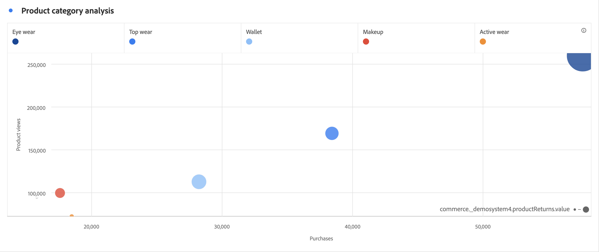

# A dispersione {#scatter}

>[!CONTEXTUALHELP]
>id="workspace_scatter_button"
>title="A dispersione"
>abstract="Crea una visualizzazione a dispersione che mostra la relazione tra gli elementi dimensionali fino a un massimo di tre metriche."

>[!BEGINSHADEBOX]

_In questo articolo viene documentata la visualizzazione a dispersione in_  _&#x200B;**Customer Journey Analytics**._ _Vedere [A dispersione](https://experienceleague.adobe.com/it/docs/analytics/analyze/analysis-workspace/visualizations/scatterplot) per la versione_  _&#x200B;**Adobe Analytics** di questo articolo._

>[!ENDSHADEBOX]

La visualizzazione  **[!UICONTROL Scatter]** ti aiuta a identificare correlazioni e pattern tra metriche diverse nei tuoi dati. La visualizzazione mostra la relazione tra gli elementi dimensionali e un massimo di tre metriche. La visualizzazione richiede tre componenti e supporta la visualizzazione di un massimo di quattro componenti.

* Il componente riga (in genere una dimensione) rappresenta ogni punto del grafico. Righe diverse vengono mostrate come punti colorati diversi.
* La colonna più a sinistra (in genere una metrica) traccia la posizione del punto sull’asse Y (verticale).
* La seconda colonna traccia la posizione del punto sull’asse X (orizzontale).
* La terza colonna determina il raggio del punto.
* Tutte le colonne successive di una tabella a forma libera vengono ignorate dalla visualizzazione grafico a dispersione.

>[!BEGINSHADEBOX]

Per un video dimostrativo, guarda  [Visualizzazione grafico a dispersione](https://experienceleague.adobe.com/it/docs/customer-journey-analytics-learn/tutorials/analysis-workspace/visualizations/use-scatterplot-visualizations){target="_blank"}.

>[!ENDSHADEBOX]

>[!NOTE]
>
>Quando [configuri la legenda affinché sia visibile](/help/analysis-workspace/visualizations/freeform-analysis-visualizations.md#settings) nella dispersione, questa viene visualizzata solo se l&#39;origine dati contiene un numero limitato di elementi dimensionali (selezionati).

>[!MORELIKETHIS]
>
>[Aggiungi una visualizzazione a un pannello](/help/analysis-workspace/visualizations/freeform-analysis-visualizations.md#add-visualizations-to-a-panel)
>[Impostazioni di visualizzazione](/help/analysis-workspace/visualizations/freeform-analysis-visualizations.md#settings)
>[Menu di scelta rapida della visualizzazione](/help/analysis-workspace/visualizations/freeform-analysis-visualizations.md#context-menu)
>
