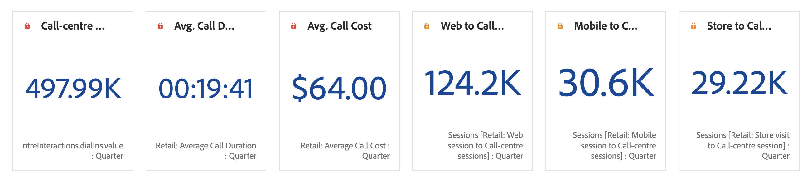
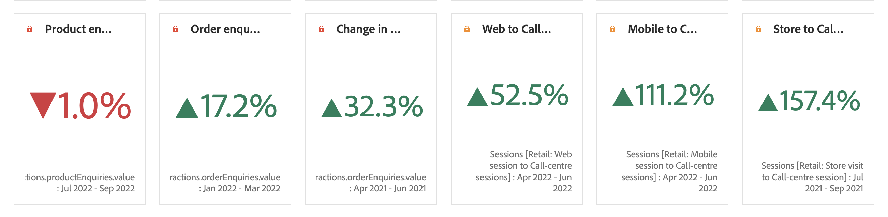

# Numero e variazione di riepilogo

>[!BEGINSHADEBOX]

_In questo articolo vengono documentate le visualizzazioni Numero riepilogo e Modifica riepilogo in_  _**Customer Journey Analytics**._ _Vedere [Numero riepilogo e Modifica riepilogo](https://experienceleague.adobe.com/it/docs/analytics/analyze/analysis-workspace/visualizations/summary-number-change) per la versione_  _**Adobe Analytics** di questo articolo._

>[!ENDSHADEBOX]

>[!BEGINSHADEBOX]

Per un video dimostrativo, guarda  [Visualizzazione numero riepilogo e modifica riepilogo](https://experienceleague.adobe.com/en/docs/customer-journey-analytics-learn/tutorials/analysis-workspace/visualizations/use-summary-visualizations){target="_blank"}.

>[!ENDSHADEBOX]

## Numero di riepilogo {#summary-number}

<!-- markdownlint-disable MD034 -->

>[!CONTEXTUALHELP]
>id="workspace_summarynumber_button"
>title="Numero di riepilogo"
>abstract="Crea una visualizzazione che mostra i totali e i subtotali."

<!-- markdownlint-enable MD034 -->

Utilizza la visualizzazione  **[!UICONTROL Numero riepilogo]** per evidenziare un numero elevato importante in un progetto. Questa visualizzazione si comporta come segue, utilizzando l’origine dati associata:

* Seleziona il totale della colonna se non è selezionata alcuna cella.
* Se è selezionata una singola cella, viene visualizzato il relativo riepilogo.
* Se sono selezionate più celle, viene visualizzata la prima cella selezionata.
* Se la colonna è selezionata, viene selezionato il primo valore di cella della colonna.

Come parte delle impostazioni di visualizzazione, sono disponibili opzioni specifiche per il numero di Riepilogo.

| Opzione | Definizione |
|--- |--- |
| **[!UICONTROL Abbrevia valore]** | Seleziona **[!UICONTROL Abbrevia valore]** per abbreviare in modo intelligente il valore numerico. Se questa opzione è selezionata, immetti un numero per definire la quantità di abbreviazione. Ad esempio: <table><tr><td>**Valore originale**</td><td>**Valore abbreviazione**</td><td>**Risultato**</td></tr><tr><td>12.011.141,25 $</td><td>Non selezionato</td><td  align="right">12.011.141,25 $</td></tr><tr><td>12.011.141,25 $</td><td>Selezionato, impostato su `0`</td><td align="right">12 milioni $</td></tr><tr><td>12.011.141,25 $</td><td> Selezionato, impostato su `1`</td><td  align="right">12,0 milioni $</td></tr><tr><td>12.011.141,25 $</td><td>Selezionato, impostato su `2`</td><td align="right">12,01 milioni $</td></tr><tr><td>12.011.141,25 $</td><td>Selezionato, impostato su `3`</td><td align="right">12,011 milioni $</td></tr></table> |
| **[!UICONTROL Riepiloga valore per]** | Scegli di visualizzare il massimo, il minimo, la media, la mediana o la somma per una selezione di dati. |

## Variazione di riepilogo {#summary-change}

<!-- markdownlint-disable MD034 -->

>[!CONTEXTUALHELP]
>id="workspace_summarychange_button"
>title="Variazione di riepilogo"
>abstract="Crea una visualizzazione che mostra il delta (variazione) tra due numeri"

<!-- markdownlint-enable MD034 -->

Utilizza la visualizzazione  **[!UICONTROL Variazione di riepilogo]** per mostrare il delta (variazione) tra due numeri. <!-- This is applicable for AA, not CJA: The green and red color of the Summary Change can be controlled through [custom event polarity](https://experienceleague.adobe.com/docs/analytics/admin/admin-tools/success-events/success-event.html) or a calculated metric's [Show Upward Trend As](https://experienceleague.adobe.com/docs/analytics/components/calculated-metrics/calcmetric-workflow/cm-build-metrics.html) option.-->

<!--
The green and red color of the Summary Change can be controlled through [custom event polarity](https://experienceleague.adobe.com/docs/analytics/admin/admin/c-manage-report-suites/c-edit-report-suites/conversion-var-admin/c-success-events/success-event.md) or a calculated metric's [Show Upward Trend As](https://experienceleague.adobe.com/docs/analytics/components/calculated-metrics/calcmetric-workflow/cm-build-metrics.html) option.
-->

Questa visualizzazione si comporta come segue:

* Se non è selezionata alcuna cella, vengono confrontati i primi due valori di cella della colonna.
* Se è selezionata una cella, viene visualizzato 0 in quanto confronta il valore della cella con se stessa.
* Se sono selezionate due celle, la prima cella selezionata viene considerata come numeratore e la seconda come denominatore.
* Se sono selezionate più di due celle, vengono considerate solo le prime due per il confronto.
* Se è selezionato un intervallo di celle, la prima viene confrontata con le ultime celle selezionate nell&#39;intervallo.
* Se la colonna è selezionata, il primo valore viene confrontato con se stesso, il che mostra una modifica di 0.

Come parte delle impostazioni di visualizzazione, sono disponibili **[!UICONTROL opzioni di modifica di riepilogo]** specifiche.

| Opzione | Definizione |
|--- |--- |
| **[!UICONTROL Mostra variazione percentuale]** | Mostra la variazione percentuale tra i 2 numeri. |
| **[!UICONTROL Mostra differenza raw]** | Mostra la differenza grezza tra i 2 numeri. Con questa opzione è inoltre possibile abbreviare i valori e visualizzare fino a 3 posizioni decimali. |
| **[!UICONTROL Abbrevia valore]** | Selezionare **[!UICONTROL Abbrevia valore]** per abbreviare in modo intelligente il valore modificato. Se questa opzione è selezionata, immetti un numero per definire la quantità di abbreviazione. Ad esempio: <table><tr><td>**Valore originale**</td><td>**Valore abbreviazione**</td><td>**Risultato**</td></tr><tr><td>12.011.141,25 $</td><td>Non selezionato</td><td  align="right">12.011.141,25 $</td></tr><tr><td>12.011.141,25 $</td><td>Selezionato, impostato su `0`</td><td align="right">12 milioni $</td></tr><tr><td>12.011.141,25 $</td><td> Selezionato, impostato su `1`</td><td  align="right">12,0 milioni $</td></tr><tr><td>12.011.141,25 $</td><td>Selezionato, impostato su `2`</td><td align="right">12,01 milioni $</td></tr><tr><td>12.011.141,25 $</td><td>Selezionato, impostato su `3`</td><td align="right">12,011 milioni $</td></tr></table> |

>[!MORELIKETHIS]
>
>[Aggiungi una visualizzazione a un pannello](/help/analysis-workspace/visualizations/freeform-analysis-visualizations.md#add-visualizations-to-a-panel)
>[Impostazioni di visualizzazione](/help/analysis-workspace/visualizations/freeform-analysis-visualizations.md#settings)
>[Menu di scelta rapida della visualizzazione](/help/analysis-workspace/visualizations/freeform-analysis-visualizations.md#context-menu)
>
