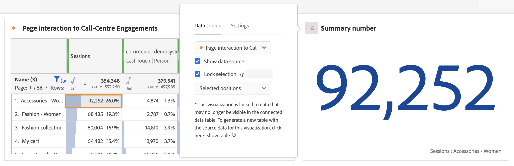

# Gestione delle origini dati {#manage-data-sources}

>[!CONTEXTUALHELP]
>id="workspace_freeformtable_lockselection"
>title="Blocca selezione"
>abstract="Abilita questa impostazione per bloccare la visualizzazione nelle posizioni o gli elementi selezionati nell’origine dati."

>[!CONTEXTUALHELP]
>id="workspace_freeformtable_lockselection_showtable"
>title="Mostra tabella"
>abstract="Selezionando **[!UICONTROL Mostra tabella]** verrà generata una nuova origine dati per la visualizzazione corrente, separata dall’origine dei dati originale."

>[!CONTEXTUALHELP]
>id="workspace_freeformtable_showtable"
>title="Mostra tabella"
>abstract="Seleziona **[!UICONTROL Mostra tabella]** per generare una nuova origine dati per la visualizzazione corrente, separata dall’origine dei dati originale."

La sincronizzazione delle visualizzazioni consente di controllare quale tabella a forma libera o origine dati corrisponde a una visualizzazione.

>[!TIP]
>
>Puoi individuare le visualizzazioni correlate dal colore del  accanto al titolo delle visualizzazioni. Colori uguali indicano che le visualizzazioni si basano sulla stessa origine dati.
>

Puoi visualizzare o nascondere l’origine dati. Puoi inoltre bloccare la selezione in base alle posizioni o agli elementi selezionati. Queste impostazioni determinano in che modo la visualizzazione cambia o meno con l’arrivo di nuovi dati.

| Opzione | Descrizione |
|--- |--- |
| **[!UICONTROL Origine dati]** | Dal menu a discesa, seleziona l’origine dati su cui si basa la visualizzazione. |
| **[!UICONTROL Visualizzazioni collegate]** | Elenca tutte le visualizzazioni collegate. Si applica all’origine dati (tabella a forma libera). |
| **[!UICONTROL Mostra origine dati]** | Consente di mostrare o nascondere l’origine dati (tabella a forma libera) corrispondente alla visualizzazione. |
| **[!UICONTROL Blocca selezione]** | Seleziona questa opzione per bloccare la visualizzazione  ai dati attualmente selezionati nella tabella di dati corrispondente. Dopo aver abilitato questa opzione, scegli tra:  <ul><li>**Posizioni selezionate**: la visualizzazione è bloccata sulle **posizioni** selezionate nella tabella di dati corrispondente. Queste posizioni continuano a essere visualizzate, anche se gli elementi specifici in queste posizioni cambiano (ad esempio a causa di ordinamento o filtri). Ad esempio, seleziona questa opzione se desideri visualizzare sempre i primi cinque nomi di campagna elencati nell’origine dati di questa visualizzazione. Indipendentemente dai nomi delle campagne visualizzati.</li> <li>**Elementi selezionati**: la visualizzazione è bloccata su **elementi** specifici attualmente selezionati nella tabella di dati corrispondente. Questi elementi continuano a essere visualizzati, anche se cambiano posizione nel ranking rispetto agli elementi della tabella. Ad esempio, seleziona questa opzione se desideri visualizzare sempre gli stessi cinque nomi di campagna specifici elencati nell’origine dati di questa visualizzazione. Indipendentemente dal ranking di quei nomi di campagna.</li></ul>Se la visualizzazione è bloccata su dati che non sono più visibili nella tabella di dati connessa, puoi generare una nuova tabella. Seleziona **[!UICONTROL Mostra tabella]** per generare una nuova origine dati per la visualizzazione corrente, separata dall&#39;origine dati originale. |
