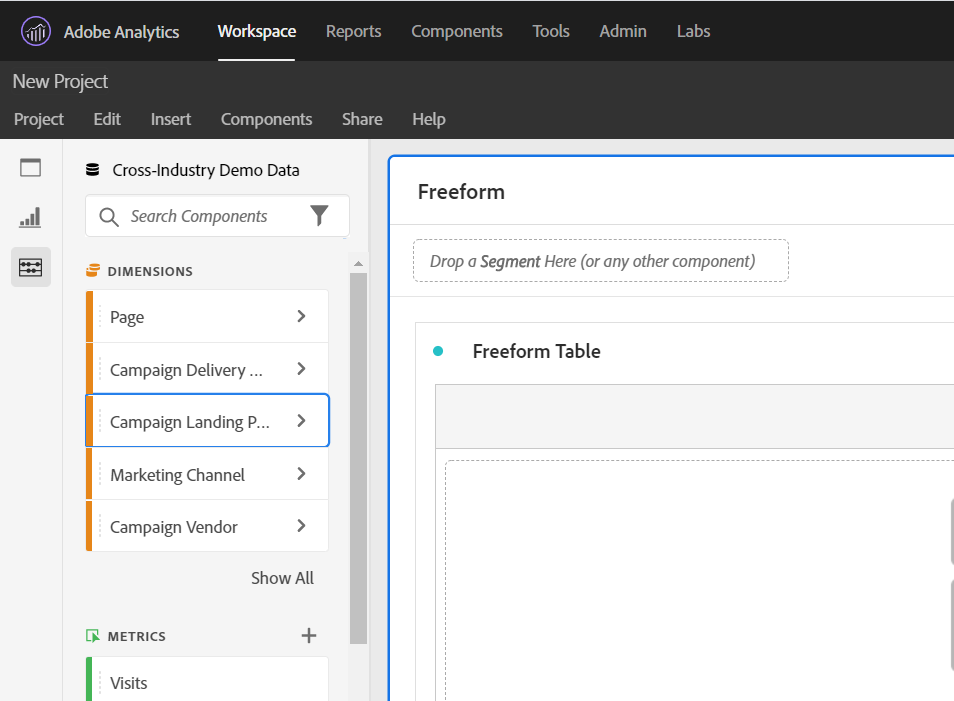
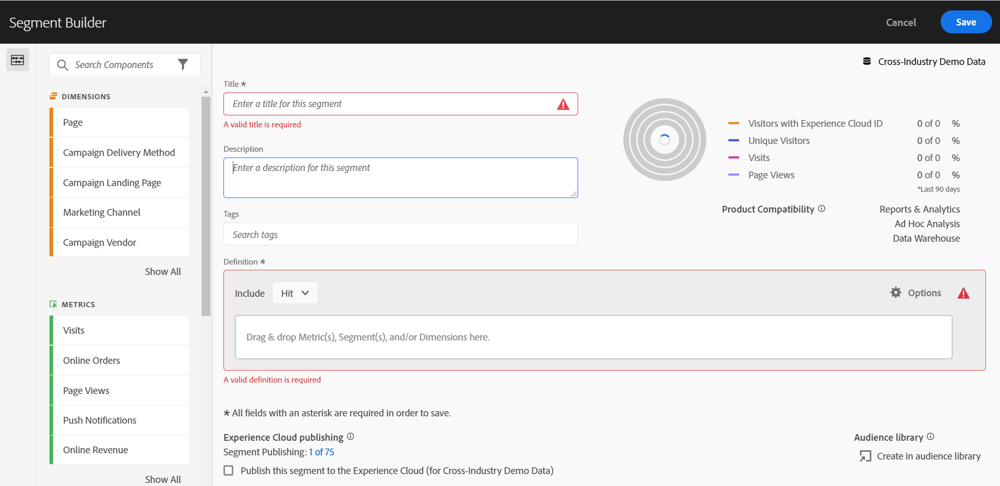

# Accessibilità di Analysis Workspace

Scopri il supporto per l’accessibilità in [!UICONTROL Analysis Workspace], lo strumento di analisi principale per Customer Journey Analytics.

Per accessibilità si intendono i prodotti utilizzabili da persone affette da disabilità visive, uditive, cognitive, motorie e di altro tipo. Gli esempi di funzioni di accessibilità per i prodotti software includono:

* supporto di assistenti vocali,
* equivalenti testuali per gli elementi grafici,
* scelte rapide da tastiera,
* modifica dei colori dello schermo per aumentare il contrasto,
* e altro ancora.

[!UICONTROL Analysis Workspace] fornisce alcuni strumenti che ne rendono accessibile l&#39;utilizzo, tra cui:

## Navigazione tramite tastiera

La navigazione in [!UICONTROL Analysis Workspace] funziona dall&#39;alto verso il basso e da sinistra a destra. I seguenti elementi di navigazione facilitano l’accessibilità:

* Il tasto **[!UICONTROL Tab]** abilita scelte rapide di punti di riferimento, spostandosi tra sezioni più grandi all&#39;interno di Workspace. Nel pannello a sinistra, **[!UICONTROL Scheda]** consente inoltre di passare da un&#39;opzione trascinabile all&#39;altra.
* I valori ◀︎ e ▶︎ vengono spostati tra i singoli elementi dopo che la chiave **[!UICONTROL Tab]** ha evidenziato un elemento.
* Il tasto **[!UICONTROL F6]** consente di passare al primo pannello del progetto e tra le visualizzazioni all&#39;interno di tale pannello. Quindi, consente di passare al pannello successivo del progetto e così via.
* Gli indicatori di attivazione vengono applicati in modo che gli utenti vedenti che utilizzano la tastiera abbiano un’indicazione chiara dell’elemento dell’interfaccia utente attualmente attivo. L’indicatore è un bordo blu per il pannello attivo. E lo sfondo grigio per la funzionalità selezionata di recente e la selezione all’interno della funzionalità. Nell&#39;esempio, [!UICONTROL Componenti] e la dimensione Pagina sono stati selezionati di recente.

  

### Navigazione tramite tastiera per la barra dei menu

1. Premi il tasto Tab fino ad arrivare alla barra dei menu.
1. Utilizza i tasti freccia per spostarti tra i menu e le voci di menu.
1. Premi **[!UICONTROL Invio]** per aprire un menu o selezionare una voce di menu.
1. Utilizza **[!UICONTROL Esc]** per chiudere un menu.

### Navigazione tramite tastiera per interazioni con trascinamento

[!UICONTROL Analysis Workspace] è un&#39;interfaccia utente di tipo trascina selezione. Tuttavia, in alternativa, gli utenti possono aggiungere componenti utilizzando la tastiera:

1. Passa a un componente nel pannello a sinistra.
1. Premi **[!UICONTROL Invio]** per selezionare.
1. Utilizza i tasti freccia per passare all’area in cui desideri rilasciare il componente.
1. Premi **[!UICONTROL Invio]** per posizionare il componente.

### Scelte rapide da tastiera

[!UICONTROL Analysis Workspace] offre un set completo di [scelte rapide da tastiera (tasti di scelta rapida)](/help/analysis-workspace/build-workspace-project/fa-shortcut-keys.md) per un flusso di lavoro più semplice.

## Supporto per assistenti vocali e lenti di ingrandimento dello schermo

Un assistente vocale legge il testo visualizzato sullo schermo del computer. Vengono lette anche informazioni non testuali, come etichette di pulsanti o descrizioni delle immagini nell’applicazione.

## Palette di colori e contrasto

[!UICONTROL Analysis Workspace] si impegna per essere conforme a WCAG 2.1 AA, inclusi i requisiti per il contrasto del colore.

Inoltre, gli utenti possono impostare la propria palette di colori preferita per un progetto in **[!UICONTROL Progetto]** > **[!UICONTROL Impostazioni progetto]** > [Palette di colori progetto](/help/analysis-workspace/build-workspace-project/color-palettes.md).

## Convalida richiesta

Quando crei un componente, una visualizzazione o un pannello, i campi obbligatori vengono convalidati al momento del salvataggio. Se un campo obbligatorio non supera la convalida, viene evidenziato in rosso con un’icona di errore. Una descrizione scritta spiega il problema che deve essere risolto.

## Supporto per le funzioni di accessibilità del sistema operativo

Analysis Workspace supporta funzioni incorporate di accessibilità di Windows e macOS come modalità ad alto contrasto, tasti permanenti e tasti lenti o filtro tasti. Fornisce inoltre informazioni sull’interfaccia utente del sistema operativo per consentire l’interazione con le tecnologie di assistenza, compresi gli assistenti vocali come VoiceOver per macOS e NVDA su Windows.
