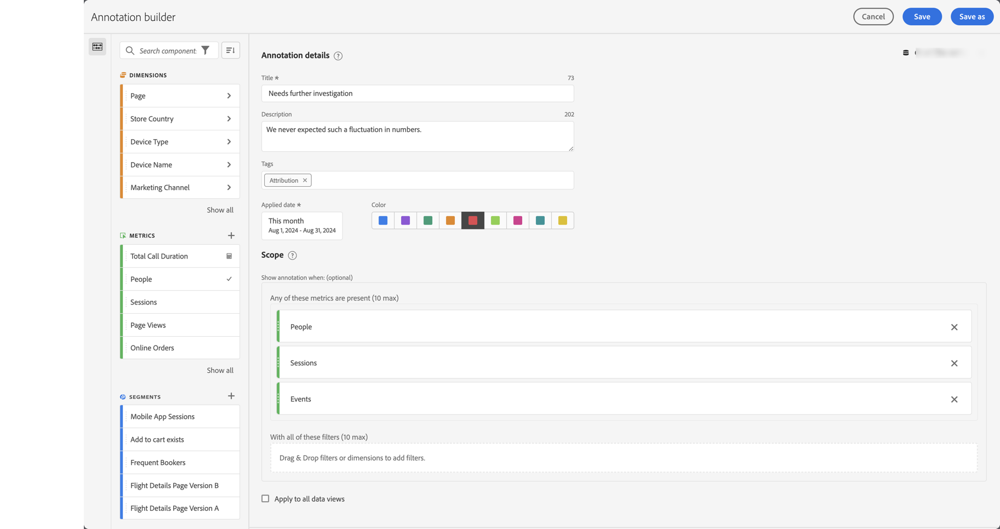

# Creare annotazioni

Per impostazione predefinita, solo gli amministratori possono creare annotazioni. Per visualizzare le annotazioni, gli utenti dispongono del diritto analogo a quello per visualizzare altri componenti (come segmenti, metriche calcolate ecc.).

Tuttavia, gli amministratori possono assegnare l&#39;autorizzazione **[!UICONTROL Creazione annotazione]** per **[!UICONTROL Strumenti di reporting]** in **[!UICONTROL Modifica autorizzazioni per CJA Workspace Access]** agli utenti tramite Admin Console. Per ulteriori informazioni, consulta [Controllo dell’accesso a livello di utente](/help/technotes/access-control.md#user-level-access).

Puoi creare un’annotazione nei modi seguenti:

* **A**. Nell&#39;interfaccia principale, selezionare **[!UICONTROL Componenti]** e **[!UICONTROL Annotazioni]**. Seleziona  [!UICONTROL **[!UICONTROL Aggiungi]**] dal gestore [[!UICONTROL Annotazioni]](/help/components/annotations/manage-annotations.md).
* **B**. In un progetto Workspace, dal menu di scelta rapida di una visualizzazione, seleziona **[!UICONTROL Crea annotazione da selezione]**.
* **C**. In un progetto Workspace, dal menu di scelta rapida in un grafico a linee, selezionare **[!UICONTROL Annota selezione]**.
* **D**. In un progetto di Workspace, seleziona **[!UICONTROL Componenti]** dal menu e **[!UICONTROL Crea annotazione]**.
* **E**.  In un progetto Workspace, utilizza il collegamento **[!UICONTROL ctrl+maiusc+o]** (Windows) o **[!UICONTROL maiusc+comando+o]** (macOS)

Per definire l&#39;annotazione, utilizzare il [[!UICONTROL Generatore di annotazioni]](#annotation-builder).

<!-- Should we really mention API here. If so, we can do it all over the place in the docs...
| **Use the [Customer Journey Analytics Annotations API](https://developer.adobe.com/cja-apis/docs/endpoints/annotations/)** | The Customer Journey Analytics Annotations APIs allow you to create, update, or retrieve annotations programmatically through Adobe Developer. These APIs use the same data and methods that Adobe uses inside the product UI. |
-->

## Generatore di annotazioni {#annotation-builder}

<!-- markdownlint-disable MD034 -->

>[!CONTEXTUALHELP]
>id="components_annotations_details"
>title="Dettagli annotazione"
>abstract="Le annotazioni consentono di comunicare in modo efficace dettagli sui dati contestuali e informazioni all’organizzazione. Le annotazioni consentono di collegare gli eventi calendario a dimensioni o metriche specifiche."

<!-- markdownlint-enable MD034 -->

<!-- markdownlint-disable MD034 -->

>[!CONTEXTUALHELP]
>id="components_annotations_scope"
>title="Ambito"
>abstract="L’ambito consente di personalizzare quali dati vengono annotati. Le metriche calcolate e i segmenti non ereditano automaticamente le annotazioni applicate ai componenti utilizzati nelle rispettive definizioni. Puoi aggiungere nuove metriche calcolate alla sezione dell’ambito di un’annotazione esistente. I segmenti nuovi richiedono un’annotazione nuova."

<!-- markdownlint-enable MD034 -->

La finestra di dialogo **[!UICONTROL Generatore di annotazioni]** viene utilizzata per creare nuove annotazioni o modificare quelle esistenti. La finestra di dialogo si chiama **[!UICONTROL Nuova annotazione]** o **[!UICONTROL Modifica annotazione]** per le annotazioni create o gestite dal gestore [[!UICONTROL Annotazioni]](/help/components/annotations/manage-annotations.md).

>[!BEGINTABS]

>[!TAB Generatore di annotazioni]

{zoomable="yes"}

>[!TAB  Modifica annotazione]

{zoomable="yes"}

>[!ENDTABS]

1. Specifica i dettagli seguenti ( indica i dati obbligatori):

   | Elemento | Descrizione |
   | --- | --- |
   | **[!UICONTROL Visualizzazione dati]** | Puoi selezionare la visualizzazione dati per l’annotazione. L’annotazione definita è disponibile come annotazione nei progetti Workspace in base alla visualizzazione dati selezionata. Questa selezione viene annullata se hai abilitato [!UICONTROL Applica a tutte le visualizzazioni dati]. |
   | **[!UICONTROL Annotazione solo progetto]** | Una casella di informazioni per spiegare che l’annotazione creata è visibile solo nel progetto Workspace su cui stai lavorando. Abilita **[!UICONTROL Rendi questa annotazione disponibile per tutti i tuoi progetti]**, per renderla visibile a tutti i tuoi progetti. Questa casella di informazioni è visibile solo quando crei un’annotazione dall’interno di un progetto Workspace. |
   | **[!UICONTROL Titolo]**  | Assegna un nome all’annotazione, ad esempio `Needs further investigation`. |
   | **[!UICONTROL Descrizione]** | Fornisci una descrizione per l’annotazione, ad esempio `We never expected such a fluctuation in numbers.`. |
   | **[!UICONTROL Tag]** | Organizza l’annotazione creando o applicando uno o più tag. Inizia a digitare per trovare i tag esistenti che puoi selezionare. Oppure premi **[!UICONTROL Invio]** per aggiungere un nuovo tag. Seleziona  per rimuovere un tag. |
   | **[!UICONTROL Data di applicazione]**  | Seleziona la data o l’intervallo di date che è necessario riportare per rendere visibile l’annotazione. Quando crei un’annotazione utilizzando la scelta rapida da tastiera, per impostazione predefinita l’annotazione viene impostata su un intervallo di date limitato al solo giorno. Quando crei un’annotazione utilizzando una selezione in una visualizzazione, per impostazione predefinita l’annotazione si basa sull’intervallo di date del pannello a cui appartiene la visualizzazione. |
   | **[!UICONTROL Colore]** | Applica un colore all’annotazione. L’annotazione viene visualizzata nel progetto con il colore selezionato. Puoi scegliere colori diversi per diverse categorie di annotazioni, ad esempio festività, eventi esterni, problemi di tracciamento, ecc. |
   | **[!UICONTROL Ambito]** | Trascina e rilascia le metriche dal pannello dei componenti che attivano l’annotazione. Ad esempio Persone, Sessioni ed Eventi. Quindi, trascina dal pannello dei componenti, i segmenti o le dimensioni che fungono da segmenti per determinare se visualizzare o meno l’annotazione. Se non specifichi un ambito, l’annotazione verrà applicata a tutti i dati.  Puoi scegliere tra due opzioni:<ul><li>**[!UICONTROL Una qualsiasi di queste metriche è presente]**: trascina fino a 10 metriche per attivare la visualizzazione dell&#39;annotazione. Ad esempio, la metrica Ricavi ha interrotto la raccolta dei dati per un intervallo di date specifico. trascina la metrica Entrate in questa casella.</li><li>**[!UICONTROL Con tutti questi segmenti]**: trascina fino a 10 dimensioni o segmenti per verificare se viene visualizzata l&#39;annotazione.</li></ul>

**Nota:** un’annotazione applicata a un componente e quindi utilizzata come parte di una metrica calcolata o di una definizione di segmento NON eredita automaticamente l’annotazione. Per visualizzare l’annotazione, è necessario aggiungere alla sezione dell’ambito anche la metrica calcolata desiderata. Tuttavia, è necessario creare una nuova annotazione per ogni segmento che si desidera annotare con le stesse informazioni. Ad esempio, puoi applicare un&#39;annotazione a [!UICONTROL Ordini] in un giorno specifico. Quindi utilizzi [!UICONTROL Ordini] in una metrica calcolata per lo stesso intervallo di date. La nuova metrica calcolata non visualizza automaticamente l’annotazione per gli ordini. Aggiungi anche la metrica calcolata alla sezione dell’ambito per l’annotazione da visualizzare. |
   | **[!UICONTROL Applica a tutte le visualizzazioni dati]** | Per impostazione predefinita, l’annotazione si applica alla visualizzazione dati di origine. Selezionando questa casella, l’annotazione viene applicata a tutte le visualizzazioni dati dell’azienda. |

   {style="table-layout:auto"}

1. Seleziona
   * **[!UICONTROL Salva]** per salvare l&#39;annotazione.
   * **[!UICONTROL Salva con nome]** per salvare una copia dell&#39;annotazione.
   * **[!UICONTROL Elimina]** per eliminare un&#39;annotazione.
   * **[!UICONTROL Annulla]** per annullare eventuali modifiche apportate a un&#39;annotazione o per annullare la creazione di una nuova annotazione.
