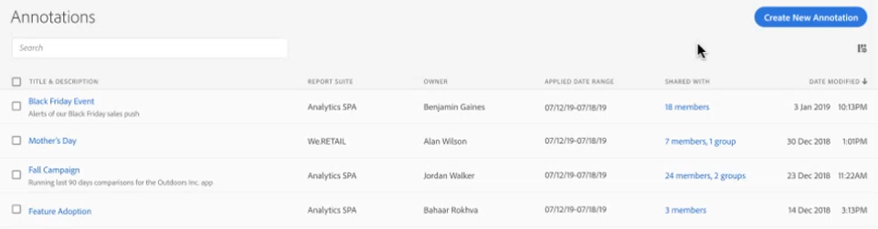

# Gestire le annotazioni

Il gestore [!UICONTROL Components] > [!UICONTROL Annotations] offre diversi modi per gestire le annotazioni, ad esempio condividere, filtrare, assegnare tag, approvare, copiare, eliminare e contrassegnare come preferite.

Il gestore [!UICONTROL Annotations] mostra tutte le annotazioni di cui sei proprietario che sono state assegnate a tutti i tuoi progetti e che sono state condivise con te.

>[!NOTE]
>
>Non vengono invece visualizzate le [!UICONTROL Annotations] che hai creato solo per un progetto specifico.

## Interfaccia utente di Annotations Manager (Gestione annotazioni)

| Elemento nell’interfaccia utente | Descrizione |
| --- | --- | 
| [!UICONTROL Title and Description] | Forniti nel generatore di annotazioni. Per modificare il titolo e la descrizione, fai clic sul collegamento del titolo, che ti riporta al generatore di annotazioni. |
| [!UICONTROL Data view] | Visualizzazioni dati a cui viene applicata l’annotazione. |
| [!UICONTROL Owner] | Proprietario dell’annotazione. In quanto utente non amministratore, puoi visualizzare solo le annotazioni che possiedi o quelle che sono state condivise con te. |
| [!UICONTROL Applied Date Range] | Data o intervallo di date a cui viene applicata l’annotazione. |
| [!UICONTROL Shared with] | Elenca con quanti singoli utenti o gruppi hai condiviso l’annotazione. Fai clic per ulteriori dettagli. |
| [!UICONTROL Date Modified] | Data e ora dell’ultima modifica apportata all’annotazione. |

{style="table-layout:auto"}

## Modificare le annotazioni

La modifica di un’annotazione consente di regolare gli intervalli di date, i colori, l’ambito o se deve essere applicata o meno a tutte le visualizzazioni dati o ai progetti. È possibile modificare le annotazioni in due modi:

* In un grafico a linee, porta il cursore sull’annotazione e fai clic sull’icona a forma di matita nella finestra a comparsa.

* In [!UICONTROL Annotations Manager], fai clic sul titolo dell’annotazione.

Entrambe queste opzioni ti riportano al generatore di annotazioni. Puoi quindi apportare le modifiche necessarie e salvare la nuova versione.

## Condividere le annotazioni

Quando condividi delle annotazioni o usi quelle che sono state condivise con te, tieni presente quanto segue:

* Supponiamo che crei un progetto con annotazioni per il solo progetto, e quindi lo condividi con un altro utente. Le annotazioni verranno visualizzate, ma non possono essere modificate o eliminate dagli utenti con cui condividi il progetto.

* Se salvi un’annotazione e la condividi direttamente con un utente, questa può essere modificata o eliminata solo se l’utente dispone dei diritti di amministratore.

* Per ricapitolare: se il progetto è condiviso con te, l’annotazione viene visualizzata solo in quel determinato progetto. Se l’annotazione viene condivisa direttamente con te, viene visualizzata in tutti i progetti in cui è possibile visualizzarla.

## Annotazioni e fusi orari

Tutte le annotazioni vengono create con una marca temporale, ma senza informazioni relative all’ora o al fuso orario. Al momento della creazione di un rapporto, viene sempre applicato il fuso orario della visualizzazione dati del pannello. Quindi un’annotazione creata per il giorno di Natale si attiva il 25 dicembre, indipendentemente dal fuso orario della visualizzazione dati in cui ti trovi.

Un altro esempio è Capodanno. Ogni ora, in un fuso orario diverso iniziano i fuochi d’artificio per festeggiare il nuovo anno. Alle 22:00 US Mountain Time, sulla costa orientale degli Stati Uniti è già mezzanotte e iniziano i fuochi d’artificio.

## Altre attività di annotazione

La funzione di gestione delle annotazioni consente agli amministratori di modificare, aggiungere, assegnare tag, eliminare, rinominare, approvare, copiare, esportare e filtrare le annotazioni. questa funzione non è visibile agli utenti non amministratori.

Quando selezioni una o più annotazioni, viene visualizzata la barra delle attività.

| Attività | Descrizione |
| --- | --- |
| Add | Consente di accedere al generatore di annotazioni per creare nuove annotazioni. |
| Tag | Tutti gli utenti possono creare tag per le annotazioni e applicarne uno o più a una annotazione. È tuttavia possibile visualizzare solo i tag dei filtri di tua proprietà. Che tipo di tag è utile creare? Di seguito sono riportati alcuni suggerimenti di tag utili:<ul><li>Tag basati sui nomi dei team, ad esempio Social Marketing e Mobile Marketing</li><li>Tag del progetto (tag di analisi), ad esempio Analisi per pagina di ingresso</li><li>Tag di categorie: uomo; geografia</li><li>Tag del flusso di lavoro: Curato per (una specifica unità operativa); Approvato</li></ul> |
| Delete (Elimina) | Quando si elimina un’annotazione, questa viene rimossa da tutti i progetti della tua organizzazione. |
| Rename (Rinomina) | Quando si rinomina un’annotazione, il nuovo nome compare in tutti i progetti a cui è stata applicata. |
| Copy (Copia) | Crea una copia distinta con un proprio ID di annotazione, ma con lo stesso nome e la stessa definizione. |
| Export to CSV (Esporta in CSV) | Esporta la definizione dell’annotazione in un file .csv. |
| Filtro (barra a sinistra) | Filtra in base a tag, visualizzazione dati, proprietari e altri filtri (Personali, Approvati, Preferiti, Condivisi con me e Mostra tutto). |

{style="table-layout:auto"}
