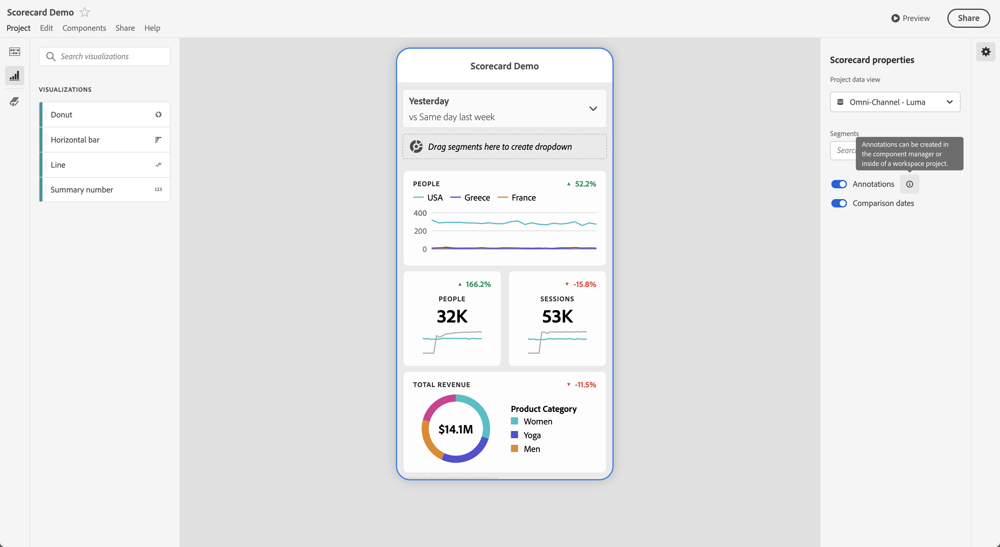
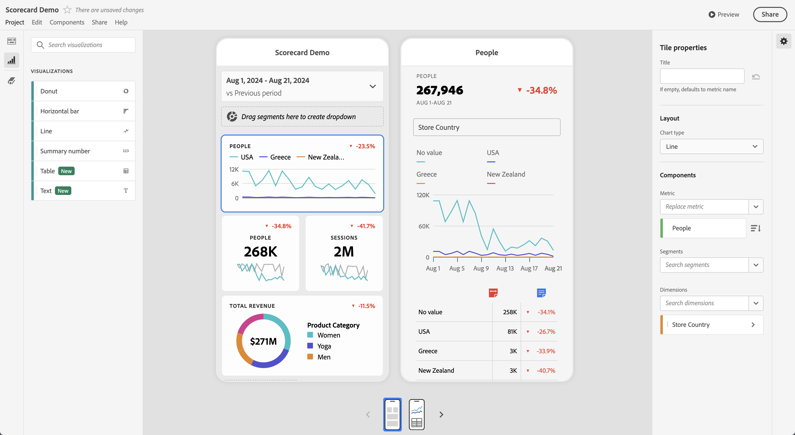
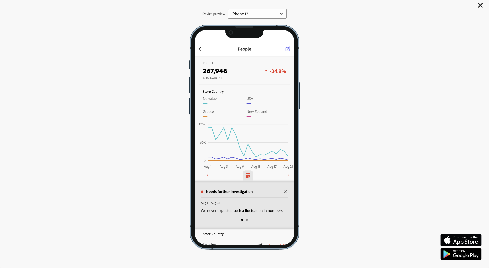

# Annotazioni delle scorecard per dispositivi mobili

Puoi visualizzare le annotazioni create in Analysis Workspace nelle scorecard per dispositivi mobili. Le annotazioni nelle scorecard per dispositivi mobili consentono di condividere dettagli sui dati contestuali e informazioni approfondite sull’organizzazione e sulle campagne.

## Visualizzare le annotazioni nelle scorecard per dispositivi mobili

Per rendere visibili le annotazioni nelle scorecard per dispositivi mobili, crea prima l’annotazione dai progetti Workspace o dal menu dei componenti.

Per informazioni sulla creazione di annotazioni, consulta [Creare annotazioni](create-annotations.md). Per impostazione predefinita, le annotazioni sono disattivate nelle scorecard per dispositivi mobili e devono essere abilitate per ogni scorecard che desideri rendere visibile nelle scorecard per dispositivi mobili.

1. Attiva le annotazioni. Per attivare le annotazioni, consulta [Attivare o disattivare le annotazioni](overview.md#turn-annotations-on-or-off).

1. Crea un’annotazione e assicurati che sia condivisa con tutti i tuoi progetti. Per ulteriori informazioni, consulta [Creare annotazioni](create-annotations.md).

1. Seleziona **[!UICONTROL Mostra annotazioni]** per visualizzare l’annotazione nelle scorecard per dispositivi mobili.

   

   Facoltativamente, puoi confermare che **[!UICONTROL Mostra annotazioni]** sia selezionato in **[!UICONTROL Progetto]** > **[!UICONTROL Informazioni e impostazioni progetto]**

## Visualizzare le annotazioni nelle scorecard per dispositivi mobili

Quando le annotazioni sono abilitate, le icone delle annotazioni sono visibili nel Generatore di scorecard. Le annotazioni vengono visualizzate solo su grafici e tabelle nella visualizzazione dettagliata e non sono visibili dalla visualizzazione affiancata principale della scorecard.

Quando le icone delle annotazioni sono visibili, non puoi visualizzare o interagire completamente con le annotazioni nell’area di lavoro del generatore. Utilizza  **[!UICONTROL Anteprima]** per visualizzare e interagire con le annotazioni così come vengono visualizzate nell&#39;app.

I colori delle annotazioni vengono selezionati al momento della creazione in Workspace. Le annotazioni grigie indicano la presenza di più annotazioni.

## Anteprima delle annotazioni

Puoi visualizzare l’anteprima delle annotazioni utilizzando l’Anteprima . Seleziona un’annotazione per aprirne i dettagli.

Se sono disponibili più annotazioni, nella parte inferiore dell&#39;annotazione verranno visualizzati più punti (●). Scorri verso sinistra o destra per passare da un’annotazione all’altra.
