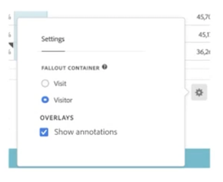

# Panoramica sulle annotazioni

Le annotazioni consentono di comunicare in modo efficace dettagli sui dati contestuali a beneficio degli utenti in tutta l’organizzazione. Consentono di collegare eventi calendario a dimensioni o metriche specifiche. È possibile aggiungere a una data o un intervallo di date annotazioni relative a problemi noti, festività, avvii di campagne, ecc. I rapporti con tendenze nel tempo offrono una rappresentazione grafica degli eventi e di come il traffico sul sito, i ricavi o altre metriche possano essere stati interessati da determinate campagne o altri eventi.

Ad esempio, supponiamo che tu condivida dei progetti con la tua organizzazione. Se si è verificato un picco importante nel traffico a causa di una campagna di marketing, puoi creare un’annotazione &quot;Data di lancio della campagna&quot; e applicarla all’intera visualizzazione dati. Quando gli utenti visualizzano eventuali set di dati che includono tale data, vedono l’annotazione all’interno dei loro progetti, insieme ai relativi dati.

Aspetti da considerare:

* Le annotazioni possono essere associate a una singola data o a un intervallo di date.

* Possono essere applicate all’intero set di dati o a metriche, dimensioni o filtri specifici.

* Possono essere applicate al progetto in cui sono state create (impostazione predefinita) oppure a tutti i progetti.

* Possono essere applicate alla visualizzazione dati in cui sono state create (impostazione predefinita) o a tutte le visualizzazioni dati.

## Autorizzazioni

Per impostazione predefinita, solo gli amministratori possono creare annotazioni. Le autorizzazioni degli utenti per visualizzare le annotazioni sono analoghe a quelle degli altri componenti di Analytics (filtri, metriche calcolate, ecc.).

Tuttavia, gli amministratori possono assegnare agli utenti l’autorizzazione [!UICONTROL Annotation Creation] (Analytics Tools) tramite [Adobe Admin Console](https://experienceleague.adobe.com/docs/analytics/admin/admin-console/permissions/analytics-tools.html?lang=it).

## Attivare o disattivare le annotazioni {#annotations-on-off}

Le annotazioni possono essere attivate o disattivate a diversi livelli:

* A livello di visualizzazione: Impostazioni [!UICONTROL Visualization] > [!UICONTROL Show annotations]

* A livello di progetto: [!UICONTROL Project info & settings] > [!UICONTROL Show annotations]

* A livello utente: [!UICONTROL Components] > [!UICONTROL User preferences] > [!UICONTROL Data] > [!UICONTROL Show annotations]

