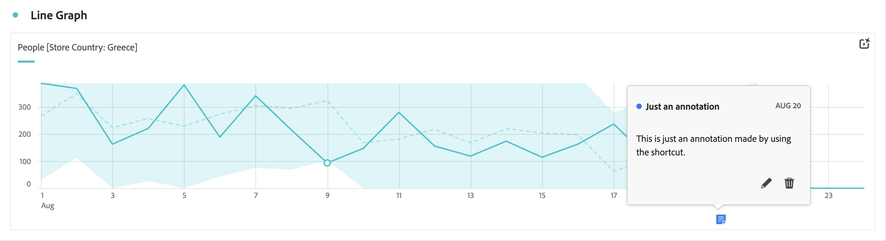
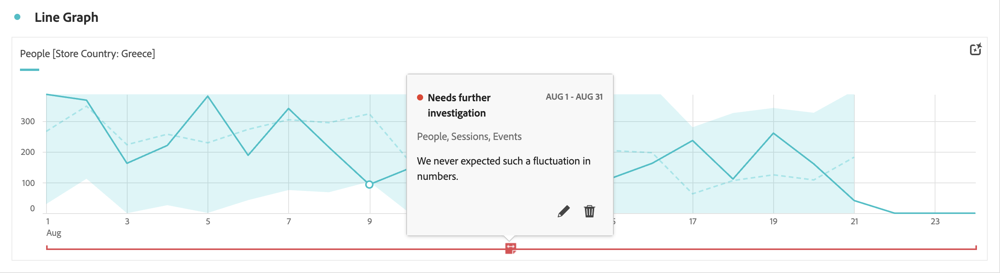
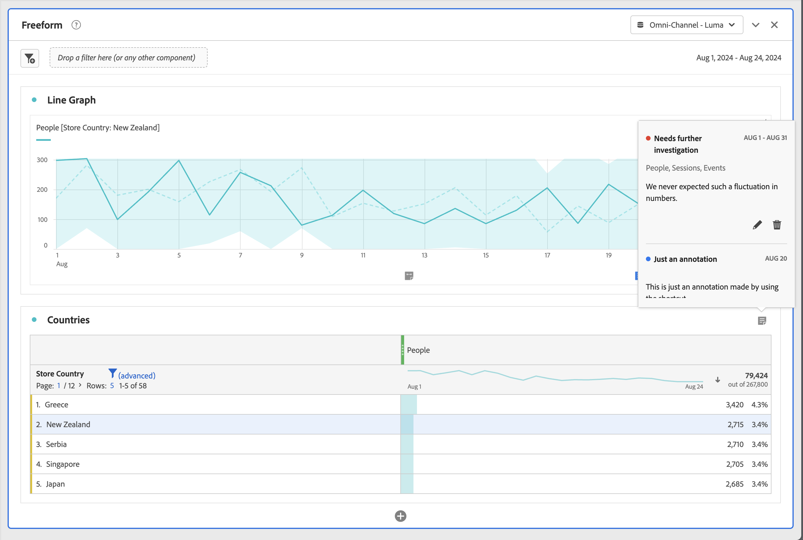
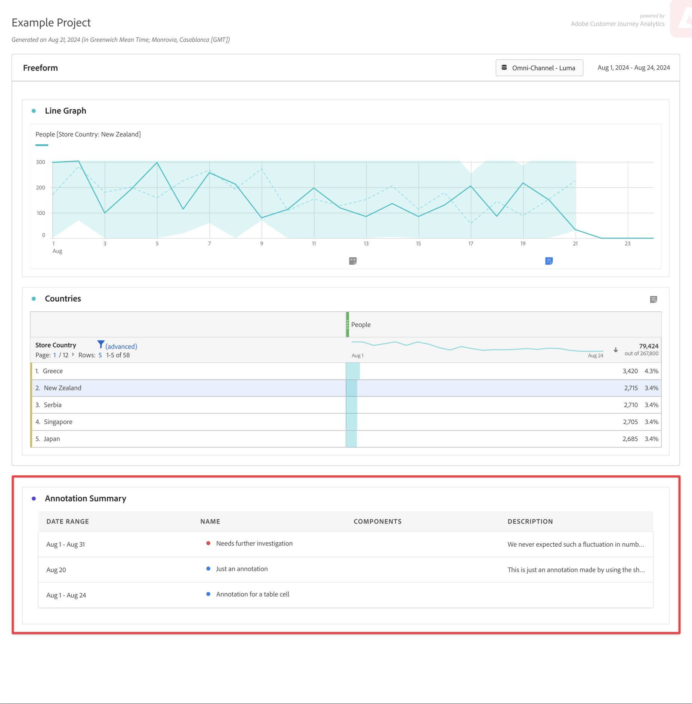

# Visualizzare le annotazioni

Le annotazioni si presentano in modo leggermente diverso, a seconda di dove vengono visualizzate e se si estendono su un singolo giorno o su un intervallo di date.

## Visualizzare le annotazioni nei grafici a linee o nelle tabelle

| Tipo di visualizzazione | Descrizione |
| --- | --- |
| **Linee &#x200B;** **Giorno singolo** | Quando selezioni  in una visualizzazione a linee, si apre un riquadro a comparsa con i dettagli dell’annotazione.  Per modificare l’annotazione nel [generatore di annotazioni](create-annotations.md#annotation-builder), seleziona . Per eliminare l’annotazione, seleziona . |
| **Linee &#x200B;** **Intervallo date** | Quando selezioni  si apre un riquadro a comparsa con i dettagli dell’annotazione e una linea in basso che indica l’intervallo di date. Per modificare l’annotazione nel [generatore di annotazioni](create-annotations.md#annotation-builder), seleziona . Per eliminare l’annotazione, seleziona . |
| **Tabella a forma libera** | In una tabella a forma libera, puoi accedere a tutte le annotazioni dal pulsante delle annotazioni in alto a destra della visualizzazione. Seleziona  per visualizzare un (elenco a scorrimento) di tutte le annotazioni.  Per ogni annotazione, puoi selezionare  per modificare l’annotazione nel [generatore di annotazioni](create-annotations.md#annotation-builder) ed  per eliminarla. |

{style="table-layout:auto"}

## Visualizzare le annotazioni in un PDF

Quando scarichi il progetto come PDF o lo invii come PDF, le annotazioni vengono riepilogate nel PDF nella sezione Riepilogo annotazioni.

