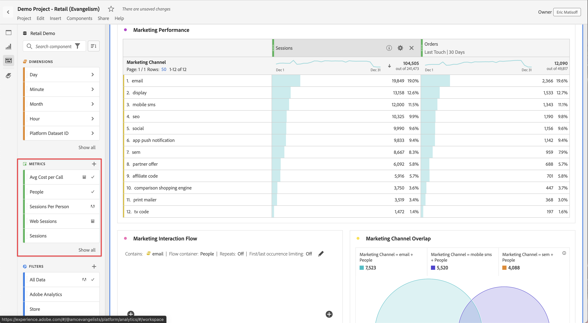

# Metriche

Le metriche consentono di quantificare i punti dati in Analysis Workspace. Sono più comunemente utilizzate come colonne in una visualizzazione e legate alle dimensioni.

## Tipi di metriche

Adobe offre diversi tipi di metriche da utilizzare in Analysis Workspace:

* **Metriche standard**: esempi di metriche standard sono Persone, Sessioni, Eventi.

* **Metriche calcolate** : metriche definite dall’utente basate su metriche standard, numeri statici o funzioni algoritmiche.

* **Modelli di metriche calcolate**   : metriche definite dall’Adobe che si comportano in modo simile alle metriche calcolate. Puoi utilizzarli così come sono nei progetti Workspace o salvarne una copia per personalizzarne la logica.

Puoi vedere se una metrica è approvata   o no. Per ulteriori dettagli su una metrica, passa il cursore del mouse sulla metrica e seleziona .

Le metriche sono flessibili per quanto riguarda il loro utilizzo in Analysis Workspace. Trascina una metrica in una tabella a forma libera vuota per visualizzare la tendenza della metrica nel periodo della data del progetto. Puoi anche trascinare una metrica quando è presente una dimensione per visualizzarla rispetto a ciascun elemento dimensione. Trascinare una metrica sopra un’intestazione di metrica esistente la sostituisce e trascinare una metrica accanto a un’intestazione consente di vedere entrambe le metriche una accanto all’altra.

## Metriche calcolate

Le metriche calcolate consentono di vedere facilmente in che modo le metriche si relazionano tra loro utilizzando semplici operatori o funzioni statistiche. Esistono diversi modi per creare metriche calcolate:

Puoi selezionare **[!UICONTROL Components]** > **[!UICONTROL Calculated metrics]**. In questo modo si accede al [Generatore di metrica calcolata](/help/components/calc-metrics/calc-metr-overview.md), in cui puoi creare metriche personalizzate partendo da metriche esistenti.

Per accelerare e semplificare la creazione delle metriche calcolate, al menu di scelta rapida delle colonne delle tabelle a forma libera è stato aggiunto il comando **[!UICONTROL Create metric from selection]**. Questa opzione viene visualizzata quando è selezionata almeno una cella di intestazione di colonna.

[Metriche calcolate: metriche senza implementazione](https://experienceleague.adobe.com/docs/analytics-learn/tutorials/components/calculated-metrics/calculated-metrics-implementationless-metrics.html?lang=it) (3:42)

## Confrontare metriche con diversi modelli di attribuzione

Per confrontare in modo rapido e semplice un modello di attribuzione con un altro, fai clic con il pulsante destro del mouse su una metrica e seleziona (Aggiungi modello di attribuzione comparativo) **[!UICONTROL Compare Attribution Models]**:

Questa scorciatoia ti consente di confrontare in maniera facile e veloce un modello di attribuzione con un altro senza trascinare una metrica e configurarla due volte.
