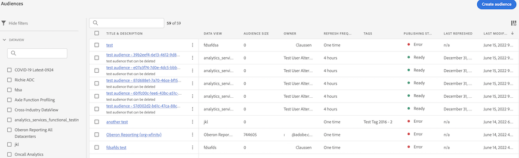

# Gestire i tipi di pubblico creati in Customer Journey Analytics

La gestione dei tipi di pubblico creati in precedenza consente di:

* **pianificare o annullare la pianificazione** dell’aggiornamento automatico del pubblico (la scadenza massima della pianificazione è di un anno);
* **rinnovare una pianificazione di aggiornamento del pubblico** quando sta per scadere (i tipi di pubblico in scadenza vengono trattati in modo simile ai rapporti pianificati in scadenza: l’amministratore riceve un’e-mail un mese prima della scadenza della pianificazione);
* visualizzare l’**intervallo di aggiornamento** e l’**ultimo aggiornamento di un pubblico**;
* ottenere informazioni sul **tempo necessario per produrre un pubblico** da Customer Journey Analytics (CJA) e il tempo necessario per far apparire il pubblico in Real-time Customer Profile a scopo di attivazione;
* scoprire se i tipi di pubblico in CJA sono **utilizzati attivamente da Real-time Customer Profile** o (idealmente) qualsiasi applicazione di Experience Platform che utilizzi i tipi di pubblico creati da CJA.

## Interfaccia utente di gestione

| Impostazione dell’interfaccia utente | Definizione |
| --- | --- |
| Hide/Show filters (Nascondi/mostra filtri) | Consente di mostrare o nascondere i seguenti filtri nella barra a sinistra: <ul><li>[!UICONTROL Data view]</li><li>[!UICONTROL Owner]</li><li>[!UICONTROL Refresh frequency]</li><li>[!UICONTROL Tags]</li></ul> |
| [!UICONTROL Title & Description] | Il titolo e la descrizione conferiti al pubblico al momento della creazione. |
| [!UICONTROL Data view] | La visualizzazione dati in cui è stato creato il pubblico. |
| [!UICONTROL Audience size] | Il numero totale di persone nel pubblico. |
| [!UICONTROL Owner] | Il proprietario del pubblico, la persona che lo ha creato. |
| [!UICONTROL Refresh frequency] | L’intervallo di aggiornamento configurato al momento della creazione del pubblico. |
| [!UICONTROL Tags] | Eventuali tag applicati a questo pubblico. |
| [!UICONTROL Publishing status] | Può mostrare [!UICONTROL Ready], [!UICONTROL In progress] o [!UICONTROL Error]. |
| [!UICONTROL  Last refreshed] | L’ultima volta che il pubblico è stato aggiornato. |
| [!UICONTROL Last modified] | L’ultima volta che il pubblico è stato modificato. |

{style=&quot;table-layout:auto&quot;}
