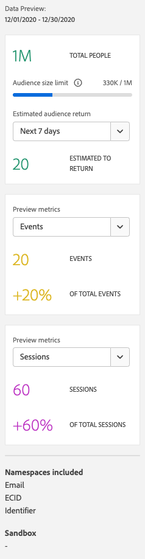

# Creare e pubblicare tipi di pubblico

Questo argomento illustra come creare e pubblicare i tipi di pubblico identificati in Customer Journey Analytics (CJA) su [Real-time Customer Profile](https://experienceleague.adobe.com/docs/experience-platform/profile/home.html?lang=it) in Adobe Experience Platform per la personalizzazione e il targeting dei clienti.

Leggi questa [panoramica](/help/components/audiences/audiences-overview.md) per acquisire familiarità con il concetto di pubblico di CJA.

## Creare un pubblico {#create}

1. Per creare tipi di pubblico, puoi iniziare in diversi modi:

   | Metodo di creazione | Dettagli |
   | --- | --- |
   | Dal menu principale **[!UICONTROL Components]>[!UICONTROL Audiences]** | Viene visualizzata la pagina di gestione dei tipi di pubblico. Fai clic su **[!UICONTROL Create audience]**; viene aperto [!UICONTROL Audience builder]. |
   | Da una tabella a forma libera | Fai clic con il pulsante destro del mouse su un elemento in una tabella a forma libera e seleziona **[!UICONTROL Create an audience from selection]**. Usando questo metodo il filtro viene precompilato con la dimensione o l’elemento della dimensione selezionato nella tabella. |
   | Dall’interfaccia utente di creazione/modifica del filtro | Seleziona la casella che riporta **[!UICONTROL Create an audience from this filter]**. Usando questo metodo il filtro viene precompilato. |

   {style=&quot;table-layout:auto&quot;}

1. Crea il pubblico.

   Configura queste impostazioni prima di pubblicare il pubblico.

   

   | Impostazione | Descrizione |
   | --- | --- |
   | [!UICONTROL Name] | Il nome del pubblico. |
   | [!UICONTROL Tags] | Qualsiasi tag che desideri assegnare al pubblico per motivi organizzativi. Puoi utilizzare un tag preesistente o inserirne uno nuovo. |
   | [!UICONTROL Description] | Aggiungi una buona descrizione del pubblico, per distinguerlo dagli altri. |
   | [!UICONTROL Refresh frequency] | La frequenza con cui desideri aggiornare il pubblico.<ul><li>Puoi scegliere di creare un pubblico una tantum (impostazione predefinita) che non necessita di aggiornamento. Ad esempio, potrebbe essere utile per campagne una tantum specifiche.</li><li>Puoi selezionare altri intervalli di aggiornamento. Per la frequenza di aggiornamento di 4 ore, esiste un limite di 75-150 aggiornamenti del pubblico, a seconda dell’adesione all’CJA.</li></ul> |
   | Data di scadenza | La data in cui il pubblico smetterà di aggiornarsi. Il valore predefinito è un anno dalla data di creazione. I tipi di pubblico in scadenza vengono trattati in modo simile ai rapporti pianificati in scadenza: l’amministratore riceve un’e-mail un mese prima della scadenza del pubblico. |
   | Finestra di lookback di aggiornamento | Specifica quanto indietro desideri andare nella finestra dei dati durante la creazione del pubblico. Il massimo è 90 giorni. |
   | [!UICONTROL One-time date range] | L’intervallo di date per la pubblicazione del pubblico una tantum. |
   | [!UICONTROL Filter] | I filtri sono l’input principale per il pubblico. Puoi aggiungere fino a 20 filtri. Questi filtri possono essere uniti con gli operatori `And` o `Or`. |
   | [!UICONTROL View sample IDs] | Un campione di ID in questo pubblico. Utilizza la barra di ricerca per cercare ID di esempio. |

   {style=&quot;table-layout:auto&quot;}

1. Interpreta l’anteprima dei dati.

   L’anteprima del pubblico viene visualizzata nella barra a destra. Consente di avere un’analisi sintetica del pubblico creato.

   

   | Impostazione di anteprima | Descrizione |
   | --- | --- |
   | Finestra di [!UICONTROL Data preview] | L’intervallo di date per il pubblico. |
   | [!UICONTROL Total people] | Un numero di riepilogo del numero totale di persone presenti nel pubblico. Può arrivare fino a 20 milioni di persone. Se il pubblico supera i 20 milioni di persone, devi ridurne la dimensione prima di poterlo pubblicare. |
   | [!UICONTROL Audience size limit] | Mostra quanto è lontano il pubblico dal limite di 20 milioni. |
   | [!UICONTROL Estimated audience return] | Questa impostazione è utile per il retargeting dei clienti del pubblico che ritornano al tuo sito. In altre parole, che compaiono nuovamente in questo set di dati. 
Qui puoi selezionare l’intervallo di tempo (i prossimi sette giorni, le prossime due settimane, il prossimo mese) per ottenere la stima del numero di clienti che potrebbero tornare. |
   | [!UICONTROL Estimated to return] | Questo numero fornisce una stima dei clienti fidelizzati nell’intervallo di tempo selezionato dall’elenco a discesa. Per prevedere questo numero usiamo il tasso storico di abbandono del pubblico. |
   | [!UICONTROL Preview metrics] | Questa impostazione ti consente di esaminare metriche specifiche per verificare se il pubblico contribuisce in misura sproporzionata a questa metrica, ad esempio “[!UICONTROL Revenue]” o “[!UICONTROL Average time on site]”. Ti fornisce il conteggio complessivo della metrica, così come la percentuale del totale che rappresenta. Puoi selezionare qualsiasi metrica disponibile nella visualizzazione dati. |
   | [!UICONTROL Namespaces included] | Gli spazi dei nomi specifici associati alle persone nel pubblico. Alcuni esempi includono ECID, ID CRM, indirizzi e-mail e così via. |
   | [!UICONTROL Sandbox] | La [sandbox di Experience Platform](https://experienceleague.adobe.com/docs/experience-platform/sandbox/home.html?lang=it) in cui risiede il pubblico. Quando pubblichi questo pubblico in Platform, puoi utilizzarlo solo entro i confini di questa sandbox. |

   {style=&quot;table-layout:auto&quot;}

1. Controlla nuovamente la configurazione del pubblico e fai clic su **[!UICONTROL Publish]**.

   Se tutto è andato correttamente, riceverai un messaggio di conferma della pubblicazione del pubblico. Ci vogliono solo pochi minuti perché questo pubblico venga visualizzato in Experience Platform. Anche per i tipi di pubblico con milioni di membri, dovrebbero essere necessari meno di 5 minuti.

1. Fai clic su **[!UICONTROL View audience in AEP]** all’interno dello stesso messaggio; ti porterà all’[interfaccia utente dei segmenti](https://experienceleague.adobe.com/docs/experience-platform/segmentation/ui/overview.html?lang=it) in Adobe Experience Platform. Per ulteriori informazioni, vedi di seguito.

## Cosa succede dopo la creazione di un pubblico {#after-audience-created}

Dopo aver creato un pubblico, Adobe crea un segmento di streaming Experience Platform per ogni nuovo pubblico CJA.

* Il segmento AEP condivide lo stesso nome/descrizione del pubblico CJA, ma al nome verrà aggiunto l’ID del pubblico di CJA per assicurarne l’univocità.

* Se il nome/descrizione del pubblico CJA cambia, anche il nome/descrizione del segmento AEP riflette tale modifica.

* Se un pubblico CJA viene eliminato da un utente, il segmento AEP NON viene eliminato. Il motivo è che in seguito il pubblico di CJA potrebbe essere rimosso.

## Utilizzare i tipi di pubblico di CJA in Experience Platform {#audiences-aep}

CJA prende tutte le combinazioni di spazio dei nomi e ID dal pubblico pubblicato e le invia in streaming al Profilo del cliente in tempo reale (RTCP). CJA invia il pubblico ad Experience Platform con il set di identità principale, in base a ciò che è stato selezionato come [!UICONTROL Person ID] quando la connessione è stata configurata.

RTCP esamina quindi ogni combinazione di spazio dei nomi/ID e cerca un profilo di cui potrebbe far parte. Un profilo è fondamentalmente un cluster di spazi dei nomi, ID e dispositivi collegati. Se trova un profilo, aggiungerà lo spazio dei nomi e l’ID agli altri ID in questo profilo come attributo di appartenenza al segmento. Ora, ad esempio, “user@adobe.com” può essere impostato come destinatario su tutti i relativi dispositivi e canali. Se non viene trovato un profilo, ne viene creato uno nuovo.

Puoi visualizzare i tipi di pubblico di CJA in Platform andando su **[!UICONTROL Segments]** > **[!UICONTROL Create segments]** > scheda **[!UICONTROL Audiences]** > **[!UICONTROL CJA Audiences]**.

Puoi trascinare i tipi di pubblico di CJA nella definizione del segmento dei segmenti di AEP.

## Domande frequenti {#faq}

Domande frequenti sulla pubblicazione di tipi di pubblico.

+++**Cosa succede se un utente non è più membro di un pubblico in CJA?**

In questo caso, viene inviato un evento di uscita a Experience Platform da CJA.

+++

+++**Cosa succede se elimini un pubblico in CJA?**

Quando un pubblico CJA viene eliminato, non viene più visualizzato nell’interfaccia utente di Experience Platform. Tuttavia, in Platform nessun profilo associato a quel pubblico viene effettivamente eliminato.

+++

+++**Se in RTCDP non esiste un profilo corrispondente, verrà creato un nuovo profilo?**

Sì.

+++

+++**CJA invia i dati del pubblico come eventi della pipeline o un file flat che va anche al data lake?**

CJA trasferisce i dati in RTCP tramite pipeline, che viene inoltre raccolta in un set di dati di sistema nel data lake.

+++

+++**Quali identità invia CJA?**

Qualsiasi coppia di identità/namespace utilizzata nella [Configurazione della connessione](https://experienceleague.adobe.com/docs/analytics-platform/using/cja-connections/create-connection.html?lang=it#create-connection). Nello specifico, il passaggio in cui un utente seleziona il campo che desidera utilizzare come &quot;ID persona&quot;.

+++

+++**Quale ID è scelto come identità principale?**

Vedi sopra. Inviiamo una sola identità per &quot;persona&quot; CJA.

+++

+++**RTCP elabora anche i messaggi CJA? CJA può aggiungere identità a un grafico dell’identità di profilo tramite la condivisione del pubblico?**

No. Inviiamo una sola identità per &quot;persona&quot;, quindi non ci sarebbero bordi grafici da utilizzare per RTCP.

+++

## Passaggi successivi

* Per gestire questo pubblico, vai all’[interfaccia utente di gestione](/help/components/audiences/manage.md).
