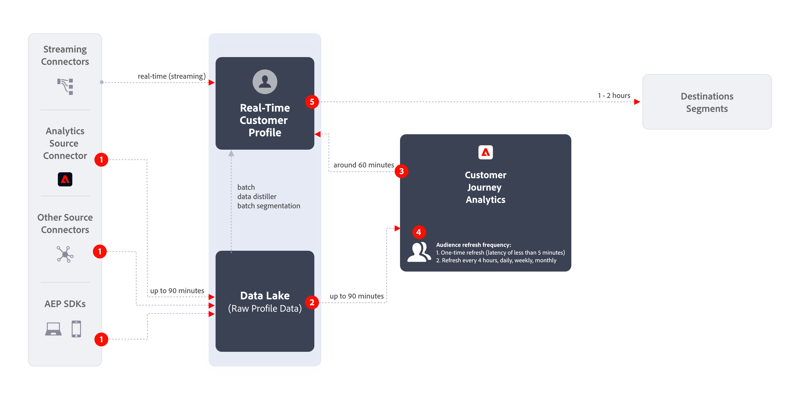

# Creare e pubblicare tipi di pubblico

Questo argomento illustra come creare e pubblicare i tipi di pubblico identificati nel Customer Journey Analytics a [Profilo cliente in tempo reale](https://experienceleague.adobe.com/docs/experience-platform/profile/home.html?lang=it) in Adobe Experience Platform per il targeting e la personalizzazione dei clienti.

Leggi questo [panoramica](/help/components/audiences/audiences-overview.md) acquisire familiarità con il concetto di pubblico di Customer Journey Analytics.

## Creare un pubblico {#create}

1. Per creare tipi di pubblico, puoi iniziare in diversi modi:

   | Metodo di creazione | Dettagli |
   | --- | --- |
   | Dal menu principale **[!UICONTROL Components]>[!UICONTROL Audiences]** | Viene visualizzata la pagina di gestione dei tipi di pubblico. Fai clic su **[!UICONTROL Create audience]**; viene aperto [!UICONTROL Audience builder]. |
   | Da una tabella a forma libera | Fai clic con il pulsante destro del mouse su un elemento in una tabella a forma libera e seleziona **[!UICONTROL Create an audience from selection]**. Usando questo metodo il filtro viene precompilato con la dimensione o l’elemento della dimensione selezionato nella tabella. |
   | Dall’interfaccia utente di creazione/modifica del filtro | Seleziona la casella che riporta **[!UICONTROL Create an audience from this filter]**. Usando questo metodo il filtro viene precompilato. |

   {style="table-layout:auto"}

1. Crea il pubblico.

   Configura queste impostazioni prima di pubblicare il pubblico.

   

   | Impostazione | Descrizione |
   | --- | --- |
   | [!UICONTROL Name] | Il nome del pubblico. |
   | [!UICONTROL Tags] | Qualsiasi tag che desideri assegnare al pubblico per motivi organizzativi. Puoi utilizzare un tag preesistente o inserirne uno nuovo. |
   | [!UICONTROL Description] | Aggiungi una buona descrizione del pubblico, per distinguerlo dagli altri. |
   | [!UICONTROL Refresh frequency] | La frequenza con cui desideri aggiornare il pubblico.<ul><li>Puoi scegliere di creare un pubblico una tantum (impostazione predefinita) che non necessita di aggiornamento. Ad esempio, potrebbe essere utile per campagne una tantum specifiche.</li><li>Puoi selezionare altri intervalli di aggiornamento. Per la frequenza di aggiornamento di 4 ore, esiste un limite di 75-150 aggiornamenti del pubblico, a seconda dell’adesione al Customer Journey Analytics.</li></ul> |
   | Data di scadenza | La data in cui il pubblico smetterà di aggiornarsi. Il valore predefinito è un anno dalla data di creazione. I tipi di pubblico in scadenza vengono trattati in modo simile ai rapporti pianificati in scadenza: l’amministratore riceve un’e-mail un mese prima della scadenza del pubblico. |
   | Finestra di lookback di aggiornamento | Specifica quanto indietro desideri andare nella finestra dei dati durante la creazione del pubblico. Il massimo è 90 giorni. |
   | [!UICONTROL One-time date range] | L’intervallo di date per la pubblicazione del pubblico una tantum. |
   | [!UICONTROL Filter] | I filtri sono l’input principale per il pubblico. Puoi aggiungere fino a 20 filtri. Questi filtri possono essere uniti con gli operatori `And` o `Or`. |
   | [!UICONTROL View sample IDs] | Un campione di ID in questo pubblico. Utilizza la barra di ricerca per cercare ID di esempio. |

   {style="table-layout:auto"}

1. Interpreta l’anteprima dei dati.

   L’anteprima del pubblico viene visualizzata nella barra a destra. Consente di avere un’analisi sintetica del pubblico creato.

   

   | Impostazione di anteprima | Descrizione |
   | --- | --- |
   | Finestra di [!UICONTROL Data preview] | L’intervallo di date per il pubblico. |
   | [!UICONTROL Total people] | Un numero di riepilogo del numero totale di persone presenti nel pubblico. Può arrivare fino a 20 milioni di persone. Se il pubblico supera i 20 milioni di persone, devi ridurne la dimensione prima di poterlo pubblicare. |
   | [!UICONTROL Audience size limit] | Mostra quanto è lontano il pubblico dal limite di 20 milioni. |
   | [!UICONTROL Estimated audience return] | Questa impostazione è utile per il retargeting dei clienti del pubblico che ritornano al tuo sito. In altre parole, che compaiono nuovamente in questo set di dati. 
Qui puoi selezionare l’arco temporale (i prossimi sette giorni, le prossime due settimane, il prossimo mese) per ottenere la stima del numero di clienti che potrebbero tornare. |
   | [!UICONTROL Estimated to return] | Questo numero fornisce una stima dei clienti fidelizzati nell’arco temporale selezionato dall’elenco a discesa. Per prevedere questo numero usiamo il tasso storico di abbandono del pubblico. |
   | [!UICONTROL Preview metrics] | Questa impostazione ti consente di esaminare metriche specifiche per verificare se il pubblico contribuisce in misura sproporzionata a questa metrica, ad esempio “[!UICONTROL Revenue]” o “[!UICONTROL Average time on site]”. Ti fornisce il conteggio complessivo della metrica, così come la percentuale del totale che rappresenta. Puoi selezionare qualsiasi metrica disponibile nella visualizzazione dati. |
   | [!UICONTROL Namespaces included] | Gli spazi dei nomi specifici associati alle persone nel pubblico. Alcuni esempi includono ECID, ID CRM, indirizzi e-mail e così via. |
   | [!UICONTROL Sandbox] | La [sandbox di Experience Platform](https://experienceleague.adobe.com/docs/experience-platform/sandbox/home.html?lang=it) in cui risiede il pubblico. Quando pubblichi questo pubblico in Platform, puoi utilizzarlo solo entro i confini di questa sandbox. |

   {style="table-layout:auto"}

1. Controlla nuovamente la configurazione del pubblico e fai clic su **[!UICONTROL Publish]**.

   Se tutto è andato correttamente, riceverai un messaggio di conferma della pubblicazione del pubblico. Ci vogliono solo pochi minuti perché questo pubblico venga visualizzato in Experience Platform. Anche per i tipi di pubblico con milioni di membri, dovrebbero essere necessari meno di 5 minuti.

1. Fai clic su **[!UICONTROL View audience in AEP]** all’interno dello stesso messaggio; ti porterà all’[interfaccia utente dei segmenti](https://experienceleague.adobe.com/docs/experience-platform/segmentation/ui/overview.html?lang=it) in Adobe Experience Platform. Per ulteriori informazioni, vedi di seguito.

## Cosa succede dopo la creazione di un pubblico? {#after-audience-created}

Dopo aver creato un pubblico, Adobe crea un segmento di streaming di Experience Platform per ogni nuovo pubblico di Customer Journey Analytics. Un segmento di streaming di Adobe Experience Platform viene creato solo se l’organizzazione è configurata per la segmentazione in streaming.

* Il segmento Adobe Experience Platform condivide lo stesso nome/descrizione del pubblico del Customer Journey Analytics, ma al nome verrà aggiunto l’ID del pubblico del Customer Journey Analytics per garantire che sia univoco.
* Se il nome/la descrizione del pubblico del Customer Journey Analytics cambia, anche il nome/la descrizione del segmento di Adobe Experience Platform riflette tale modifica.
* Se un pubblico di Customer Journey Analytics viene eliminato da un utente, il segmento Adobe Experience Platform NON viene eliminato. Il motivo è che il pubblico di Customer Journey Analytics potrebbe in seguito non essere eliminato.

## Considerazioni sulla latenza {#latency}

In diversi punti prima, durante e dopo la pubblicazione del pubblico, possono verificarsi latenze. Ecco una panoramica delle latenze che possono verificarsi.

| # | Punto di latenza | Durata della latenza |
| --- | --- | --- |
| Non visualizzato | Connettore di origine da Adobe Analytics ad Analytics (A4T) | Fino a 30 minuti |
| 1 | Acquisizione dei dati nel Data Lake (dal connettore di origine di Analytics o da altre origini) | Fino a 90 minuti |
| 2 | Acquisizione dei dati da Experienci Platform Data Lake a Customer Journey Analytics | Fino a 90 minuti |
| 3 | La pubblicazione dei tipi di pubblico sul Profilo cliente in tempo reale inclusa la creazione automatica del segmento in streaming e consentendo al segmento di essere pronto a ricevere i dati.
**Nota**: il pubblico viene creato/definito in Experienci Platform entro 1-2 minuti. Tuttavia, sono necessari circa 60 minuti prima che il pubblico inizi a ricevere gli ID in base ai criteri corrispondenti ed è pronto per l’attivazione. | Circa 60 minuti |
| 4 | Frequenza di aggiornamento per tipi di pubblico | <ul><li>Aggiornamento singolo (latenza inferiore a 5 minuti)</li><li>Aggiornamento ogni 4 ore, ogni giorno, ogni settimana, ogni mese (la latenza va di pari passo con la frequenza di aggiornamento) |
| 5 | Creazione di una destinazione in Adobe Experience Platform: attivazione del nuovo segmento | 1-2 ore |

{style="table-layout:auto"}

## Utilizzare i tipi di pubblico di Customer Journey Analytics in Experienci Platform {#audiences-aep}

Customer Journey Analytics prende tutte le combinazioni di spazi dei nomi e ID dal pubblico pubblicato e le trasmette a Real-time Customer Profile (RTCP). Il Customer Journey Analytics invia il pubblico all&#39;Experience Platform con l&#39;identità primaria impostata, in base a quella selezionata come [!UICONTROL Person ID] quando la connessione è stata configurata.

RTCP esamina quindi ogni combinazione di spazio dei nomi/ID e cerca un profilo di cui potrebbe far parte. Un profilo è fondamentalmente un cluster di spazi dei nomi, ID e dispositivi collegati. Se trova un profilo, aggiungerà lo spazio dei nomi e l’ID agli altri ID in questo profilo come attributo di appartenenza al segmento. Ora, per esempio, <user@adobe.com> possono essere indirizzati a tutti i loro dispositivi e canali. Se non viene trovato un profilo, ne viene creato uno nuovo.

Puoi visualizzare i tipi di pubblico del Customer Journey Analytics in Platform andando su **[!UICONTROL Segments]** > **[!UICONTROL Create segments]** > **[!UICONTROL Audiences]** scheda > **[!UICONTROL CJA Audiences]**.

Puoi trascinare i tipi di pubblico del Customer Journey Analytics nella definizione del segmento per i segmenti di Adobe Experience Platform.

## Domande frequenti {#faq}

Domande frequenti sulla pubblicazione dei tipi di pubblico.

+++**Cosa succede se un utente non è più membro di un pubblico in un Customer Journey Analytics?**

In questo caso, viene inviato un evento di uscita all’Experience Platform dal Customer Journey Analytics.

+++

+++**Cosa succede se elimini un pubblico nel Customer Journey Analytics?**

Quando un pubblico di Customer Journey Analytics viene eliminato, non viene più visualizzato nell’interfaccia utente di Experienci Platform. Tuttavia, in Platform nessun profilo associato a quel pubblico viene effettivamente eliminato.

+++

+++**Se in RTCDP non esiste un profilo corrispondente, verrà creato un nuovo profilo?**

Sì.

+++

+++**Il Customer Journey Analytics invia i dati del pubblico come eventi della pipeline o come file flat che va anche al data lake?**

Il Customer Journey Analytics trasmette i dati in RTCP tramite pipeline e questi dati vengono raccolti anche in un set di dati di sistema nel data lake.

+++

+++**Quali identità trasmette il Customer Journey Analytics?**

Qualsiasi coppia identità/spazio dei nomi specificata nel [Configurazione della connessione](https://experienceleague.adobe.com/docs/analytics-platform/using/cja-connections/create-connection.html?lang=it#create-connection). Nello specifico, il passaggio in cui un utente seleziona il campo che desidera utilizzare come “ID persona”.

+++

+++**Quale ID è scelto come identità primaria?**

Vedi sopra. Mandiamo una sola identità per Customer Journey Analytics &quot;persona&quot;.

+++

+++**RTCP elabora anche i messaggi del Customer Journey Analytics? Il Customer Journey Analytics può aggiungere identità a un grafico delle identità di profilo tramite la condivisione dei tipi di pubblico?**

No. Inviamo una sola identità per “persona”, quindi RTCP non avrebbe bordi del grafico da utilizzare.

+++

+++**A che ora vengono eseguiti aggiornamenti giornalieri, settimanali e mensili? In quale giorno della settimana si verificano aggiornamenti settimanali?**

La tempistica dell’aggiornamento si basa su quando è stato pubblicato il pubblico originale ed è ancorata a tale ora del giorno (e al giorno della settimana o del mese).

+++

+++**Gli utenti possono configurare l’ora di aggiornamento giornaliera, settimanale e mensile?**

No, non possono essere configurate dagli utenti.

+++

## Passaggi successivi

* Per gestire questo pubblico, vai all’[interfaccia utente di gestione](/help/components/audiences/manage.md).
