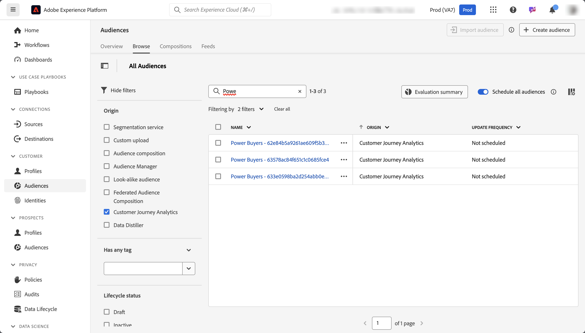

# Creare e pubblicare tipi di pubblico {#create-and-publish-audiences}

<!-- markdownlint-disable MD034 -->

>[!CONTEXTUALHELP]
>id="components_audiences_refreshfrequency"
>title="Frequenza di aggiornamento"
>abstract="Scopri con quale frequenza verrà rivalutata l’iscrizione di un pubblico. I tipi di pubblico occasionali vengono valutati una sola volta."

<!-- markdownlint-enable MD034 -->

<!-- markdownlint-disable MD034 -->

>[!CONTEXTUALHELP]
>id="components_audiences_audiencelimit"
>title="Limite del pubblico"
>abstract="L’aggiornamento dei tipi di pubblico è limitato in base alla frequenza con cui questi vengono aggiornati."

<!-- markdownlint-enable MD034 -->

<!-- markdownlint-disable MD034 -->

>[!CONTEXTUALHELP]
>id="component_audiences_refreshlookbackwindow"
>title="Finestra di lookback di aggiornamento"
>abstract="Definisci il numero di giorni di lookback a partire da oggi da cui viene valutato un pubblico."

<!-- markdownlint-enable MD034 -->

<!-- markdownlint-disable MD034 -->

>[!CONTEXTUALHELP]
>id="component_audiences_audiencesizelimit"
>title="Limite della dimensione del pubblico"
>abstract="Il pubblico non può superare la dimensione di 20 milioni di membri."

<!-- markdownlint-enable MD034 -->

<!-- markdownlint-disable MD034 -->

>[!CONTEXTUALHELP]
>id="component_audiences_namespacesincluded"
>title="Spazi dei nomi inclusi"
>abstract="Le identità in questo pubblico sono composte dagli spazi dei nomi seguenti."

<!-- markdownlint-enable MD034 -->

Questo argomento illustra come creare e pubblicare i tipi di pubblico identificati in Customer Journey Analytics su [Profilo cliente in tempo reale](https://experienceleague.adobe.com/it/docs/experience-platform/profile/home) in Adobe Experience Platform per la personalizzazione e il targeting dei clienti.

Consulta questa [panoramica](/help/components/audiences/audiences-overview.md) per acquisire familiarità con il concetto di tipi di pubblico in Customer Journey Analytics.

## Creare e pubblicare un pubblico {#create}

1. Per creare e pubblicare un pubblico, effettua una delle seguenti operazioni:

   | Metodo di creazione | Dettagli |
   | --- | --- |
   | Dall’interfaccia **[!UICONTROL Audiences]**. | Seleziona **[!UICONTROL Components]** > **[!UICONTROL Audiences]** dal menu principale di Customer Journey Analytics. Viene visualizzata l’interfaccia Tipi di pubblico. Seleziona **[!UICONTROL Create audience]** per aprire [!UICONTROL Audience builder]. |
   | Da una visualizzazione in Analysis Workspace | Molte visualizzazioni in Analysis Workspace consentono di creare un pubblico utilizzando il menu di scelta rapida. Ad esempio, puoi selezionare **[!UICONTROL Create audience]** dal menu di scelta rapida di un elemento in una [tabella a forma libera](/help/analysis-workspace/visualizations/freeform-table/freeform-table.md) o un nodo nell’[Area di lavoro del percorso](/help/analysis-workspace/visualizations/journey-canvas/journey-canvas.md).
L’utilizzo di questo metodo precompila il segmento in Audience builder con la dimensione o l’elemento dimensione selezionato.

Le seguenti visualizzazioni ti consentono di creare un pubblico utilizzando il menu di scelta rapida:
<ul><li>[Tabella coorte](/help/analysis-workspace/visualizations/cohort-table/cohort-analysis.md)</li><li>[Fallout](/help/analysis-workspace/visualizations/fallout/fallout-flow.md)</li><li>[Flusso](/help/analysis-workspace/visualizations/c-flow/flow.md)</li><li>[Tabella a forma libera](/help/analysis-workspace/visualizations/freeform-table/freeform-table.md)</li><li>[Area di lavoro del percorso](/help/analysis-workspace/visualizations/journey-canvas/journey-canvas.md)</li><li>[Venn](/help/analysis-workspace/visualizations/venn.md)</li></ul>
**Nota:** i tipi di pubblico non possono includere metriche calcolate. Se tenti di creare un pubblico che contiene una metrica calcolata, questa non viene inclusa nella definizione del pubblico.
 |
   | Dall’interfaccia utente di creazione/modifica del segmento | Seleziona la casella con la dicitura **[!UICONTROL Create an audience from this segment]**. Usando questo metodo il segmento viene precompilato. Per ulteriori informazioni, consulta [Creare i segmenti](/help/components/segments/seg-create.md). |

   {style="table-layout:auto"}

1. Crea il pubblico utilizzando [Audience builder](#audience-builder).

1. Interpreta i dati utilizzando il pannello [Anteprima data](#data-preview).

1. Seleziona **[!UICONTROL [!UICONTROL View sample IDs]]** per visualizzare un esempio di ID in questo pubblico. Nella finestra di dialogo **[!UICONTROL Sample IDs]** puoi utilizzare  [!UICONTROL *Ricerca ID di esempio*] per cercare ID di esempio.

1. Controlla nuovamente la configurazione del pubblico e seleziona **[!UICONTROL Publish]**.
Ricevi un messaggio di conferma della pubblicazione del pubblico. Ci vogliono solo pochi minuti perché questo pubblico venga visualizzato in Experience Platform.

1. Selezionando **[!UICONTROL View audience in AEP]** all’interno dello stesso messaggio; vieni portato all’[interfaccia utente dei segmenti](https://experienceleague.adobe.com/it/docs/experience-platform/segmentation/ui/overview) in Adobe Experience Platform. Per ulteriori informazioni, vedi di seguito.

## Audience builder

Configura queste impostazioni per definire o aggiornare il pubblico.

| Impostazione | Descrizione |
| --- | --- |
|  | Seleziona una visualizzazione dati da utilizzare per la creazione del pubblico. |
| **[!UICONTROL Name]** | Il nome del pubblico. Ad esempio: `Really Interested in Potential Car Buyers` |
| **[!UICONTROL Tags]** | Qualsiasi tag che desideri assegnare al pubblico per motivi organizzativi. Puoi selezionare uno o più tag preesistenti o immetterne uno nuovo. |
| **[!UICONTROL Description]** | Descrizione del pubblico, per distinguerlo dagli altri. Ad esempio: `Build an audience of really interested potential car buyers` |
| **[!UICONTROL Refresh frequency]** | La frequenza con cui desideri aggiornare il pubblico.
Puoi scegliere tra <ul><li>Pubblico **[!UICONTROL One time]**: un pubblico (predefinito) che non deve essere aggiornato. Ad esempio, potrebbe essere utile per campagne una tantum specifiche. Devi specificare un **[!UICONTROL One time date range]**. Puoi utilizzare  per immettere un intervallo di date.</li><li>Un pubblico che si aggiorna. Puoi scegliere una delle opzioni seguenti:<ul><li>**[!UICONTROL Every 4 hour]**: un pubblico che si aggiorna ogni 4 ore.</li><li>**[!UICONTROL Daily]**: un pubblico che si aggiorna ogni giorno</li><li>**[!UICONTROL Weekly]**: un pubblico che si aggiorna settimanalmente.</li><li>**[!UICONTROL Monthly]**: un pubblico che si aggiorna mensilmente</li></ul></li>Per i tipi di pubblico che si aggiornano, devi specificare:<ul><li>**[!UICONTROL Refresh lookback window]**. Definisci il numero di giorni di lookback a partire da oggi da cui viene valutato un pubblico. Puoi selezionare una delle opzioni o definire un’ora personalizzata. Il massimo è 90 giorni.</li><li>**[!UICONTROL Expiration date]**: definisci quando il pubblico smette di aggiornarsi. Puoi utilizzare  per selezionare una data. Il valore predefinito è un anno dalla data di creazione. I tipi di pubblico in scadenza vengono trattati in modo simile ai rapporti pianificati in scadenza. L’amministratore riceve un’e-mail un mese prima della scadenza del pubblico.</li></ul> Tieni presente che esiste un limite di 75-150 aggiornamenti di pubblico, a seconda della tua adesione a Customer Journey Analytics.</li></ul> |
| **[!UICONTROL Filter]** | I filtri sono l’input principale per il pubblico. Trascina nell’area Segmento uno o più segmenti dal pannello  **[!UICONTROL Segment]** a sinistra. Per cercare i segmenti, puoi utilizzare  [!UICONTROL *Ricerca segmenti*]. Puoi aggiungere fino a 20 segmenti. I segmenti possono essere uniti con gli operatori **[!UICONTROL And]** o **[!UICONTROL Or]**.
Se crei un pubblico da una visualizzazione in Analysis Workspace (ad esempio, da una tabella a forma libera o dall’area di lavoro del percorso), vengono mantenuti tutti i segmenti applicati al pannello o alla colonna. Puoi rimuovere i segmenti applicati in automatico.
 |
| **[!UICONTROL Data preview]** | Seleziona  per mostrare o nascondere l’[Anteprima dati](#data-preview) per l’intervallo date selezionato. |

## Anteprima dati

Il pannello Anteprima dati fornisce le seguenti informazioni.

| Elemento | Descrizione |
| --- | --- |
| **[!UICONTROL Total people]** | Un numero di riepilogo del numero totale di persone presenti nel pubblico. La dimensione massima è di 20 milioni di persone. Se il pubblico supera i 20 milioni di persone, devi ridurne la dimensione prima di poterlo pubblicare. |
| **[!UICONTROL Audience size limit]** | Visualizzazione che mostra quanto è lontano questo pubblico dal limite di 20 milioni. |
| **[!UICONTROL Estimated audience return]** | Puoi utilizzare questo valore per eseguire il retargeting delle persone nel pubblico che tornano al tuo sito, all’app mobile o a un altro canale.
Puoi selezionare l’intervallo di tempo (**[!UICONTROL Next 7 days]**, **[!UICONTROL Next 2 weeks]** o **[!UICONTROL Next month]**) per il numero stimato di clienti che potrebbero tornare. |
| **[!UICONTROL Estimated to return]** | Questo numero fornisce una stima dei clienti di ritorno nell’arco temporale che hai selezionato. Questo numero viene previsto utilizzando il tasso di abbandono storico per questo pubblico. |
| **[!UICONTROL Preview metrics]** | Puoi selezionare una metrica specifica per vedere in che modo i dati per quella metrica si basano sul pubblico definito.  Ogni metrica di anteprima mostra un totale per la metrica in base al pubblico. E una percentuale della metrica basata sul pubblico rispetto al totale complessivo della metrica, come definito dalla visualizzazione dati. Ad esempio, 381 persone (la metrica selezionata) sono il risultato della definizione del pubblico, che è il 5% del totale delle persone disponibili nella visualizzazione dati. Puoi selezionare qualsiasi metrica disponibile nella visualizzazione dati. |
| **[!UICONTROL Namespaces included]** | Gli spazi dei nomi specifici associati alle persone nel pubblico. Alcuni esempi includono ECID, ID CRM, indirizzi e-mail e così via. |
| **[!UICONTROL Sandbox]** | La [sandbox di Experience Platform](https://experienceleague.adobe.com/it/docs/experience-platform/sandbox/home) in cui risiede il pubblico. Quando pubblichi questo pubblico in Platform, puoi utilizzarlo solo entro i confini di questa sandbox. |

{style="table-layout:auto"}

## Cosa succede dopo la creazione e la pubblicazione di un pubblico? {#after-audience-created}

Dopo aver creato e pubblicato un pubblico in Customer Journey Analytics, questo è disponibile in Experience Platform e può essere visualizzato nel [portale dei tipi di pubblico](https://experienceleague.adobe.com/it/docs/experience-platform/segmentation/ui/audience-portal). Se il pubblico è disponibile in Experience Platform, può essere utilizzato in altre applicazioni Experience Platform, come Adobe Journey Optimizer.

Un segmento di Adobe Experience Platform in streaming verrà creato solo se l’organizzazione è configurata per la segmentazione in streaming.

Quando si utilizzano tipi di pubblico pubblicati da Customer Journey Analytics ad Experience Platform, considera quanto segue:

* Il pubblico in Experience Platform condivide lo stesso nome e la stessa descrizione del pubblico in Customer Journey Analytics. Al nome viene aggiunto l’ID del pubblico di Customer Journey Analytics per garantire che il pubblico sia univoco.
* Eventuali modifiche apportate al nome o alla descrizione del pubblico in Customer Journey Analytics vengono riportate in Experience Platform.
* Un pubblico che viene eliminato in Customer Journey Analytics continua a essere disponibile in Experience Platform fino alla scadenza dell’iscrizione al profilo del pubblico. L’iscrizione al profilo scade dopo 420 giorni per i tipi di pubblico una tantum e dopo 16 giorni per i tipi di pubblico ricorrenti.

## Considerazioni sulla latenza {#latency}

In diversi intervalli precedenti, durante e dopo la pubblicazione del pubblico, possono verificarsi alcune latenze. Ecco una panoramica delle latenze che possono verificarsi.

|  | Punto di latenza | Durata della latenza |
| --- | --- | --- |
| Non visualizzata | Connettore di origine da Adobe Analytics ad Analytics (A4T) | Fino a 30 minuti |
| 1 | Acquisizione dei dati nel data lake (dal connettore di origine di Analytics o da altre origini) | Fino a 90 minuti |
| 2 | Acquisizione dei dati dal data lake Experience Platform in Customer Journey Analytics | Fino a 90 minuti |
| 3 | Pubblicazione del pubblico sul Profilo cliente in tempo reale inclusa la creazione automatica del segmento in streaming, autorizzato e pronto a ricevere i dati. | Qualche secondo |
| 4 | Frequenza di aggiornamento per tipi di pubblico | <ul><li>Aggiornamento singolo (latenza inferiore a 5 minuti)</li><li>Aggiornamento ogni 4 ore, ogni giorno, ogni settimana, ogni mese (la latenza va di pari passo con la frequenza di aggiornamento) |
| 5 | Creazione della destinazione in Adobe Experience Platform: attivazione del nuovo segmento | 1-2 ore |

{style="table-layout:auto"}

## Utilizzare i tipi di pubblico di Customer Journey Analytics in Experience Platform {#audiences-aep}

Customer Journey Analytics prende tutte le combinazioni di spazi dei nomi e ID dal pubblico pubblicato e le trasmette a Real-Time Customer Data Platform. Customer Journey Analytics invia il pubblico a Experience Platform con l’identità primaria impostata in base a ciò che è stato selezionato come [!UICONTROL Person ID] al momento della configurazione della connessione.

Real-Time Customer Data Platform esamina quindi ogni combinazione di spazio dei nomi/ID e cerca un profilo di cui potrebbe far parte. Un profilo è fondamentalmente un cluster di spazi dei nomi, ID e dispositivi collegati. Se trova un profilo, aggiunge lo spazio dei nomi e l’ID agli altri ID in questo profilo come attributo di appartenenza al segmento. Ad esempio, può essere eseguito il targeting di <user@adobe.com> su tutti i relativi dispositivi e canali. Se non viene trovato un profilo, ne viene creato uno nuovo.

Per visualizzare i tipi di pubblico di Customer Journey Analytics in Platform:

1. Espandi **[!UICONTROL Customer]** nel pannello a sinistra, quindi seleziona **[!UICONTROL Audiences]**. <!-- is there a folder called "Customer Journey Analytics? -->

1. Seleziona la scheda **[!UICONTROL Browse]**.

1. Per individuare il pubblico pubblicato da Customer Journey Analytics, effettua una delle seguenti operazioni:

   

   * Ordina la tabella in base alla colonna **[!UICONTROL Origin]** per visualizzare i tipi di pubblico che mostrano [!UICONTROL **Customer Journey Analytics**] come origine.

   * Filtra  su **[!UICONTROL Origin]** e seleziona **[!UICONTROL Customer Journey Analytics]**.

   * Utilizza il campo di ricerca .

Per ulteriori informazioni sull’utilizzo dei tipi di pubblico in Platform, consulta la sezione [Tipi di pubblico](https://experienceleague.adobe.com/it/docs/experience-platform/segmentation/ui/segment-builder) nella [guida dell’interfaccia utente del Generatore di segmenti](https://experienceleague.adobe.com/it/docs/experience-platform/segmentation/ui/segment-builder), nella documentazione di Experience Platform.

### Comprendere le discrepanze nei conteggi del pubblico

Possono verificarsi discrepanze nei conteggi del pubblico tra Customer Journey Analytics e Real-Time Customer Data Platform.

<!--

-->

#### Conteggi stimati e deterministici

La metodologia con cui vengono calcolati i numeri di iscrizione al pubblico differisce tra le due app, come descritto di seguito.

* **Customer Journey Analytics**: la metrica **[!UICONTROL Total People]** in Customer Journey Analytics è un valore stimato. Ciò significa che il conteggio è una stima basata sulle regole del pubblico e può variare tra gli intervalli di aggiornamento.
* **Real-Time Customer Data Platform**: il conteggio in Real-Time Customer Data Platform è deterministico, basato sui processi di valutazione giornalieri e corretto al termine della pubblicazione del pubblico nel portale del pubblico.

#### Intervallo e frequenza di pubblicazione

I tipi di pubblico vengono pubblicati in Real-Time Customer Data Platform a una velocità di 1500 record al secondo (RPS). Ad esempio, un pubblico di 20 milioni di membri impiegherà circa 3,7 ore per la pubblicazione completa (20M/1500 RPS/3600 secondi all’ora). Durante questo periodo, sono probabili differenze di iscrizione al pubblico tra le due app.

#### Frammentazione del profilo

Se i profili importati da Customer Journey Analytics esistono già in Real-Time Customer Data Platform, non vengono conteggiati come nuovi profili. Questo può causare conteggi di profili inferiori al previsto in Real-Time Customer Data Platform.

#### Tipi di pubblico in batch e in streaming

I tipi di pubblico di Customer Journey Analytics non sono inclusi nel processo di valutazione batch giornaliero e rimangono invariati fino al successivo intervallo di pubblicazione. Al contrario, altri tipi di pubblico in batch in Real-Time Customer Data Platform vengono rivalutati ogni 24 ore.

### Punti chiave da ricordare

* **Conteggi stimati in Customer Journey Analytics**: comprendere che il conteggio delle **[!UICONTROL Total People]** in Customer Journey Analytics è una stima e può variare a causa dei dati in streaming e dei comportamenti di identità.
* **Conteggi deterministici in Real-Time Customer Data Platform**: il conteggio in Real-Time Customer Data Platform è fisso e non cambia fino al successivo intervallo di pubblicazione.
* **Frammentazione dei profili**: tieni presente che i profili esistenti in Real-Time Customer Data Platform potrebbero non contribuire a nuovi conteggi di profili durante l’importazione da Customer Journey Analytics.

Differenziando chiaramente questi aspetti, puoi comprendere e gestire meglio i dati del pubblico in Customer Journey Analytics e Real-Time Customer Data Platform.--->

## Domande frequenti {#faq}

Domande frequenti sulla pubblicazione dei tipi di pubblico.

+++**Cosa succede se un utente non è più membro di un pubblico in Customer Journey Analytics?**

In questo caso, viene inviato un evento di uscita a Experience Platform da Customer Journey Analytics.

+++

+++**Cosa succede se elimini un pubblico in Customer Journey Analytics?**

Quando un pubblico Customer Journey Analytics viene eliminato, non viene più visualizzato nell’interfaccia utente di Experience Platform. Tuttavia, i profili associati a quel pubblico non vengono eliminati in Experience Platform.

+++

+++**Se in Real-Time Customer Data Platform non esiste un profilo corrispondente, verrà creato un nuovo profilo?**

Sì.

+++

+++**Customer Journey Analytics invia i dati del pubblico come eventi della pipeline o come un file flat che viene trasmesso anche al data lake?**

Customer Journey Analytics trasmette i dati in Real-Time Customer Data Platform tramite pipeline e questi dati vengono anche raccolti in un set di dati di sistema nel data lake.

+++

+++**Quali identità invia Customer Journey Analytics?**

Qualsiasi coppia di identità/spazio dei nomi utilizzata nella [configurazione della connessione](https://experienceleague.adobe.com/it/docs/analytics-platform/using/cja-connections/create-connection). Nello specifico, il passaggio in cui un utente seleziona il campo che desidera utilizzare come ID persona.

+++

+++**Quale ID è scelto come identità primaria?**

Vedi sopra. Viene inviata una sola identità per persona Customer Journey Analytics.

+++

+++**Real-Time Customer Data Platform elabora anche i messaggi di Customer Journey Analytics? Customer Journey Analytics può aggiungere identità a un grafo identità di profilo tramite la condivisione del pubblico?**

No. Viene inviata una sola identità per persona, quindi non ci sarebbero bordi nel grafo da utilizzare per Real-Time Customer Data Platform.

+++

+++**A che ora del giorno vengono eseguiti aggiornamenti giornalieri, settimanali e mensili? Quale giorno della settimana si verificano aggiornamenti settimanali?**

La tempistica dell’aggiornamento si basa su quando è stato pubblicato il pubblico originale ed è ancorata a tale ora del giorno (e al giorno della settimana o del mese).

+++

+++**È possibile configurare l’orario dell’aggiornamento giornaliero, settimanale e mensile?**

No, gli utenti non possono configurare l’orario dell’aggiornamento.

+++

## Passaggi successivi

* Per gestire questo pubblico, vai all’[interfaccia utente di gestione](/help/components/audiences/manage.md).
