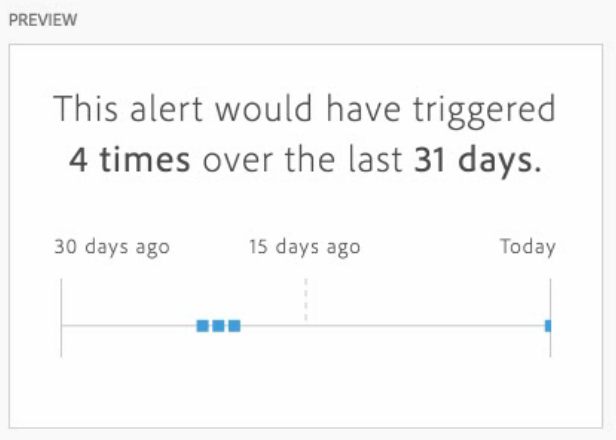

# Creare avvisi

>[!NOTE]
>
>L&#39;utilizzo degli avvisi con rilevamento delle anomalie (noti anche come _avvisi intelligenti_) è disponibile solo per le organizzazioni con un pacchetto Select di Customer Journey Analytics, Prime o Ultimate.

Gli avvisi nel Customer Journey Analytics ti consentono di ricevere notifiche in base a percentuali modificate o a punti dati specifici. A seconda del pacchetto di Customer Journey Analytics, puoi anche utilizzare gli avvisi da attivare in base alle soglie delle anomalie.

Per informazioni di panoramica più dettagliate sugli avvisi, vedere [Panoramica avvisi](/help/components/c-intelligent-alerts/intelligent-alerts.md).

Per creare un avviso:

1. Inizia a creare un avviso accedendo al generatore di avvisi. <!-- add this back in after the other methods are available like in AA and make a bulleted list: "You can access the alert builder in any of the following ways:" --> Nel Customer Journey Analytics, selezionare **[!UICONTROL Components]** > [!UICONTROL **Avvisi**] > **[!UICONTROL Create new alert]**.

   Viene visualizzato il generatore di avvisi. Questa interfaccia è familiare a coloro che hanno creato segmenti o metriche calcolate in Analytics:

   

1. Specificare le opzioni seguenti per configurare l&#39;avviso:

   | Opzione | Descrizione |
   |---------|----------|
   | [!UICONTROL **Titolo**] | Inserisci un nome per l’avviso. Il nome può contenere il nome del rapporto o la soglia di metrica. |
   | [!UICONTROL **Descrizione (facoltativo)**] | Specificare una descrizione per l&#39;avviso. |
   | [!UICONTROL **Granularità temporale**] | Seleziona la frequenza con cui vuoi che la metrica venga controllata: Giornaliero, Settimanale o Mensile.
<b>Nota:</b>Nelle visualizzazioni dati con un calendario personalizzato non è supportata la granularità mensile nel generatore di avvisi.<!--true?-->
 |
   | [!UICONTROL **Recipients (Destinatari)**] | Specifica a chi deve essere inviato l’avviso. Può essere inviato a un utente o un gruppo di Analytics, a un indirizzo e-mail o a un numero telefonico.
<b>Importante:</b>Il numero di telefono deve essere preceduto dal segno &quot;+&quot; e dal [codice paese](https://countrycode.org/).

L’e-mail che un utente riceve dopo l’attivazione di un avviso è simile al seguente:

 |
   | [!UICONTROL **Data di scadenza**] | Impostare la data e l&#39;ora di scadenza dell&#39;avviso. |
   | [!UICONTROL **Ritardo**] | Il tempo necessario prima che i dati siano completi e disponibili per essere segnalati in Customer Journey Analytics varia in base all’organizzazione, in genere da 3 a 9 ore dopo l’ora dell’evento dati. Affinché gli avvisi siano precisi, i dati evento per un determinato intervallo di eventi devono essere completi, il che significa che Adobe non riceve più i dati evento per l’intervallo di eventi specificato.
Per tenere conto di questo ritardo nel tempo di acquisizione, gli avvisi hanno un ritardo predefinito di 9 ore prima di essere inviati.

Puoi impostare il ritardo predefinito di 9 ore su un valore compreso tra 0 e 24 ore. Tuttavia, la riduzione del ritardo al di sotto di 9 ore può significare che stai eseguendo la segnalazione di dati incompleti, il che si traduce in informazioni di avviso imprecise.

Quando riduci il tempo di ritardo, considera quanto segue:
<ul><li>**Comprendere la disponibilità dei dati rispetto alla completezza dei dati**: alcuni dati potrebbero essere disponibili per generare rapporti prima, ma tutti i dati batch vengono acquisiti in un set di dati di Platform solo dopo un periodo di 3-9 ore. Affinché gli avvisi siano precisi, l’acquisizione dei dati deve essere completa, con tutti i dati batch disponibili nel set di dati.</li><li>**Determinare il tempo necessario per il completamento e la disponibilità dei dati nel set di dati**: i tempi di inserimento dei dati variano a seconda dell&#39;organizzazione. Verificare che il ritardo scelto per la consegna degli avvisi sia lo stesso o meno frequente del tempo necessario per rendere disponibili i dati batch nel set di dati di Platform<!--add link? -->.</li>
**Suggerimento:** Il modo più accurato per conoscere il tempo necessario per il completamento e l&#39;acquisizione di tutti i dati batch nel set di dati di Platform consiste nel consultare i data engineer della tua organizzazione.

In alternativa, puoi avere un’idea generale di quanto tempo ci vuole affinché la consegna in batch nell’organizzazione sia disponibile nel set di dati di Platform creando la seguente tabella a forma libera in Analysis Workspace:
<ol><li>In una tabella a forma libera in Analysis Workspace, aggiungi una metrica [!UICONTROL **Events**] e una dimensione [!UICONTROL **Day**].</li><li>Suddividi la dimensione [!UICONTROL **Giorno**] utilizzando una dimensione [!UICONTROL **Ore**].
Le ore prive di dati verranno visualizzate come 0.
</li></ol><li>**Conto degli errori nei calcoli**: se riduci il tempo di ritardo predefinito, ti consigliamo di configurare il ritardo per almeno un&#39;ora in più rispetto al tempo necessario all&#39;organizzazione per completare l&#39;acquisizione dei dati. Ad esempio, in caso di ritardo di 3 ore prima del completamento dell’acquisizione dei dati, imposta il ritardo su 4 ore.</li></ul>
Per ulteriori informazioni, vedere [I tempi di inserimento dei dati variano nel Customer Journey Analytics](/help/components/c-intelligent-alerts/alerts-feature-comparison.md#data-ingestion-times-vary-in-customer-journey-analytics) nell&#39;articolo [Confronto delle funzionalità degli avvisi: Customer Journey Analytics e Adobe Analytics](/help/components/c-intelligent-alerts/alerts-feature-comparison.md). |
   | [!UICONTROL **Invia un avviso quando**] | [!UICONTROL **Uno di questi trigger di metriche**]: trascinare le metriche (comprese le metriche calcolate) qui per creare trigger per l&#39;avviso.
Se non tutte le metriche, le dimensioni o i segmenti nell&#39;avviso sono compatibili con la visualizzazione dati attualmente selezionata, viene visualizzato il messaggio **&quot;components incompatibili&quot;**.

Determina la soglia che dovrà essere superata affinché venga attivato l’avviso. Puoi impostare questo valore su una soglia e quindi su una delle seguenti condizioni:
<ul><li>anomaly exists (l’anomalia esiste)</li><li>anomaly is above expected (l’anomalia supera il valore previsto)</li><li>anomaly is below expected (l’anomalia è inferiore al valore previsto)</li><li>is above or equals (è superiore o uguale a)</li><li>is below or equals (è inferiore o uguale a)</li><li>changes by (cambia di)</li><li>Puoi impostare una soglia di 90%, 95%, 99%, 99,75% o 99,9%.</li></ul>
[!UICONTROL **Con tutti questi filtri**]: trascina segmenti o dimensioni per aggiungere filtri. Ad esempio, l’aggiunta di un segmento &quot;Solo dispositivi mobili&quot; significherebbe che la regola si attiva solo per i dispositivi mobili. Puoi aggiungere altri filtri utilizzando un’istruzione AND. Per aggiungere una regola AND o OR, fai clic sull’icona a forma di ingranaggio.

Vedi [Avvisi - casi d&#39;uso](/help/components/c-intelligent-alerts/alerts-use-cases.md) per esempio, casi d&#39;uso.
 |
   | [!UICONTROL **Anteprima**] | L’anteprima interattiva degli avvisi mostra la frequenza approssimativa di un avviso sulla base dell’esperienza passata.
Ad esempio, se imposti la granularità su Ogni giorno, l’anteprima indicherà che l’avviso è stato attivato x volte per una specifica metrica negli ultimi 30 o 31 giorni.

Se riscontri che sarebbero stati attivati troppi avvisi, puoi regolare la soglia in [Gestione avvisi](/help/components/c-intelligent-alerts/alert-manager.md).

 |

1. Seleziona [!UICONTROL **Salva**].

