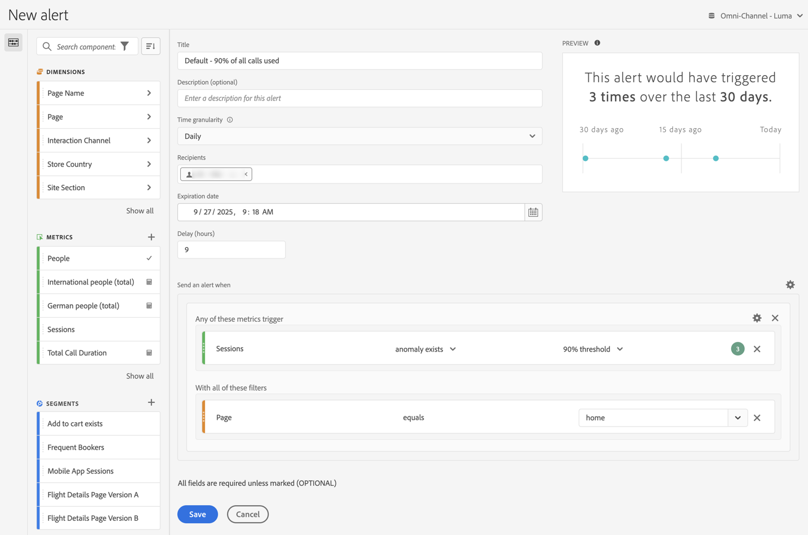
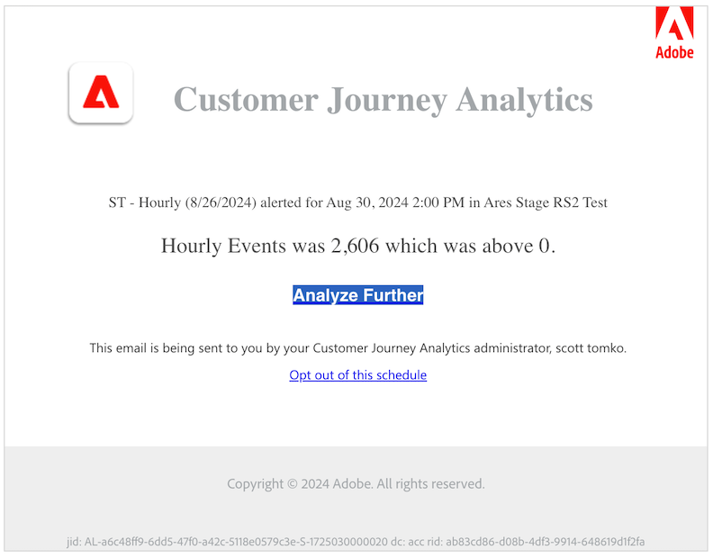
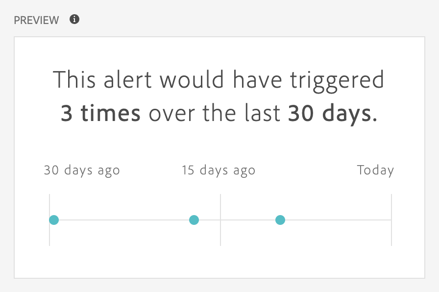

# Creare avvisi {#create-alerts}

<!-- markdownlint-disable MD034 -->

>[!CONTEXTUALHELP]
>id="components_alerts_timegranularity"
>title="Granularità temporale"
>abstract="La granularità temporale si riferisce alla frequenza con cui viene controllato l’avviso."

<!-- markdownlint-enable MD034 -->

>[!NOTE]
>
>L’utilizzo degli avvisi con rilevamento delle anomalie (noti anche come _avvisi intelligenti_) è disponibile solo per le organizzazioni con un pacchetto Customer Journey Analytics Prime o Ultimate.

Gli avvisi in Customer Journey Analytics ti consentono di ricevere notifiche in base a percentuali di modifica o a punti dati specifici. A seconda del pacchetto di Customer Journey Analytics, puoi anche utilizzare gli avvisi da attivare in base alle soglie delle anomalie.

Per informazioni più dettagliate sugli avvisi, vedere [Panoramica avvisi](/help/components/c-intelligent-alerts/intelligent-alerts.md).

Per creare un avviso:

<!-- Note that there are difference in how alerts are created in CJA vs AA. In AA you can create alerts from the Workspace menu and using a shortcut; these are not possible in CJA... -->

1. In Customer Journey Analytics, selezionare **[!UICONTROL Componenti]** > **[!UICONTROL Avvisi]**. In [Gestione avvisi](alert-manager.md), selezionare  **[!UICONTROL Aggiungi]** per creare un nuovo avviso oppure selezionare uno degli avvisi elencati per modificare un avviso esistente.

1. In Analysis Workspace, seleziona uno o più elementi di riga in una tabella a forma libera, seleziona **[!UICONTROL Crea avviso dalla selezione]** dal menu di scelta rapida. Questa azione precompila immediatamente il generatore di avvisi per creare un avviso con le metriche e i segmenti corretti.

Viene visualizzata l’interfaccia del [Generatore di avvisi](#alert-builder).

## Generatore di avvisi

L’interfaccia del Generatore di avvisi è familiare a quella utilizzata per creare segmenti o metriche calcolate in Customer Journey Analytics:

Specifica i seguenti dettagli nel generatore di avvisi per un avviso:

| Elemento | Descrizione |
|---------|----------|
| **[!UICONTROL Titolo]** | Specificare un nome per l&#39;avviso. Il nome dell’avviso può contenere il nome del rapporto o la soglia delle metriche. |
| **[!UICONTROL Descrizione (facoltativo)]** | Inserisci una descrizione per l’avviso. |
| **[!UICONTROL Granularità temporale]** | Specifica quanto spesso desideri che la metrica sia controllata: ogni giorno, settimana o mese.
<b>Nota</b>: per le visualizzazioni dati con un [calendario personalizzato](/help/data-views/create-dataview.md#calendar), la granularità mensile non è supportata nel generatore di avvisi.<!--true?-->
 |
| **[!UICONTROL Recipients (Destinatari)]** | Specifica dove può essere inviato l’avviso. Un avviso può essere inviato a un utente Analytics, a un gruppo Analytics, a un indirizzo e-mail non elaborato o a un numero di telefono.
<b>Importante</b>: il numero di telefono deve essere preceduto da un `+` e da un [codice paese](https://countrycode.org/).

L’e-mail che un utente riceve dopo un avviso:

 |
| **[!UICONTROL Data di scadenza]** | Imposta la data e l’ora di scadenza dell’avviso. |
| **[!UICONTROL Ritardo]** | Il tempo necessario prima che i dati siano completi e disponibili per essere inseriti in Customer Journey Analytics varia a seconda dell’organizzazione, in genere da 3 a 9 ore dopo l’ora dell’evento dati. Affinché gli avvisi siano precisi, i dati evento per un determinato intervallo di eventi devono essere completi, il che significa che Adobe non riceve più i dati evento per l’intervallo di eventi specificato.
Per tenere conto di questo ritardo nel tempo di acquisizione, gli avvisi hanno un ritardo predefinito di 9 ore prima di essere inviati.

Puoi impostare il ritardo predefinito di 9 ore su qualsiasi valore compreso tra 0 e 24 ore. Tuttavia, la riduzione del ritardo al di sotto di 9 ore può significare che stai eseguendo un rapporto con dati incompleti, il che si traduce in informazioni di avviso imprecise.

Quando configuri la riduzione del ritardo, tieni presente quanto segue:
<ul><li>**Comprendere la disponibilità dei dati rispetto alla completezza dei dati**: i dati batch vengono acquisiti in un set di dati Experience Platform solo dopo un periodo di 3-9 ore. Affinché gli avvisi siano precisi, l’acquisizione dei dati deve essere completa, con tutti i dati batch disponibili nel set di dati.</li><li>**Determina il tempo necessario per il completamento e la disponibilità dei dati nel set di dati**: i tempi di acquisizione dei dati variano a seconda dell’organizzazione. Verifica che il ritardo scelto per la consegna degli avvisi sia lo stesso o meno frequente del tempo necessario per rendere disponibili i dati batch nel set di dati di Platform<!--add link? -->.</li>
**Suggerimento:** Il modo più accurato per conoscere il tempo necessario per il completamento e l&#39;acquisizione di tutti i dati batch nel set di dati di Experience Platform consiste nel consultare i data engineer della tua organizzazione.

In alternativa, puoi avere un’idea generale di quanto tempo ci vuole affinché la consegna batch nell’organizzazione sia disponibile nel set di dati di Platform. Crea la seguente tabella a forma libera in Analysis Workspace:
<ol><li>In una tabella a forma libera in Analysis Workspace, aggiungi una metrica [!UICONTROL **Eventi**] e una dimensione [!UICONTROL **Giorno**].</li><li>Suddividi la dimensione [!UICONTROL **Giorno**] utilizzando una dimensione [!UICONTROL **Ore**].
Le ore senza dati vengono visualizzate come 0.
</li></ol><li>**Conto degli errori nei calcoli**: se riduci il ritardo predefinito, configura il ritardo per almeno un&#39;ora in più rispetto al tempo necessario all&#39;organizzazione per completare l&#39;acquisizione dei dati. Ad esempio, in caso di ritardo di 3 ore prima del completamento dell’acquisizione dei dati, imposta il ritardo su 4 ore.</li></ul>
Per ulteriori informazioni, consulta [Tempi di acquisizione dati in Customer Journey Analytics](/help/components/c-intelligent-alerts/alerts-feature-comparison.md#data-ingestion-times-vary-in-customer-journey-analytics) nell’articolo [Confronto delle funzionalità degli avvisi: Customer Journey Analytics e Adobe Analytics](/help/components/c-intelligent-alerts/alerts-feature-comparison.md). |
| **[!UICONTROL Invia un avviso quando]** | [!UICONTROL **Uno di questi trigger di metriche**]: <ol><li>Trascina le metriche (comprese le metriche calcolate) per creare i trigger per l’avviso.
Se non tutte le metriche, dimensioni o segmenti nell&#39;avviso sono compatibili con la suite di rapporti attualmente selezionata, viene visualizzato un messaggio di *componenti non compatibili*.

Determina la soglia (per un’anomalia) che la metrica deve superare o il valore (in caso di sopra, sotto, è uguale o modifica della percentuale) da utilizzare prima di impostare un avviso.</li><li>Seleziona una delle seguenti condizioni:<ul><li>esiste un’anomalia</li><li>anomalia è superiore al previsto</li><li>anomalia inferiore al previsto</li><li>è superiore o uguale a</li><li>è inferiore o uguale a</li><li>modifiche di</li></ul></li><li>Selezionate un valore di soglia o immettete un valore.</li></ol>[!UICONTROL **Con tutti questi filtri**]: trascina segmenti o dimensioni per aggiungere filtri all&#39;avviso. Ad esempio, l&#39;aggiunta di un segmento *Solo dispositivi mobili* implica che la regola viene attivata solo per i dispositivi mobili. Puoi aggiungere altri filtri utilizzando un’istruzione AND. Per aggiungere una regola AND o OR, fai clic sull’icona a forma di ingranaggio.

Consulta [Avvisi: casi d’uso](alerts-use-cases.md) per esempi di casi d’uso.
 |
| **[!UICONTROL Anteprima]** | L’anteprima interattiva degli avvisi mostra la frequenza con cui, approssimativamente, un avviso viene attivato in base all’esperienza passata.
Ad esempio, se imposti la granularità temporale su giornaliera, l’anteprima può indicare che l’avviso sarebbe stato attivato per una determinata metrica x volte negli ultimi 30 o 31 giorni.

Se vengono attivati troppi avvisi, è possibile regolare la soglia in [Gestisci avvisi](/help/components/c-intelligent-alerts/alert-manager.md).

{width="50%"}
 |
