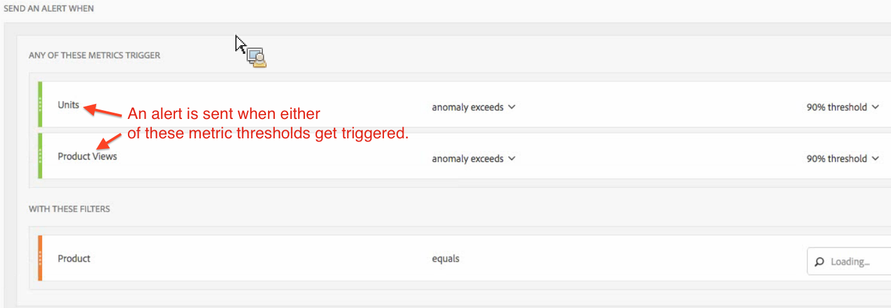

# Avvisi intelligenti: casi di utilizzo

Puoi creare avvisi intelligenti come descritto in [Crea avvisi](/help/components/c-intelligent-alerts/alert-builder.md).

Nelle sezioni seguenti sono illustrati alcuni esempi di casi d’uso da considerare durante la creazione di avvisi.

## Creare un semplice avviso filtrato da due filtri {#section_2E96FFFA93D44F7D8DBCEC97203204AA}

<!-- 

Update screenshots for better readability.

 -->

## Consolidare (raggruppare) gli avvisi invece di creare più avvisi {#section_B27B0856BA104B9FB6D0BBB317633F18}

Gli avvisi possono essere combinati in modo da evitare di ricevere troppi avvisi distinti.

