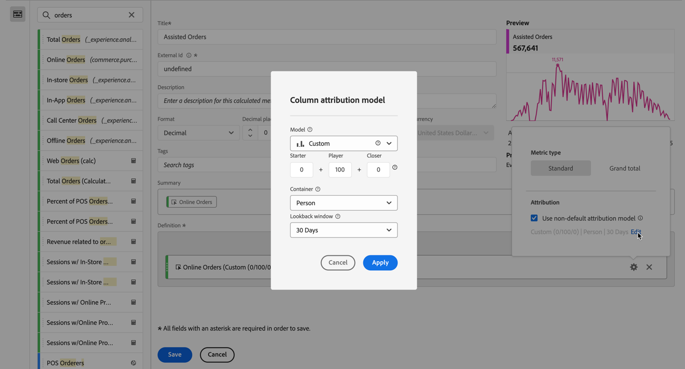
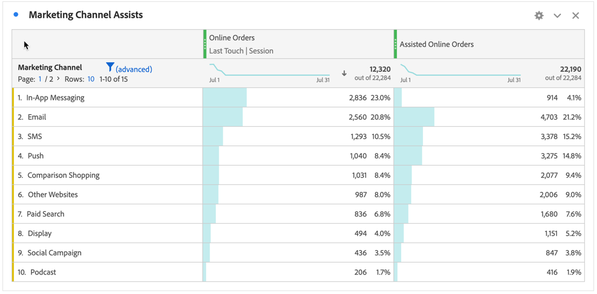

# Creare una metrica calcolata più complessa

Questo articolo spiega un esempio più complesso di metrica calcolata. Queste metriche calcolate mostrano quali canali di marketing forniscono assistenza per la gestione degli ordini. Questo tipo di metrica calcolata può essere adattata a qualsiasi dimensione o evento di successo.

1. Inizia a generare una metrica calcolata, come descritto in [Metriche di compilazione](/help/components/calc-metrics/cm-workflow/cm-build-metrics.md).

1. Nel generatore di metriche calcolate, assegnare un nome alla metrica `Assisted Online Orders` o a un nome simile.

1. Seleziona la metrica **[!UICONTROL Ordini in linea]** dai componenti **[!UICONTROL Metriche]** e trascina la metrica nell&#39;area **[!UICONTROL Definizione]**.

   1. Selezionare  per la metrica.
   1. Selezionare **[!UICONTROL Usa modello di attribuzione non predefinito]**.
   1. Regola il modello di attribuzione nel **[!UICONTROL modello di attribuzione colonna]**.
      1. Seleziona **[!UICONTROL Personalizzato]** per **[!UICONTROL Modello]**. Imposta **[!UICONTROL Starter]** su `0`, **[!UICONTROL Player]** su `100` e **[!UICONTROL Closer]** su `0`.
      1. Seleziona **[!UICONTROL Visitatore]** per **[!UICONTROL Contenitore]**.
      1. Seleziona **[!UICONTROL 30 giorni]** per **[!UICONTROL Intervallo di lookback]**.

      1. Seleziona **[!UICONTROL Applica]**.

      

1. Seleziona **[!UICONTROL Salva]** per salvare la metrica calcolata.

Per utilizzare la metrica calcolata:

1. In Analysis Workspace, crea una tabella a forma libera con la dimensione **[!UICONTROL Canale di marketing]**, **[!UICONTROL Ordini online]** e la nuova metrica **[!UICONTROL Ordini online con assistenza]**.

   

1. (Facoltativo) Condividi la metrica con altri utenti dell&#39;organizzazione, come descritto in [Condividi metriche calcolate](/help/components/calc-metrics/cm-workflow/cm-sharing.md).

Questo è un modo semplice per capire quali canali di marketing hanno assistito negli ordini. In alternativa, da una tabella a forma libera, puoi selezionare qualsiasi metrica e dal menu di scelta rapida regolare il modello di attribuzione direttamente dalla tabella.
