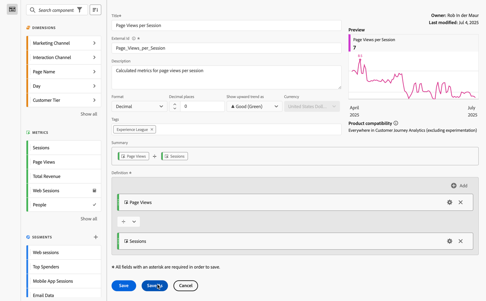

# Creare una metrica calcolata semplice

Le informazioni seguenti spiegano come creare una semplice metrica *Visualizzazioni pagina per visite*.

1. Inizia a generare una metrica, come descritto in [Metriche di compilazione](/help/components/calc-metrics/cm-workflow/cm-build-metrics.md).
1. Denomina la metrica `Page Views per Session` o qualcosa di simile.
1. Assegna alla metrica un **[!UICONTROL Description]** intuitivo per mostrare a cosa serve la metrica.
1. Seleziona **[!UICONTROL Format]** a destra. Per questo esempio, scegliere **[!UICONTROL Decimal]**.
1. Decidi quante cifre decimali visualizzare nel rapporto.
1. Nel menu a discesa **[!UICONTROL Show updward trend as]**, selezionare ▲ **[!UICONTROL Good (Green)]**.
1. Aggiungi **[!UICONTROL Tag]** per organizzare le metriche.
1. Per questa metrica calcolata, trascinare **[!UICONTROL Page Views]** dai componenti **[!UICONTROL Metrics]** nella sezione **[!UICONTROL Definition]** dell&#39;area di lavoro.
1. Trascinare quindi **[!UICONTROL Sessions]** dai componenti **[!UICONTROL Metrics]** e rilasciare la metrica sotto **[!UICONTROL Page Views]** (attendere che la linea blu venga visualizzata prima di rilasciare la metrica).
1. Selezionare l&#39;operatore . (Dividi è l&#39;operatore predefinito).
1. È possibile visualizzare un **[!UICONTROL Preview]** della metrica durante la creazione della metrica.
1. **[!UICONTROL Product compatibility]** mostra se la metrica calcolata è compatibile ovunque in Customer Journey Analytics (esclusa la sperimentazione).

   
1. Seleziona **[!UICONTROL Save]**.

   La formula **[!UICONTROL Summary]** viene aggiornata ogni volta che si apporta una modifica alla definizione della metrica.

1. (Facoltativo) Per condividere, approvare, (ri)assegnare tag, rinominare o eliminare una metrica, puoi passare al [Gestore metriche calcolate](/help/components/calc-metrics/cm-workflow/cm-manager.md).

