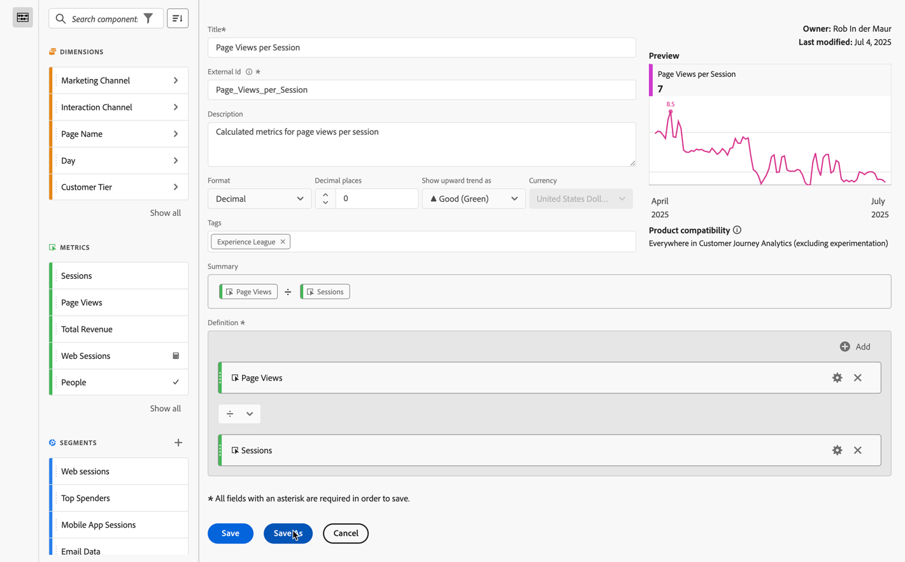

# Creare una metrica calcolata semplice

Le informazioni seguenti spiegano come creare una semplice metrica *Visualizzazioni pagina per visite*.

1. Inizia a generare una metrica, come descritto in [Metriche di compilazione](/help/components/calc-metrics/cm-workflow/cm-build-metrics.md).
1. Denomina la metrica `Page Views per Session` o qualcosa di simile.
1. Assegna alla metrica una **[!UICONTROL Descrizione]** intuitiva per mostrare a cosa serve la metrica.
1. Seleziona il **[!UICONTROL Formato]** destro. Per questo esempio, scegli **[!UICONTROL Decimal]**.
1. Decidi quante cifre decimali visualizzare nel rapporto.
1. Nel menu a discesa **[!UICONTROL Mostra tendenza verso l&#39;alto come]**, selezionare ▲ **[!UICONTROL Buono (Verde)]**.
1. Aggiungi un **[!UICONTROL Tag]** per organizzare le metriche.
1. Per questa metrica calcolata, trascina prima **[!UICONTROL Visualizzazioni pagina]** dai componenti **[!UICONTROL Metriche]** nella sezione **[!UICONTROL Definizione]** dell&#39;area di lavoro.
1. Trascina quindi **[!UICONTROL Sessioni]** dai componenti **[!UICONTROL Metriche]** e rilascia la metrica sotto **[!UICONTROL Visualizzazioni pagina]** (attendi che venga visualizzata la linea blu prima di rilasciare la metrica).
1. Selezionare l&#39;operatore . (Dividi è l&#39;operatore predefinito).
1. È possibile visualizzare una **[!UICONTROL Anteprima]** della metrica durante la creazione della metrica.
1. **[!UICONTROL Compatibilità del prodotto]** indica se la metrica calcolata è compatibile ovunque in Customer Journey Analytics (esclusa la sperimentazione).

   
1. Seleziona **[!UICONTROL Salva]**.

   La formula **[!UICONTROL Riepilogo]** viene aggiornata ogni volta che si apporta una modifica alla definizione della metrica.

1. (Facoltativo) Per condividere, approvare, (ri)assegnare tag, rinominare o eliminare una metrica, puoi passare al [Gestore metriche calcolate](/help/components/calc-metrics/cm-workflow/cm-manager.md).

