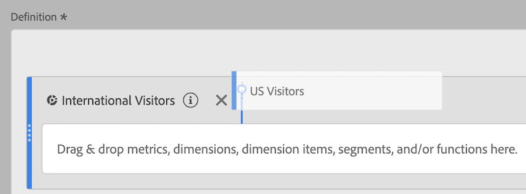

# Sovrapponi filtri

Mostra come sovrapporre e sostituire i filtri nel Generatore di metriche calcolate.

## Filtri di stack {#stack-filter}

Nell'area di lavoro Definizione, rilascia semplicemente il nuovo filtro accanto a quello esistente:

## Sostituire un filtro con un altro {#replace-filter}

Nell'area di lavoro Definizione, è sufficiente posizionare il nuovo filtro su quello esistente:

