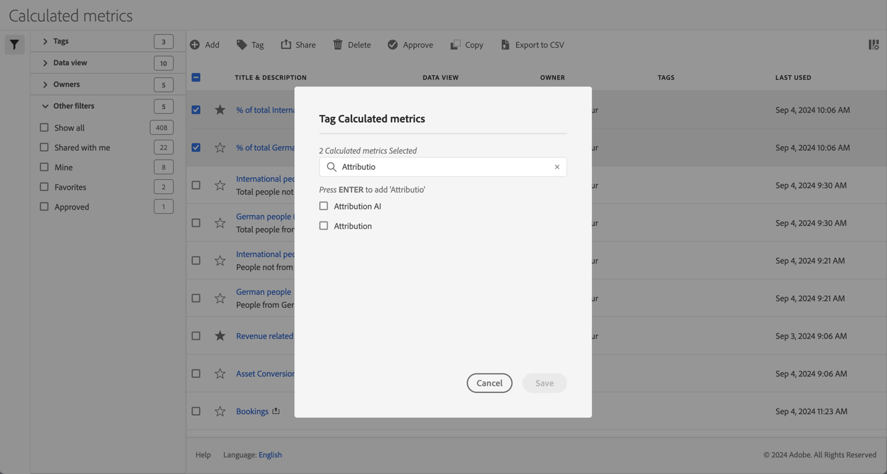
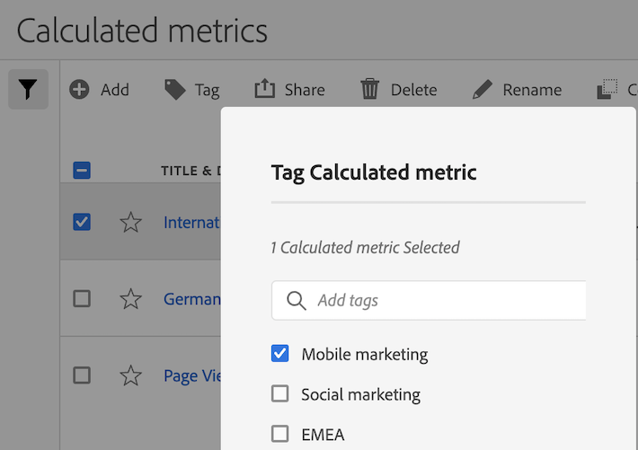

# Assegnare tag alle metriche calcolate

In [Gestione metriche calcolate](cm-manager.md) è possibile utilizzare i tag per organizzare le metriche calcolate. Gli amministratori possono assegnare tag a tutte le metriche calcolate. Gli utenti che non sono amministratori possono assegnare tag solo alle metriche calcolate create o condivise con loro.

Per assegnare tag a una o più metriche calcolate:

1. In [Gestione metriche calcolate](cm-manager.md), selezionare una o più delle metriche calcolate a cui si desidera assegnare il tag.
1. Dalla barra delle azioni, seleziona  **[!UICONTROL Tag]**.
1. Nella finestra di dialogo **[!UICONTROL Assegna tag alle metriche calcolate]**

   

   1. (facoltativamente) utilizzare  per cercare e limitare l&#39;elenco di tag.

   2. In base all’elenco dei tag:

      * seleziona uno o più tag esistenti dall’elenco, oppure
      * immettere un nuovo tag e premere **[!UICONTROL INVIO]**. Ripeti l’operazione per aggiungere più di un nuovo tag.

1. Seleziona **[!UICONTROL Salva]** per salvare i tag per le metriche calcolate. Seleziona **[!UICONTROL Annulla]** per annullare.

Una volta salvati, i tag sono elencati nel campo [!UICONTROL Tag] per la metrica calcolata selezionata nel [Generatore di metriche calcolate](cm-tagging.md).

<!--

In the Calculated metric manager, you can organize segments by tagging them.

All users can create tags for calculated metrics and apply one or more tags to a metric. However, you can see tags only for those calculated metrics that you own or that have been shared with you. 

>[!TIP]
>
>The most useful types of tags are usually tags that are based on the following criteria:
>
>* **Team names**, such as Social Marketing or Mobile Marketing.
>* **Project** (analysis tags), such as Entry-page analysis.
>* **Categories**, such as Women's or Geography.
>* **Workflows**, such as To be approved or Curated for (a specific business unit).

## Apply tags to a calculated metric

1. In Customer Journey Analytics, select [!UICONTROL **Components**] > [!UICONTROL **Calculated metrics**].

1. In the Calculated metrics manager, select the checkbox next to any metrics that you want to tag.

   

1. In the [!UICONTROL **Tag Calculated metric**] dialog box: 

   * Add a new tag. Type the name in the **[!UICONTROL Add tags]** field, then press Enter.
   * Select one or more existing tags to apply to the selected metrics.

1. Select [!UICONTROL **Save**] to apply the tags.

## View applied tags

1. In Customer Journey Analytics, select [!UICONTROL **Components**] > [!UICONTROL **Calculated metrics**] to go to the Calculated metrics manager.

1. In the Calculated metrics manager, tags appear in the [!UICONTROL **Tags**] column. (Click the gear icon on the top-right to manage your columns.)

## Filter metrics by tags

1. In Customer Journey Analytics, select [!UICONTROL **Components**] > [!UICONTROL **Calculated metrics**] to go to the Calculated metrics manager.

1. In the Calculated metrics manager, select the **Filter** icon, then select the tags that you want to filter by. 

   Only metrics that have the filter you select are shown.

-->

