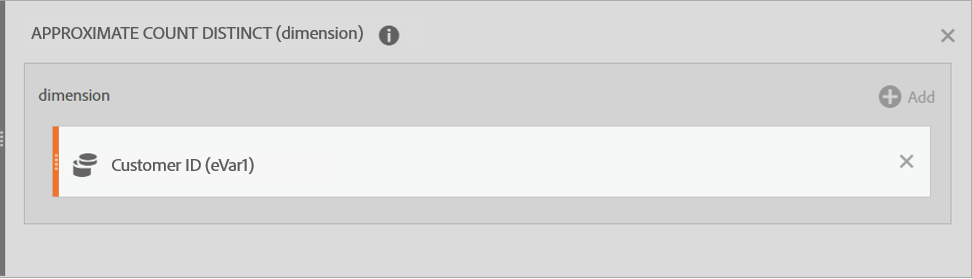

# Usare le funzioni

Le funzioni ti consentono di filtrare e ordinare i dati ed eseguire analisi statistiche semplici e complesse.

Per un elenco di tutte le funzioni, consultare [Funzioni di base](/help/components/calc-metrics/cm-functions.md) e [Funzioni avanzate](/help/components/calc-metrics/cm-adv-functions.md).


>[!NOTE]
>
>Se [!DNL metric] è identificato come argomento in una funzione, sono consentite anche altre espressioni di metriche. Ad esempio, [!DNL MAXV(metrics)] consente anche [!DNL MAXV(PageViews + Visits).]
>

>[!NOTE]
>
>Quando includi funzioni nella Definizione del generatore di metriche calcolate, applica sempre la funzione prima di trascinare metriche o filtri.
>

## Funzioni tabella e funzioni riga

Una funzione tabella è una funzione in cui l’output è lo stesso per ogni riga della tabella. Una funzione riga contiene un output diverso per ogni riga della tabella.

## Che cosa significa il parametro Include-Zeros?

Il parametro indica se includere gli zeri all’interno del calcolo. Talvolta lo zero non ha alcun significato, ma in determinate occasioni può risultare importante.

Ad esempio, se hai una metrica Revenue (Entrate) e ne aggiungi al report una del tipo Page Views (Visualizzazioni pagina), improvvisamente saranno presenti più righe per le entrate che sono pari a zero. È probabile che non vorrai estendere questo risultato ai calcoli MEAN, MIN, QUARTILE e così via, che sono presenti nella colonna Revenue (Entrate). In questo caso, dovrai controllare il parametro include-zeros.

D’altra parte, se disponi di due metriche di tuo interesse, potrebbe non essere giusto affermare che una presenti una media o un minimo più alto in virtù di alcune righe pari a zero, quindi non controlleresti il parametro in modo da includere gli zeri.

<!-- This video is way too outdated and too much AA oriented to comfortably show as part of CJA functionality 

Watch this [video](https://youtu.be/SSyWvomnewI) to understand the use of functions.

-->

+++ Funzioni di base


## Valore assoluto (riga)

Restituisce il valore assoluto di un numero. Il valore assoluto di un numero è il numero con un valore positivo.

```
ABS(metric)
```

| Argomento | Descrizione |
|---|---|
| *metrica* | La metrica della quale desideri il valore assoluto. |

## Massimo colonna

Restituisce il valore più grande in un insieme di elementi dimensionali della colonna di una metrica. MAXV valuta verticalmente all’interno di una singola colonna (metrica) tra gli elementi dimensionali.

```
MAXV(metric)
```

| Argomento | Descrizione |
|---|---|
| *metrica* | Una metrica che desideri valutare. |

## Minimo colonna

Restituisce il valore più piccolo in un insieme di elementi dimensionali della colonna di una metrica. MINV valuta verticalmente all’interno di una singola colonna (metrica) tra gli elementi dimensionali.

```
MINV(metric)
```

| Argomento | Descrizione |
|---|---|
| *metrica* | Una metrica che desideri valutare. |

## Somma colonna

Somma tutti i valori numerici di una metrica all’interno di una colonna (negli elementi di una dimensione).

```
SUM(metric)
```

| Argomento | Descrizione |
|---|---|
| *metrica* | La metrica della quale desideri il valore totale o la somma. |

## Conteggio (tabella)

Restituisce il numero, o conteggio, di valori diversi da zero di una metrica all’interno di una colonna (il numero di elementi univoci riportati all’interno di una dimensione).

```
COUNT(metric)
```

| Argomento | Descrizione |
|---|---|
| *metrica* | La metrica che desideri conteggiare. |

## Esponente (riga)

Restituisce *e* elevato alla potenza di un numero specificato. La costante *e* è uguale a 2,71828182845904, la base del logaritmo naturale. EXP è l’inverso di LN, il logaritmo naturale di un numero.

```
EXP(metric)
```

| Argomento | Descrizione |
|---|---|
| *metrica* | L’esponente applicato alla base *e*. |

## Esponenziazione

Operatore di potenza


pow(x,y) = x<sup>y</sup> = x *x* x*... (y volte)


## Media (tabella)

Restituisce la media aritmetica, o media, di una metrica in una colonna.

```
MEAN(metric)
```

| Argomento | Descrizione |
|---|---|
| *metrica* | La metrica di cui desideri la media. |

## Mediana (tabella)

Restituisce la mediana di una metrica in una colonna. La mediana è il numero nel mezzo di un insieme di numeri, ovvero metà dei numeri ha valori che sono maggiori o uguali alla mediana, e metà sono minori o uguali alla mediana.

```
MEDIAN(metric)
```

| Argomento | Descrizione |
|---|---|
| *metrica* | La metrica di cui desideri la mediana. |

## Modulo

Il resto di col1 / col2, utilizzando la divisione euclidea.

Restituisce il resto dopo aver diviso x per y.

```
x = floor(x/y) + modulo(x,y)
```

Il valore restituito ha lo stesso segno dell’input (o è zero).

```
modulo(4,3) = 1 
modulo(-4,3) = -1 
modulo(-3,3) = 0
```

Per ottenere sempre un numero positivo, utilizza

```
modulo(modulo(x,y)+y,y)
```

## Percentile (tabella)

Restituisce il k-esimo percentile dei valori di una metrica. Puoi utilizzare questa funzione per stabilire una soglia di accettazione. Ad esempio, puoi decidere di esaminare gli elementi dimensionali con un punteggio superiore al 90 percentile.

```
PERCENTILE(metric,k)
```

<table id="table_35CD840ACFB44CD9979881DB8823CC53"> 
 <thead> 
  <tr> 
   <th colname="col1" class="entry"> Argomento </th> 
   <th colname="col2" class="entry"> Descrizione </th> 
  </tr> 
 </thead>
 <tbody> 
  <tr> 
   <td colname="col1"> <i>metrica</i> </td> 
   <td colname="col2"> La colonna della metrica che definisce la condizione relativa. </td> 
  </tr> 
  <tr> 
   <td colname="col1"> <p>k </p> </td> 
   <td colname="col2"> Il valore percentile compreso tra 0 e 100 incluso. </td> 
  </tr> 
 </tbody> 
</table>

## Quartile (tabella)

Restituisce il quartile dei valori di una metrica. Ad esempio, i quartili possono essere utilizzati per trovare il 25% dei prodotti che generano maggiori ricavi. MINV, MEDIAN e MAXV restituiscono lo stesso valore di QUARTILE quando il quarto è uguale rispettivamente a 0 (zero), 2 e 4.

```
QUARTILE(metric,quart)
```

<table id="table_64EA3DAAE77541439D59FAF0353F83A2"> 
 <thead> 
  <tr> 
   <th colname="col1" class="entry"> Argomento </th> 
   <th colname="col2" class="entry"> Descrizione </th> 
  </tr> 
 </thead>
 <tbody> 
  <tr> 
   <td colname="col1"> <i>metrica</i> </td> 
   <td colname="col2"> La metrica di cui desideri il valore del quartile. </td> 
  </tr> 
  <tr> 
   <td colname="col1"> <p>quarto </p> </td> 
   <td colname="col2"> Indica il valore* da restituire. </td> 
  </tr> 
 </tbody> 
</table>

&#42;Se *quarto* = 0, QUARTILE restituisce il valore minimo. Se *quarto* = 1, QUARTILE restituisce il primo quartile (25 percentile). Se *quarto* = 2, QUARTILE restituisce il primo quartile (50 percentile). Se *quarto* = 3, QUARTILE restituisce il primo quartile (75 percentile). Se *quarto* = 4, QUARTILE restituisce il valore massimo.

## Arrotondamento

Restituisce il numero intero più vicino a un determinato valore. Ad esempio, se desideri evitare di riportare i decimali della valuta per le entrate e un prodotto ha 569,34 $, utilizza la formula Round(*Entrate*) per arrotondare le entrate al dollaro più vicino, cioè 569 $. Un prodotto che riporta 569,51 $ sarà arrotondato al dollaro più vicino, cioè 570 $.

```
ROUND(metric)
```

| Argomento | Descrizione |
|---|---|
| *numero* | La metrica che desideri arrotondare. |

L’arrotondamento senza un parametro di cifre è uguale all’arrotondamento con un parametro di cifre pari a 0, vale a dire arrotondato al numero intero più vicino. Con un parametro di cifre restituisce quel numero di cifre a destra del decimale. Se la cifra è negativa, restituisce quel numero di 0 a sinistra del decimale.

```
round( 314.15, 0) = 314 
round( 314.15, 1) = 314.1 
round( 314.15, -1) = 310 
round( 314.15, -2) = 300
```

## Conteggio righe

Restituisce il numero di righe di una colonna specificata (il numero di elementi univoci riportati all’interno di una dimensione). “Univoci superati” viene conteggiato come 1.

## Massimo riga

Il massimo delle colonne in ogni riga.

## Minimo riga

Il minimo delle colonne in ogni riga.

## Somma righe

La somma delle colonne di ogni riga.

## Radice quadrata (riga)

Restituisce la radice quadrata positiva di un numero. La radice quadrata di un numero è il valore di quel numero elevato alla potenza di 1/2.

```
SQRT(metric)
```

| Argomento | Descrizione |
|---|---|
| *numero* | La metrica della quale desideri la radice quadrata. |

## Deviazione standard (tabella)

Restituisce la deviazione standard, o radice quadrata della varianza, in base a una popolazione di dati campione.

L’equazione per STDEV è:


dove x è la media del campione (*metrica*) e *n* è la dimensione del campione.

```
STDEV(metric)
```

<table id="table_8BCF2E4B02434AABAAD026FB3C4E8B2F"> 
 <tbody> 
  <tr> 
   <td> <b> Argomento</b> </td> 
   <td> <b> Descrizione</b> </td> 
  </tr> 
  <tr> 
   <td> <b> <i> metrica</i> </b> </td> 
   <td> <p> La metrica di cui desideri la deviazione standard. </p> </td> 
  </tr> 
 </tbody> 
</table>

## Varianza (tabella)

Restituisce la varianza in base a una popolazione di dati campione.

L’equazione per VARIANCE è:


dove x è la media del campione, MEAN(*metrica*) e *n* è la dimensione del campione.

```
VARIANCE(metric)
```

| Argomento | Descrizione |
|---|---|
| *metrica* | La metrica di cui desideri la varianza. |

Per calcolare una varianza, si considera un’intera colonna di numeri. Di tale elenco di numeri si calcola prima la media. Una volta ottenuta la media, si esamina ogni voce e si effettuano le seguenti operazioni:

1. Si sottrae la media dal numero.

2. Si eleva al quadrato il risultato.

3. Si aggiunge al totale.

Dopo aver ripetuto per l’intera colonna, si ottiene un singolo totale. Si divide quindi il totale per il numero di elementi nella colonna. Tale numero è la varianza della colonna. È un singolo numero. Viene tuttavia visualizzato come una colonna di numeri.

Nel caso di una colonna a tre elementi:

1

2

3

La media di questa colonna è 2. La varianza della colonna sarà ((1 - 2)<sup>2</sup> + (2 - 2)<sup>2</sup> + (3 - 2)<sup>2</sup>/3 = 2/3.

+++

+++ Funzioni avanzate


## AND

Restituisce il valore del relativo argomento. Per assicurarti che un valore non sia uguale a un valore particolare, utilizza la funzione NOT.

>[!NOTE]
>
>0 (zero) significa False, mentre qualsiasi altro valore corrisponde a True.

```
AND(logical_test1,[logical_test2],...)
```

| Argomento | Descrizione |
|---|---|
| *logical_test1* | Obbligatorio. Qualsiasi valore o espressione che può essere valutato come TRUE o FALSE. |
| *logical_test2* | Facoltativo. Condizioni aggiuntive da valutare come TRUE o FALSE. |

## Approximate Count Distinct (dimension) (Conteggio valori univoci approssimativo (dimensione))

Restituisce il conteggio valori univoci approssimativo degli elementi dimensione per la dimensione selezionata. La funzione sfrutta il metodo HyperLogLog (HLL) per approssimare i conteggi valori univoci ed è configurata per garantire che il valore sia compreso entro il 5% del valore effettivo per il 95% del tempo.

```
Approximate Count Distinct (dimension)
```

| Argomento |  |
|---|---|
| *dimension* | La dimensione per la quale vuoi ottenere il conteggio dei valori univoci approssimativo degli elementi. |

### Caso d’uso di esempio

Approximate Count Distinct (customer ID eVar) (Conteggio valori univoci approssimativo (eVar ID cliente)) rappresenta un caso d’uso comune per questa funzione.

Definizione di una nuova metrica calcolata “Approximate Customers” (Clienti approssimativi):



Questo è il modo in cui la metrica “Approximate Customers” (Clienti approssimativi) potrebbe essere utilizzata nel reporting:


### Confronto delle funzioni di conteggio

Approximate Count Distinct() rappresenta un miglioramento rispetto alle funzioni Count() e RowCount(), perché la metrica creata può essere utilizzata in qualsiasi report dimensionale per rappresentare un conteggio approssimativo di elementi per una dimensione separata. Ad esempio, un conteggio degli ID cliente utilizzati all’interno di un report Mobile Device Type (Tipo dispositivo mobile).

Questa funzione risulterà leggermente meno precisa rispetto a Count() e RowCount() perché sfrutta il metodo HLL, mentre Count() e RowCount() rappresentano conteggi esatti.

## Arcocoseno (riga)

Restituisce l’arcocoseno di una metrica, detto anche inverso del coseno. L’arcocoseno è l’angolo di cui è numero il coseno. L’angolo restituito è espresso in radianti compresi nell’intervallo tra 0 (zero) e pi. Per convertire il risultato dai radianti ai gradi, moltiplicalo per 180/PI( ).

```
ACOS(metric)
```

| Argomento |  |
|---|---|
| *metric* | Il coseno dell’angolo desiderato da -1 a 1. |

## Arcoseno (riga)

Restituisce l’arcoseno, o seno inverso, di un numero. L’arcoseno è l’angolo di cui è numero il seno. L’angolo restituito è espresso in radianti compresi nell’intervallo tra -pi/2 e pi/2. Per esprimere l’arcoseno in gradi, moltiplica il risultato per 180/PI( ).

```
ASIN(metric)
```

| Argomento |  |
|---|---|
| *metric* | Il coseno dell’angolo desiderato da -1 a 1. |

## Arcotangente (riga)

Restituisce l’arcotangente, o tangente inversa, di un numero. L’arcotangente è l’angolo di cui è numero la tangente. L’angolo restituito è espresso in radianti compresi nell’intervallo tra -pi/2 e pi/2. Per esprimere l’arcotangente in gradi, moltiplica il risultato per 180/PI( ).

```
ATAN(metric)
```

| Argomento |  |
|---|---|
| *metric* | Il coseno dell’angolo desiderato da -1 a 1. |

## Regressione esponenziale: valore Y previsto (riga)

Calcola i valori y previsti (metric_Y), in base ai valori x noti (metric_X) utilizzando il metodo dei minimi quadrati per calcolare la riga di adattamento ottimale in base a.

```
ESTIMATE.EXP(metric_X, metric_Y)
```

| Argomento | Descrizione |
|---|---|
| *metric_X* | Una metrica da designare come dati dipendenti. |
| *metric_Y* | Una metrica da designare come dati indipendenti. |

## Cdf-T

Restituisce la percentuale di valori nella distribuzione t di uno studente con n gradi di libertà che presenta un punteggio z inferiore a x.

```
cdf_t( -∞, n ) = 0
cdf_t(  ∞, n ) = 1
cdf_t( 3, 5 ) ? 0.99865
cdf_t( -2, 7 ) ? 0.0227501
cdf_t( x, ∞ ) ? cdf_z( x )
```

## Cdf-Z

Restituisce la percentuale di valori in una distribuzione normale che presenta un punteggio z inferiore a x.

```
cdf_z( -∞ ) = 0
cdf_z( ∞ ) = 1
cdf_z( 0 ) = 0.5
cdf_z( 2 ) ? 0.97725
cdf_z( -3 ) ? 0.0013499
```

## Eccesso (riga)

Restituisce l’integer più piccolo, non inferiore a un valore specificato. Ad esempio, se vuoi evitare di riportare i decimali della valuta per le entrate e il prezzo di un prodotto è pari a 569,34 $, utilizza la formula CEILING(*Revenue*) per arrotondare le entrate al dollaro più vicino o 570 $.

```
CEILING(metric)
```

| Argomento | Descrizione |
|---|---|
| *metric* | La metrica da arrotondare. |

## Confidence

[!UICONTROL Confidence] (affidabilità) è una misura probabilistica della quantità di prove che dimostrano che una specifica variante è uguale alla variante di controllo. Una maggiore affidabilità indica meno prove dell’ipotesi che le varianti di controllo e non di controllo abbiano prestazioni uguali.

```
fx Confidence (normalizing-container, success-metric, control, significance-threshold)
```

| Argomento | Descrizione |
| --- | --- |
| normalizing-container | La base (persone, sessioni o eventi) su cui verrà eseguito un test. |
| success-metric | La metrica o le metriche con cui un utente confronta le varianti. |
| control | La variante con cui vengono confrontate tutte le altre varianti dell’esperimento. Immetti il nome dell’elemento della dimensione della variante di controllo. |
| significance-threshold | La soglia in questa funzione è impostata su un valore predefinito di 95%. |

{style="table-layout:auto"}

## Coseno (riga)

Restituisce il coseno dell’angolo specificato. Se l’angolo è in gradi, moltiplicalo per PI( )/180.

```
COS(metric)
```

| Argomento | Descrizione |
|---|---|
| *metric* | L’angolo in radianti di cui vuoi ottenere il coseno. |

## Radice cubica

Restituisce la radice cubica positiva di un numero. La radice cubica di un numero corrisponde al valore di quel numero elevato alla potenza di 1/3.

```
CBRT(metric)
```

| Argomento | Descrizione |
|---|---|
| *metric* | La metrica per la quale vuoi ottenere la radice cubica. |

## Cumulativo

Restituisce la somma di x per le ultime N righe secondo quanto ordinato dalla dimensione, utilizzando valori hash per i campi basati su stringhe.

Se N &lt;= 0 vengono usate tutte le righe precedenti. Poiché questa funzione è ordinata dalla dimensione, risulta utile solo per le dimensioni con ordine naturale, come data o lunghezza del percorso.

```
| Date | Rev  | cumul(0,Rev) | cumul(2,Rev) |
|------+------+--------------+--------------|
| May  | $500 | $500         | $500         |
| June | $200 | $700         | $700         |
| July | $400 | $1100        | $600         |
```

## Media cumulativa

Restituisce la media delle ultime N righe.

Se N &lt;= 0 vengono usate tutte le righe precedenti. Poiché questa funzione è ordinata dalla dimensione, risulta utile solo per le dimensioni con ordine naturale, come data o lunghezza del percorso.

>[!NOTE]
>
>Questa funzione non opera come previsto con metriche di tasso come entrate/persona: essa calcola la media dei tassi, anziché sommare le entrate rispetto all’ultima N, quindi sommare le persone rispetto all’ultima N e infine dividere i due valori ottenuti. Invece, utilizza

```
cumul(revenue)/cumul(person)
```

## Uguale

Restituisce elementi che corrispondono esattamente a un valore numerico o stringa.

## Regressione esponenziale: coefficiente di correlazione (tabella)

Restituisce il coefficiente di correlazione, *r*, tra due colonne di metrica ( *metric_A* e *metric_B*) per l’equazione di regressione.

```
CORREL.EXP(metric_X, metric_Y)
```

| Argomento | Descrizione |
|---|---|
| *metric_X* | Metrica da correlare con *metric_Y*. |
| *metric_Y* | Metrica da correlare con *metric_X*. |

## Regressione esponenziale: intersezione (tabella)

Restituisce l’intersezione, *b*, tra due colonne di metrica ( *metric_X* e *metric_Y*) per

```
INTERCEPT.EXP(metric_X, metric_Y)
```

| Argomento | Descrizione |
|---|---|
| *metric_X* | Una metrica da designare come dati dipendenti. |
| *metric_Y* | Una metrica da designare come dati indipendenti. |

## Regressione esponenziale: pendenza (tabella)

Restituisce la pendenza, *a*, tra due colonne di metrica ( *metric_X* e *metric_Y*) per

```
SLOPE.EXP(metric_X, metric_Y)
```

| Argomento | Descrizione |
|---|---|
| *metric_X* | Una metrica da designare come dati dipendenti. |
| *metric_Y* | Una metrica da designare come dati indipendenti. |

## Base (riga)

Restituisce l’integer più grande, non superiore a un valore specificato. Ad esempio, se vuoi evitare di riportare i decimali della valuta per le entrate e il prezzo di un prodotto è pari a 569,34 $, utilizza la formula FLOOR(*Revenue*) per arrotondare le entrate al dollaro più vicino o 569$.

```
FLOOR(metric)
```

| Argomento | Descrizione |
|---|---|
| *metric* | La metrica da arrotondare. |

## Maggiore di

Restituisce elementi il cui conteggio numerico è maggiore del valore immesso.

## Maggiore di o uguale a

Restituisce elementi il cui conteggio numerico è maggiore di o uguale al valore immesso.

## Coseno iperbolico (riga)

Restituisce il coseno iperbolico di un numero.

```
COSH(metric)
```

| Argomento | Descrizione |
|---|---|
| *metric* | L’angolo in radianti di cui vuoi ottenere il coseno iperbolico. |

## Seno iperbolico (riga)

Restituisce il seno iperbolico di un numero.

```
SINH(metric)
```

| Argomento | Descrizione |
|---|---|
| *metric* | L’angolo in radianti di cui vuoi ottenere il seno iperbolico. |

## Tangente iperbolica (riga)

Restituisce la tangente iperbolica di un numero.

```
TANH(metric)
```

| Argomento | Descrizione |
|---|---|
| *metric* | L’angolo in radianti di cui vuoi ottenere la tangente iperbolica. |

## IF (riga)

La funzione IF restituisce un valore se una condizione specificata restituisce TRUE, mentre consente di ottenere un altro valore se tale condizione restituisce FALSE.

```
IF(logical_test, [value_if_true], [value_if_false])
```

| Argomento | Descrizione |
|---|---|
| *logical_test* | Obbligatorio. Qualsiasi valore o espressione che può essere valutato come TRUE o FALSE. |
| *[value_if_true]* | Il valore che vuoi ottenere se l’argomento *logical_test* restituisce TRUE. Se non è incluso, questo argomento sarà pari a 0 per impostazione predefinita. |
| *[value_if_false]* | Il valore che vuoi ottenere se l’argomento *logical_test* restituisce FALSE. Se non è incluso, questo argomento sarà pari a 0 per impostazione predefinita. |

## Minore di

Restituisce elementi il cui conteggio numerico è inferiore al valore immesso.

## Minore o uguale a

Restituisce elementi il cui conteggio numerico è minore o uguale al valore immesso.

## Lift

Restituisce l’incremento di una particolare variante nelle conversioni rispetto a una variante di controllo. Più precisamente, rappresenta la differenza di prestazioni tra una determinata variante e la linea di base, divisa per le prestazioni della linea di base, espressa in percentuale.

```
fx Lift (normalizing-container, success-metric, control)
```

| Argomento | Descrizione |
| --- | --- |
| normalizing-container | La base (persone, sessioni o eventi) su cui verrà eseguito un test. |
| success-metric | La metrica o le metriche con cui un utente confronta le varianti. |
| control | La variante con cui vengono confrontate tutte le altre varianti dell’esperimento. Immetti il nome dell’elemento della dimensione della variante di controllo. |

{style="table-layout:auto"}

## Regressione lineare: coefficiente di correlazione

Y = a X + b. Restituisce il coefficiente di correlazione.

## Regressione lineare: intersezione

Y = a X + b. Restituisce b.

## Regressione lineare: valore Y previsto

Y = a X + b. Restituisce Y.

## Regressione lineare: pendenza

Y = a X + b. Restituisce a.

## Base logaritmo 10 (riga)

Restituisce il logaritmo base 10 di un numero.

```
LOG10(metric)
```

| Argomento | Descrizione |
|---|---|
| *metric* | Numero reale positivo di cui vuoi ottenere il logaritmo base 10. |

## Regressione logaritmo: coefficiente di correlazione (tabella)

Restituisce il coefficiente di correlazione, *r*, tra due colonne di metrica (*metric_X* e *metric_Y*) per l’equazione di regressione [!DNL Y = a ln(X) + b]. Viene calcolato utilizzando l’equazione CORREL.

```
CORREL.LOG(metric_X,metric_Y)
```

| Argomento | Descrizione |
|---|---|
| *metric_X* | Metrica da correlare con *metric_Y*. |
| *metric_Y* | Metrica da correlare con *metric_X*. |

## Regressione logaritmo: intersezione (tabella)

Restituisce l’intersezione *b* come regressione dei minimi quadrati tra due colonne di metrica (*metric_X* e *metric_Y*) per l’equazione di regressione [!DNL Y = a ln(X) + b]. Viene calcolata utilizzando l’equazione INTERCEPT.

```
INTERCEPT.LOG(metric_X, metric_Y)
```

| Argomento | Descrizione |
|---|---|
| *metric_X* | Una metrica da designare come dati dipendenti. |
| *metric_Y* | Una metrica da designare come dati indipendenti. |

## Regressione logaritmo: valore Y previsto (riga)

Calcola i [!DNL y] valori previsti (metric_Y), in base ai [!DNL x] valori noti (metric_X) utilizzando il metodo dei minimi quadrati per calcolare la riga di adattamento ottimale in base a [!DNL Y = a ln(X) + b]. Viene calcolata utilizzando l’equazione ESTIMATE.

Nell’analisi di regressione, questa funzione calcola i [!DNL y] valori previsti (*metric_Y*), dati i [!DNL x] valori noti (*metric_X*) utilizzando il logaritmo per calcolare la linea più adatta all’equazione di regressione [!DNL Y = a ln(X) + b]. I [!DNL a] valori corrispondono a ciascun valore x e [!DNL b] è un valore costante.

```
ESTIMATE.LOG(metric_X, metric_Y)
```

| Argomento | Descrizione |
|---|---|
| *metric_X* | Una metrica da designare come dati dipendenti. |
| *metric_Y* | Una metrica da designare come dati indipendenti. |

## Regressione logaritmo: pendenza (tabella)

Restituisce la pendenza, *a*, tra due colonne di metrica (*metric_X* e *metric_Y*) per l’equazione di regressione [!DNL Y = a ln(X) + b]. Viene calcolata utilizzando l’equazione SLOPE.

```
SLOPE.LOG(metric_A, metric_B)
```

| Argomento | Descrizione |
|---|---|
| *metric_A* | Una metrica da designare come dati dipendenti. |
| *metric_B* | Una metrica da designare come dati indipendenti. |

## Logaritmo naturale

Restituisce il logaritmo naturale di un numero. I logaritmi naturali si basano sulla costante *e* (2,71828182845904). LN è l’inverso della funzione EXP.

```
LN(metric)
```

| Argomento | Descrizione |
|---|---|
| *metric* | Numero reale positivo di cui vuoi ottenere il logaritmo naturale. |

## NOT

Restituisce 1 se il numero è 0 o restituisce 0 se è presente un altro numero.

```
NOT(logical)
```

| Argomento | Descrizione |
|---|---|
| *logical* | Obbligatorio. Un valore o espressione che può essere valutato come TRUE o FALSE. |

Per utilizzare NOT è necessario verificare se le espressioni (&lt;, >, =, &lt;>, ecc.) restituiscono i valori 0 o 1.

## Non uguale

Restituisce tutti gli elementi che non contengono la corrispondenza esatta del valore immesso.

## O (riga)

Restituisce TRUE se un qualsiasi argomento è TRUE oppure FALSE se tutti gli argomenti sono FALSE.

>[!NOTE]
>
>0 (zero) significa False, mentre qualsiasi altro valore corrisponde a True.

```
OR(logical_test1,[logical_test2],...)
```

| Argomento | Descrizione |
|---|---|
| *logical_test1* | Obbligatorio. Qualsiasi valore o espressione che può essere valutato come TRUE o FALSE. |
| *logical_test2* | Facoltativo. Condizioni aggiuntive da valutare come TRUE o FALSE. |

## Pi

Restituisce la costante PI, 3,14159265358979, con una precisione di 15 cifre.

```
PI()
```

La funzione [!DNL PI]non ha argomenti.

## Regressione di potenza: coefficiente di correlazione (tabella)

Restituisce il coefficiente di correlazione, *r*, tra due colonne di metrica (*metric_X* e *metric_Y*) per [!DNL Y = b*X].

```
CORREL.POWER(metric_X, metric_Y)
```

| Argomento | Descrizione |
|---|---|
| *metric_X* | Metrica da correlare con *metric_Y*. |
| *metric_Y* | Metrica da correlare con *metric_X*. |

## Regressione di potenza: intersezione (tabella)

Restituisce l’intersezione, *b*, tra due colonne di metrica (*metric_X* e *metric_Y*) per [!DNL Y = b*X].

```
 INTERCEPT.POWER(metric_X, metric_Y)
```

| Argomento | Descrizione |
|---|---|
| *metric_X* | Una metrica da designare come dati dipendenti. |
| *metric_Y* | Una metrica da designare come dati indipendenti. |

## Regressione di potenza: valore Y previsto (riga)

Calcola i [!DNL y] valori previsti ( [!DNL metric_Y]), in base ai [!DNL x] valori noti ( [!DNL metric_X]) utilizzando il metodo dei minimi quadrati per calcolare la riga di adattamento ottimale per [!DNL Y = b*X].

```
 ESTIMATE.POWER(metric_X, metric_Y)
```

| Argomento | Descrizione |
|---|---|
| *metric_X* | Una metrica da designare come dati dipendenti. |
| *metric_Y* | Una metrica da designare come dati indipendenti. |

## Regressione di potenza: pendenza (tabella)

Restituisce la pendenza, *a*, tra due colonne di metrica (*metric_X* e *metric_Y*) per [!DNL Y = b*X].

```
SLOPE.POWER(metric_X, metric_Y)
```

| Argomento | Descrizione |
|---|---|
| *metric_X* | Una metrica da designare come dati dipendenti. |
| *metric_Y* | Una metrica da designare come dati indipendenti. |

## Regressione quadratica: coefficiente di correlazione (tabella)

Restituisce il coefficiente di correlazione, *r*, tra due colonne di metrica (*metric_X* e *metric_Y*) per [!DNL Y=(a*X+b)]****.

```
CORREL.QUADRATIC(metric_X, metric_Y)
```

| Argomento | Descrizione |
|---|---|
| *metric_X* | Metrica da correlare con *metric_Y*. |
| *metric_Y* | Metrica da correlare con *metric_X*. |

## Regressione quadratica: intersezione (tabella)

Restituisce l’intersezione, *b*, tra due colonne di metrica (*metric_X* e *metric_Y*) per [!DNL Y=(a*X+b)]****.

```
INTERCEPT.POWER(metric_X, metric_Y)
```

| Argomento | Descrizione |
|---|---|
| *metric_X* | Una metrica da designare come dati dipendenti. |
| *metric_Y* | Una metrica da designare come dati indipendenti. |

## Regressione quadratica: valore Y previsto (riga)

Calcola i [!DNL y] valori previsti (metric_Y), in base ai [!DNL x] valori noti (metric_X) utilizzando il metodo dei minimi quadrati per calcolare la riga di adattamento ottimale tramite [!DNL Y=(a*X+b)]****.

```
ESTIMATE.QUADRATIC(metric_A, metric_B)
```

| Argomento | Descrizione |
|---|---|
| *metric_A* | Una metrica da designare come dati dipendenti. |
| *metric_B* | Una metrica da designare come dati dipendenti. |

## Regressione quadratica: pendenza (tabella)

Restituisce la pendenza, *a*, tra due colonne di metrica (*metric_X* e metric_Y) per [!DNL Y=(a*X+b)]****.

```
SLOPE.QUADRATIC(metric_X, metric_Y)
```

| Argomento | Descrizione |
|---|---|
| *metric_X* | Una metrica da designare come dati dipendenti. |
| *metric_Y* | Una metrica da designare come dati indipendenti. |

## Regressione reciproca: coefficiente di correlazione (tabella)

Restituisce il coefficiente di correlazione, *r*, tra due colonne di metrica (*metric_X)* e *metric_Y*) per [!DNL Y = a/X+b].

```
CORREL.RECIPROCAL(metric_X, metric_Y)
```

| Argomento | Descrizione |
|---|---|
| *metric_X* | Metrica da correlare con *metric_Y*. |
| *metric_Y* | Metrica da correlare con *metric_X*. |

## Regressione reciproca: intersezione (tabella)

Restituisce l’intersezione, *b*, tra due colonne di metrica (*metric_X* e *metric_Y*) per [!DNL Y = a/X+b].

```
INTERCEPT.RECIPROCAL(metric_A, metric_B)
```

| Argomento | Descrizione |
|---|---|
| *metric_X* | Una metrica da designare come dati dipendenti. |
| *metric_Y* | Una metrica da designare come dati indipendenti. |

## Regressione reciproca: valore Y previsto (riga)

Calcola i [!DNL y] valori previsti (metric_Y), in base ai [!DNL x] valori noti (metric_X) utilizzando il metodo dei minimi quadrati per calcolare la riga di adattamento ottimale tramite [!DNL Y = a/X+b].

```
ESTIMATE.RECIPROCAL(metric_X, metric_Y)
```

| Argomento | Descrizione |
|---|---|
| *metric_X* | Una metrica da designare come dati dipendenti. |
| *metric_Y* | Una metrica da designare come dati indipendenti. |

## Regressione reciproca: pendenza (tabella)

Restituisce la pendenza, *a*, tra due colonne di metrica (*metric_X* e *metric_Y*) per [!DNL Y = a/X+b].

```
SLOPE.RECIPROCAL(metric_X, metric_Y)
```

| Argomento | Descrizione |
|---|---|
| *metric_X* | Una metrica da designare come dati dipendenti. |
| *metric_Y* | Una metrica da designare come dati indipendenti. |

## Seno (riga)

Restituisce il seno dell’angolo specificato. Se l’angolo è in gradi, moltiplicalo per PI( )/180.

```
SIN(metric)
```

| Argomento | Descrizione |
|---|---|
| *metric* | L’angolo in radianti di cui vuoi ottenere il seno. |

## Punteggio T

Alias per punteggio Z, vale a dire la deviazione dalla media divisa per la deviazione standard.

## Test T

Esegue un test t a coda m con un punteggio t di col e n gradi di libertà.

La firma è `t_test( x, n, m )`. Sotto, effettua semplicemente la chiamata `m*cdf_t(-abs(x),n)`. È simile alla funzione di test z che esegue `m*cdf_z(-abs(x))`.

Qui `m` indica il numero di code e `n` corrisponde ai gradi di libertà. Devono essere numeri costanti per l’intero report, ovvero senza subire modifiche per riga.

`X` è la statistica del test t e spesso è una formula (ad es., zscore) basata su una metrica, che sarà valutata su ogni riga.

Il valore restituito è la probabilità di visualizzare la statistica x del test in base ai gradi di libertà e al numero di code.

**Esempi:**

1. Utilizza questo valore per individuare gli outlier:

   ```
   t_test( zscore(bouncerate), row-count-1, 2)
   ```

1. Combinalo con `if` per ignorare tassi non raggiunti molto elevati o bassi e per contare le visite degli altri elementi:

   ```
   if ( t_test( z-score(bouncerate), row-count, 2) < 0.01, 0, visits )
   ```

## Tangente

Restituisce la tangente dell’angolo specificato. Se l’angolo è in gradi, moltiplicalo per PI( )/180.

```
TAN (metric)
```

| Argomento | Descrizione |
|---|---|
| *metric* | L’angolo in radianti di cui vuoi ottenere la tangente. |

## Punteggio Z (riga)

Restituisce il punteggio Z, o punteggio normale, in base a una distribuzione normale. Il punteggio Z è il numero di deviazioni standard di un’osservazione dalla media. Un punteggio Z pari a 0 (zero) indica che il punteggio è uguale alla media. Un punteggio Z può essere positivo o negativo, il che significa se è superiore o inferiore alla media, oltre al numero di deviazioni standard.

L’equazione per il punteggio Z è:


dove [!DNL x] è il punteggio non elaborato, [!DNL μ] corrisponde alla media della popolazione e [!DNL σ] indica la deviazione standard della popolazione.

>[!NOTE]
>
>[!DNL μ] (mu) e[!DNL σ] (sigma) vengono calcolati automaticamente dalla metrica.

Punteggio Z (metrica)

<table id="table_AEA3622A58F54EA495468A9402651E1B">
 <thead>
  <tr>
   <th colname="col1" class="entry"> Argomento </th>
   <th colname="col2" class="entry"> Descrizione </th>
  </tr>
 </thead>
 <tbody>
  <tr>
   <td colname="col1"> <i>metric</i> </td>
   <td colname="col2"> <p> Restituisce il valore del primo argomento diverso da zero. </p> </td>
  </tr>
 </tbody>
</table>

## Test Z

Effettua un test Z con coda n con punteggio Z di A.

Restituisce la probabilità che la riga corrente possa essere vista casualmente nella colonna.

>[!NOTE]
>
>Presuppone che i valori siano distribuiti normalmente.

+++

