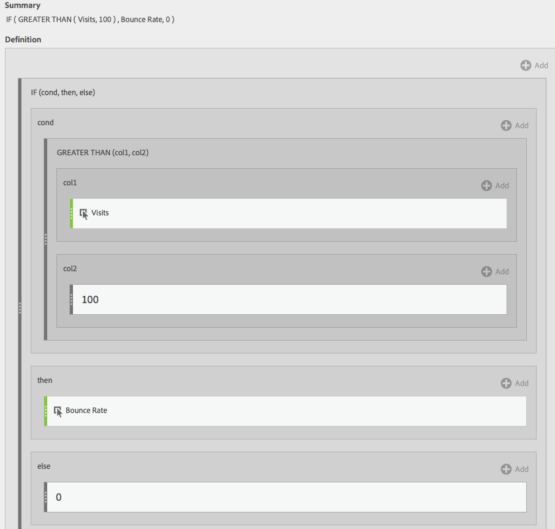

# Metriche filtrate e ponderate

Mostra esempi di metriche filtrate e ponderate.

## Frequenza di rimbalzo filtrata {#section_D42F2452E4464948934063EB6F2DAAB4}

Questa semplice metrica filtrata mostra il tasso di mancato recapito solo per le pagine con più di 100 visite:

Tieni presente che questa formula dipende da un intervallo di tempo coerente. Se esegui un rapporto per un singolo giorno, vale la pena esaminare qualsiasi pagina con più di 20 visite. Se lo esegui per un mese, potresti voler includere più visite nel filtro.

## Frequenza di rimbalzo filtrata con percentuale {#section_4F3E6D33A1FD438A932FA662B3510552}

Questo filtro mostra la frequenza di rimbalzo per il 30% delle pagine principali, quando ordinato per visite.

## Metrica ponderata {#section_F2D16B14569948289CF1310F9E6E3FC2}

Supponiamo di voler ordinare per frequenza di rimbalzo in generale, ma le pagine con visite più elevate dovrebbero essere più in alto nell’elenco. Puoi creare una frequenza di rimbalzo ponderata simile a questa:

