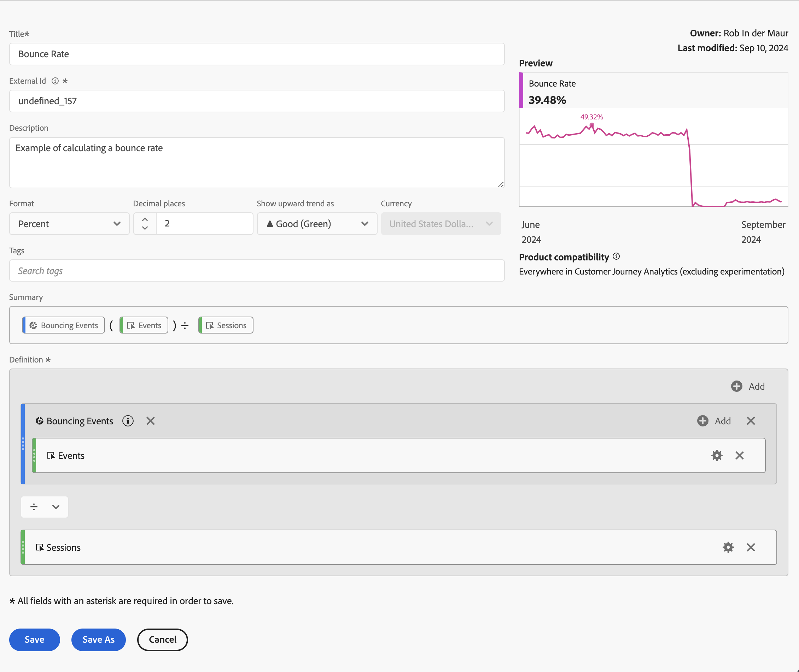

# Esempi di metriche calcolate

Questo articolo mostra alcuni esempi su come definire metriche calcolate più avanzate.

## Percentuale mancati recapiti

Desideri calcolare la frequenza di mancato recapito.

+++ Dettagli

La definizione di un mancato recapito è oggetto di un&#39;altra discussione, ma per questo esempio si definisce un segmento di eventi di mancato recapito in cui Inizio sessione è uguale a 1 e Fine sessione è uguale a 1. Questo segmento consente di definire la frequenza delle sessioni non recapitate alle sessioni.

### Segmento

### Metrica calcolata

### Campi derivati

In alternativa, è possibile definire un tasso di mancato recapito [&#x200B; utilizzando campi derivati](/help/data-views/derived-fields/derived-fields.md#bounces).

I campi derivati fanno parte di una visualizzazione dati che presenta il vantaggio che non tutti gli utenti possono ignorare o modificare la definizione di una metrica del tasso di mancato recapito. Anche tale vantaggio ha introdotto una limitazione. Gli utenti che non hanno accesso a una visualizzazione dati non possono utilizzare campi derivati e devono ricorrere a segmenti e metriche calcolate per definire un tasso di mancato recapito.

Per ulteriori informazioni su come calcolare i mancati recapiti e il relativo tasso in Customer Journey Analytics, consulta questo [post di blog](https://experienceleaguecommunities.adobe.com/t5/adobe-analytics-blogs/calculating-bounces-amp-bounce-rate-in-adobe-customer-journey/ba-p/706446).

+++

## Visualizzazioni pagina condizionali

Desideri definire una metrica calcolata che calcoli solo le visualizzazioni di pagina per le pagine visitate in oltre 100 sessioni.

+++ Dettagli 

+++

## Visualizzazioni di pagina per il 30% delle prime sessioni

Desideri definire una metrica calcolata che calcoli solo le visualizzazioni di pagina per le prime 30% delle sessioni.

+++ Dettagli

+++
