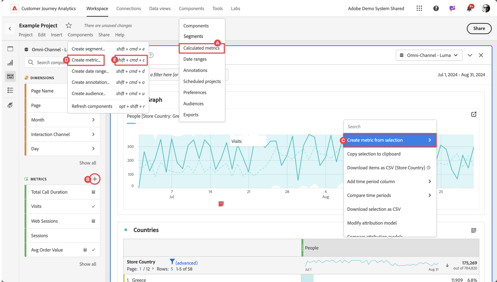

# Creare metriche calcolate

Per impostazione predefinita, solo gli amministratori possono creare metriche calcolate. Gli utenti dispongono delle autorizzazioni per visualizzare le metriche calcolate, in modo analogo a come visualizzano altri componenti (come segmenti, annotazioni e altro ancora).

Tuttavia, gli amministratori possono assegnare l&#39;autorizzazione **[!UICONTROL Creazione metrica calcolata]** per **[!UICONTROL Strumenti di reporting]** in **[!UICONTROL Modifica autorizzazioni per CJA Workspace Access]** agli utenti tramite [Admin Console](/help/technotes/access-control.md#user-level-access).

Puoi creare una metrica calcolata nei seguenti modi:

* **A**. Nell&#39;interfaccia principale, selezionare **[!UICONTROL Componenti]** e **[!UICONTROL Metriche calcolate]**. Seleziona  [!UICONTROL **[!UICONTROL Aggiungi]**] dal gestore [[!UICONTROL Metriche calcolate]](/help/components/calc-metrics/cm-workflow/cm-manager.md).
* **B**. In un progetto Workspace, dal pannello a sinistra Componenti, seleziona  in  **Metriche**.
* **C**. In un progetto Workspace, dal menu di scelta rapida nell&#39;intestazione della colonna Metrics, selezionare **[!UICONTROL Create metric from selection]**. Dal sottomenu, puoi selezionare una funzione o selezionare **[!UICONTROL Apri nel generatore di metriche calcolate]**.  Se selezioni una funzione, la metrica calcolata viene definita come metrica solo progetto. Quando successivamente modifichi questa metrica, tramite il popup [Informazioni componente](/help/components/use-components-in-workspace.md#component-info), viene visualizzata una notifica nel [Generatore di metriche calcolate](/help/components/calc-metrics/cm-workflow/cm-build-metrics.md).
* **D**. In un progetto di Workspace, seleziona **[!UICONTROL Componenti]** dal menu, quindi seleziona **[!UICONTROL Crea metrica]**.
* **E**. In un progetto Workspace, utilizza il collegamento **[!UICONTROL shift+cmd+c]** (macOS) o **[!UICONTROL shift+ctrl+c]** (Windows).

Per definire la nuova metrica calcolata, utilizzare il generatore di metriche calcolate .

## Flusso di lavoro

Prima di creare le metriche calcolate, considera attentamente il seguente flusso di lavoro:

| Attività flusso di lavoro | Descrizione |
| --- | --- |
| Pianificare le metriche calcolate | Soprattutto per le metriche che verranno approvate ufficialmente, la pianificazione ha senso delineare quali metriche calcolate verranno ampiamente utilizzate e come verranno definite. |
| [Genera](/help/components/calc-metrics/cm-workflow/cm-build-metrics.md) metriche calcolate | Genera e modifica metriche calcolate e calcolate avanzate da utilizzare nei componenti [!DNL Customer Journey Analytics]. |
| [Tag](cm-tagging.md) metriche calcolate | Assegna tag alle metriche calcolate per semplificarne l’organizzazione e la condivisione. Scopri come pianificare e assegnare tag per ricerche e organizzazioni semplici e avanzate. |
| [Approva](cm-approving.md) metriche calcolate | Approva le metriche calcolate per renderle canoniche. |
| Utilizzare le metriche calcolate | Utilizza le metriche calcolate nei progetti. |
| [Condividi](cm-sharing.md) metriche calcolate | Condividere le metriche calcolate con altri individui, gruppi o organizzazioni. |
| [Filtro](cm-filter.md) metriche calcolate | Filtrare le metriche calcolate per tag, proprietari e altri filtri (Mostra tutto, Personali, Condivisi con me, Preferiti e Approvati). |
| Contrassegna metriche calcolate come [preferiti](cm-finding.md) | Contrassegnare le metriche come preferite è un altro modo per organizzarle in modo semplice e intuitivo. |

