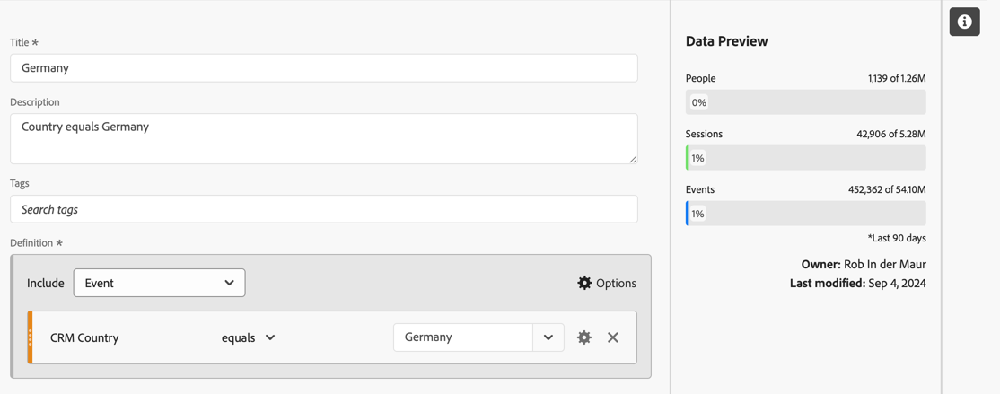
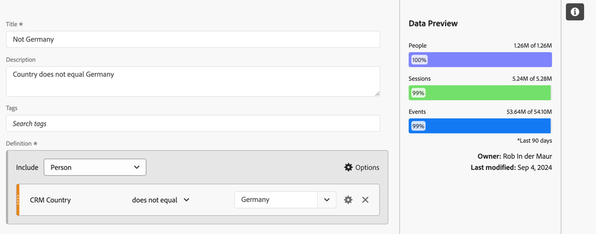
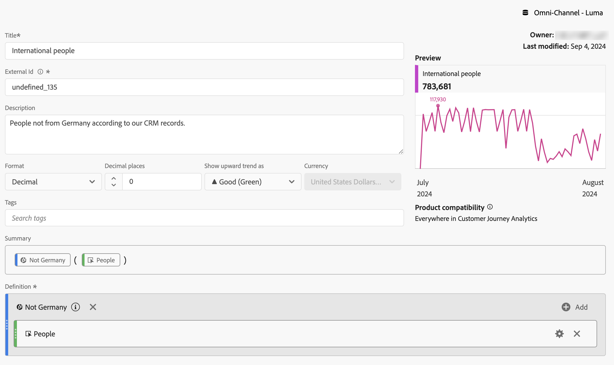
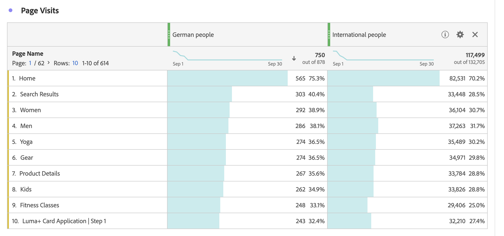
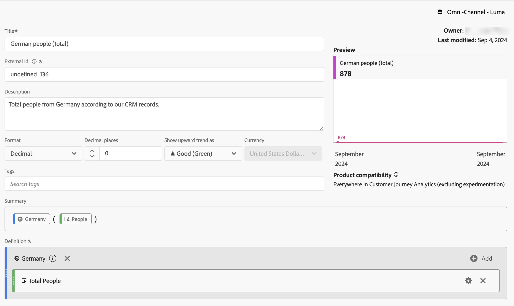
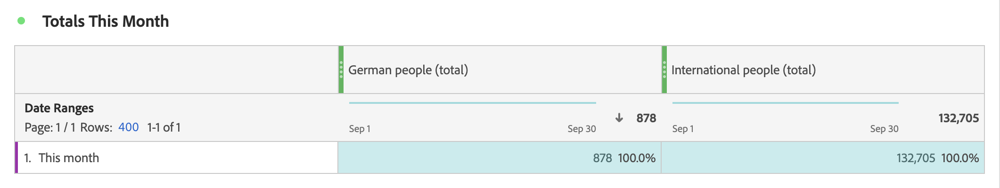
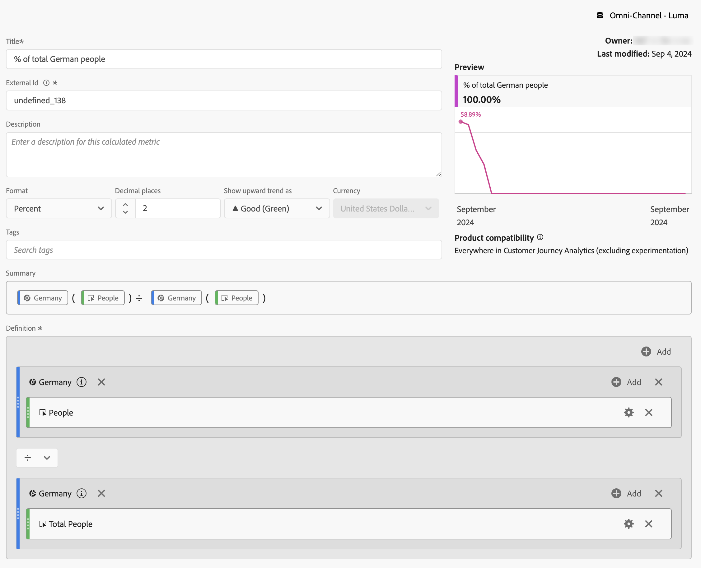
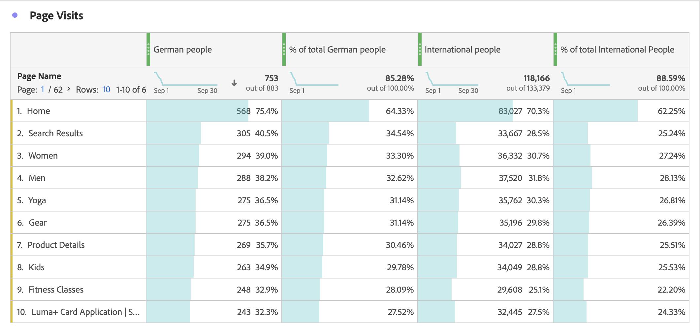

# Metriche segmentate

Nel [Generatore di metriche calcolate](cm-build-metrics.md#definition-builder), puoi applicare segmenti all&#39;interno della definizione della metrica. L’applicazione di segmenti è utile se desideri utilizzare nell’analisi le metriche per un sottoinsieme di dati.

>[!NOTE]
>
>Le definizioni dei segmenti vengono aggiornate tramite il [Generatore di segmenti](/help/components/segments/seg-builder.md). Se apporti una modifica a un segmento, questo viene aggiornato automaticamente ovunque venga utilizzato, incluso se il segmento fa parte di una definizione di metrica calcolata.
>

Vuoi confrontare le metriche per i tedeschi che interagiscono con il tuo marchio con quelle di persone al di fuori della Germania. Quindi puoi rispondere a domande come:

1. Quante persone tedesche e internazionali visitano le [pagine più popolari](#popular-pages).
1. Quante persone tedesche e internazionali in [totale](#totals) hanno interagito online con il tuo marchio questo mese.
1. Quali sono le [percentuali](#percentages) di tedeschi e di persone internazionali che hanno visitato le tue pagine popolari?

Consulta le sezioni seguenti per illustrare come le metriche segmentate possono aiutarti a rispondere a queste domande. Se del caso, si fa riferimento alla documentazione più dettagliata.

## Pagine popolari

1. [Creare una metrica calcolata](cm-workflow.md) da un progetto Workspace, denominato `German people`.
1. Dall&#39;interno del [Generatore di metriche calcolate](cm-build-metrics.md), [crea un segmento](/help/components/segments/seg-builder.md), denominato `Germany`, che utilizza il campo Paese CRM dai dati del tuo sistema di gestione delle relazioni con i clienti per determinare la provenienza di una persona.

   >[!TIP]
   >
   >Nel generatore di metriche calcolate, puoi creare un segmento direttamente utilizzando il pannello Componenti.
   >   

   Il segmento potrebbe essere simile a.

   

1. Nel generatore di metriche calcolate, utilizza il segmento per aggiornare la metrica calcolata.

   

Ripeti i passaggi precedenti per la versione internazionale della metrica calcolata.

1. Creare una metrica calcolata dal progetto Workspace, denominata `International people`.
1. Dall&#39;interno del generatore di metriche calcolate, creare un segmento, denominato `Not Germany`, che utilizza il campo Paese CRM dai dati del sistema di gestione delle relazioni con i clienti per determinare la provenienza di una persona.

   Il segmento dovrebbe essere simile a.

   

1. Nel generatore di metriche calcolate, utilizza il segmento per aggiornare la metrica calcolata.

   

1. Crea un progetto in Analysis Workspace, dove puoi vedere le pagine visitate da tedeschi e internazionali.

   

## Totali

1. Crea due nuove metriche calcolate basate sul totale complessivo. Apri ciascuno dei segmenti creati in precedenza, rinomina il segmento, imposta il **[!UICONTROL tipo di metrica]** per **[!UICONTROL Persone]** su **[!UICONTROL Totale complessivo]** e utilizza **[!UICONTROL Salva con nome]** per salvare il segmento utilizzando il nuovo nome. Ad esempio:

   

1. Aggiungi al progetto Workspace una nuova visualizzazione a forma libera che mostra il totale delle pagine del mese corrente.

   

## Percentuali

1. Crea due nuove metriche calcolate che calcolano una percentuale dalle metriche calcolate create in precedenza.

   

1. Aggiorna il progetto Workspace.

   

>[!BEGINSHADEBOX]

Vedi  [Utilizza una metrica calcolata segmentata come metrica senza implementazione](https://experienceleague.adobe.com/en/docs/analytics-learn/tutorials/components/calculated-metrics/calculated-metrics-segmented-metrics){target="_blank"} per un video dimostrativo.

{{videoaa}}

>[!ENDSHADEBOX]

